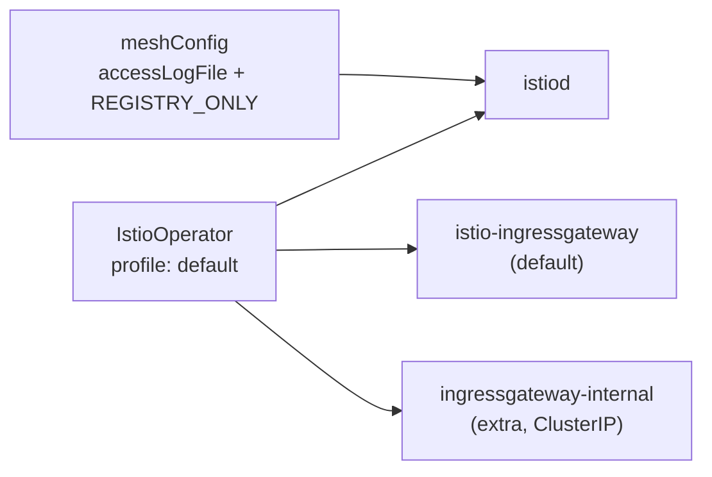

[RU version](README_RU.MD) · [Eng version](README.MD) · [Versión en español](README_ES.MD) · [Version française](README_FR.MD)

# Lab 15 - Installation & Configuration: Anpassung der Istio-Installation (IstioOperator + MeshConfig)

## Überblick

In den meisten Labs ist Istio bereits für uns installiert. Hier ist die Aufgabe umgekehrt: **Istio
installieren und für konkrete Anforderungen konfigurieren**. Das ist eine Kernkompetenz der Domäne
*Installation, Upgrade & Configuration* - „Customizing your Istio Installation".

Istio wird über `istioctl install -f <Datei>` installiert, wobei die Datei ein
`IstioOperator`-Manifest ist. Darin legen wir fest:
- **profile** - der Basissatz an Komponenten (`default`, `minimal`, `demo`, ...);
- **meshConfig** - globale Mesh-Einstellungen (Logging, Egress-Policy usw.);
- **components** - welche Komponenten und in welcher Anzahl ausgerollt werden (zum Beispiel
  mehrere Ingress-Gateways).

In diesem Lab ist der Cluster bereits eingerichtet (control-plane + worker), aber Istio ist **nicht
installiert** - die Installation ist genau die Aufgabe. `istioctl` ist auf dem worker PC vorinstalliert.



## Infrastruktur

| Komponente | Typ | Anzahl | Rolle |
|---|---|---|---|
| control-plane | `t3.medium` | 1 | master + Workloads (istiod, Gateways) |
| worker | `t3.small` | 1 | zusätzliche Kapazität für zwei Gateways |
| worker PC | `t3.small` | 1 | Arbeitsplatz: `kubectl`, `istioctl`, `check_result` |

Region: `eu-central-1` (AZ `eu-central-1a` / `eu-central-1b`).

## Deployment

```bash
TASK=15 make run_ica_task
```

## Aufgabe

1. Ein `IstioOperator`-Manifest auf Basis des Profils `default` schreiben.
2. In `meshConfig` festlegen:
   - `accessLogFile: /dev/stdout` - Envoy-Access-Logs in stdout aktivieren;
   - `outboundTrafficPolicy.mode: REGISTRY_ONLY` - ausgehenden Traffic zu Hosts blockieren,
     die nicht in der Mesh-Registry beschrieben sind.
3. Ein **zweites** Ingress-Gateway `ingressgateway-internal` neben dem Standard-Gateway
   `istio-ingressgateway` hinzufügen.
4. Istio mit diesem Manifest installieren und sicherstellen, dass alles angewendet wurde.

## Schritt 1. IstioOperator-Manifest

```bash
cat > custom-istio.yaml <<'EOF'
apiVersion: install.istio.io/v1alpha1
kind: IstioOperator
metadata:
  name: custom-istio
spec:
  profile: default
  meshConfig:
    accessLogFile: /dev/stdout
    outboundTrafficPolicy:
      mode: REGISTRY_ONLY
  components:
    ingressGateways:
      - name: istio-ingressgateway
        enabled: true
      - name: ingressgateway-internal
        enabled: true
        label:
          istio: ingressgateway-internal
        k8s:
          service:
            type: ClusterIP
EOF
```

## Schritt 2. Installation

```bash
istioctl install -f custom-istio.yaml -y
```

## Schritt 3. Prüfung

```bash
kubectl get pods -n istio-system
kubectl get deploy -n istio-system | grep -E 'ingressgateway'
kubectl get configmap istio -n istio-system -o jsonpath='{.data.mesh}' \
  | grep -E 'accessLogFile|outboundTrafficPolicy|REGISTRY_ONLY'
```

Wir erwarten:
- `istiod` im Status `Running`;
- zwei Deployments: `istio-ingressgateway` und `ingressgateway-internal` - beide bereit;
- in der ConfigMap `istio` sind `accessLogFile: /dev/stdout` und
  `outboundTrafficPolicy.mode: REGISTRY_ONLY` vorhanden.

## Analyse

- **profile: default** - rollt `istiod` und ein Ingress-Gateway aus. Das Profil ist
  der Ausgangspunkt, auf den wir unsere eigenen Änderungen aufsetzen.
- **meshConfig** landet in der ConfigMap `istio` (Schlüssel `mesh`) und wird von istiod gelesen. So
  werden globale Parameter konfiguriert, ohne die Deployments selbst zu bearbeiten.
- **outboundTrafficPolicy: REGISTRY_ONLY** verbietet Aufrufe an externe Hosts, die
  nicht über `ServiceEntry` beschrieben sind (siehe Lab 05). Standardmäßig gilt der Modus `ALLOW_ANY`.
- **components.ingressGateways** ermöglicht es, mehrere Gateways auszurollen - ein typisches
  Muster, wenn man ein separates internes Gateway (`ClusterIP`) zusätzlich zum externen benötigt.

## Ergebnisprüfung

Führen Sie auf dem worker PC aus:

```bash
check_result
```

## Fazit

Sie haben Istio aus einem angepassten `IstioOperator` installiert: ein Profil ausgewählt, globale
Mesh-Parameter über `meshConfig` festgelegt und ein zusätzliches Ingress-Gateway als Komponente
ausgerollt. Genau das ist die Fähigkeit „Customizing your Istio Installation" aus dem ICA-Programm.
