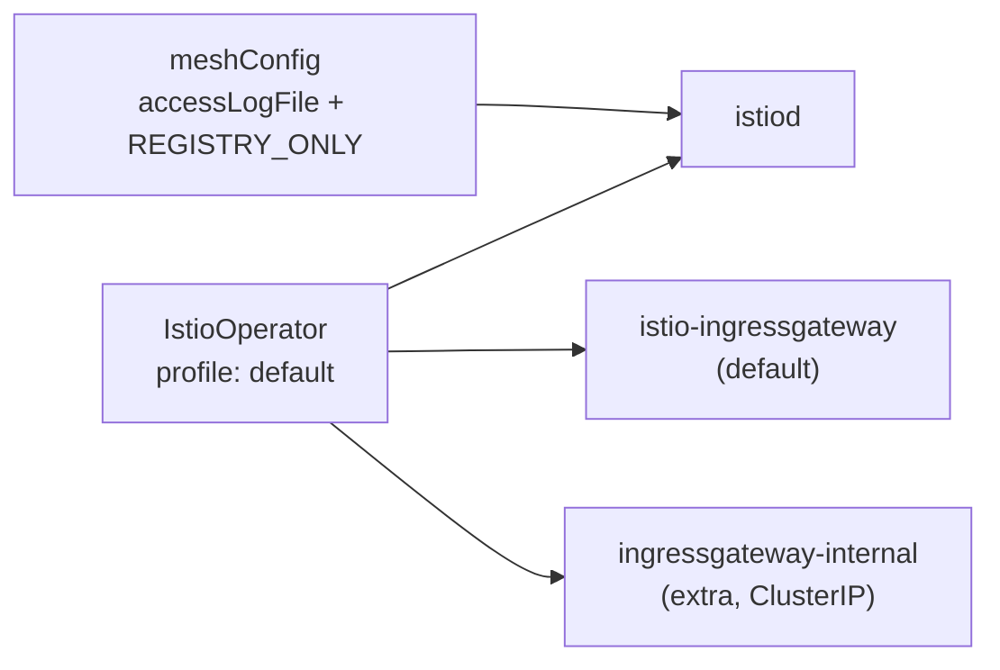

[RU version](README_RU.MD) · [Eng version](README.MD) · [Version française](README_FR.MD) · [Deutsche Version](README_DE.MD)

# Lab 15 - Installation & Configuration: personalización de la instalación de Istio (IstioOperator + MeshConfig)

## Visión general

En la mayoría de los labs Istio ya está instalado por nosotros. Aquí la tarea es la
inversa: **instalar y configurar Istio según unos requisitos concretos**. Es una
competencia clave del dominio *Installation, Upgrade & Configuration* - «Customizing
your Istio Installation».

Istio se instala mediante `istioctl install -f <archivo>`, donde el archivo es un
manifiesto `IstioOperator`. En él definimos:
- **profile** - el conjunto base de componentes (`default`, `minimal`, `demo`, ...);
- **meshConfig** - la configuración global del mesh (logging, política de egress, etc.);
- **components** - qué componentes y en qué cantidad desplegar (por ejemplo,
  varios ingress-gateway).

En este lab el clúster ya está levantado (control-plane + worker), pero Istio **no está
instalado** - la instalación es precisamente la tarea. `istioctl` está preinstalado en el
worker PC.



## Infraestructura

| Componente | Tipo | Cantidad | Rol |
|---|---|---|---|
| control-plane | `t3.medium` | 1 | master + cargas de trabajo (istiod, gateways) |
| worker | `t3.small` | 1 | capacidad adicional para dos gateway |
| worker PC | `t3.small` | 1 | puesto de trabajo: `kubectl`, `istioctl`, `check_result` |

Región: `eu-central-1` (AZ `eu-central-1a` / `eu-central-1b`).

## Despliegue

```bash
TASK=15 make run_ica_task
```

## Tarea

1. Escribir un manifiesto `IstioOperator` basado en el profile `default`.
2. Definir en `meshConfig`:
   - `accessLogFile: /dev/stdout` - activar los access-logs de Envoy en stdout;
   - `outboundTrafficPolicy.mode: REGISTRY_ONLY` - bloquear el tráfico saliente a
     hosts no descritos en el registro del mesh.
3. Añadir un **segundo** ingress-gateway `ingressgateway-internal` junto al estándar
   `istio-ingressgateway`.
4. Instalar Istio con este manifiesto y comprobar que todo se aplicó.

## Paso 1. Manifiesto IstioOperator

```bash
cat > custom-istio.yaml <<'EOF'
apiVersion: install.istio.io/v1alpha1
kind: IstioOperator
metadata:
  name: custom-istio
spec:
  profile: default
  meshConfig:
    accessLogFile: /dev/stdout
    outboundTrafficPolicy:
      mode: REGISTRY_ONLY
  components:
    ingressGateways:
      - name: istio-ingressgateway
        enabled: true
      - name: ingressgateway-internal
        enabled: true
        label:
          istio: ingressgateway-internal
        k8s:
          service:
            type: ClusterIP
EOF
```

## Paso 2. Instalación

```bash
istioctl install -f custom-istio.yaml -y
```

## Paso 3. Comprobación

```bash
kubectl get pods -n istio-system
kubectl get deploy -n istio-system | grep -E 'ingressgateway'
kubectl get configmap istio -n istio-system -o jsonpath='{.data.mesh}' \
  | grep -E 'accessLogFile|outboundTrafficPolicy|REGISTRY_ONLY'
```

Esperamos:
- `istiod` en estado `Running`;
- dos deployments: `istio-ingressgateway` e `ingressgateway-internal` - ambos listos;
- en el configmap `istio` están presentes `accessLogFile: /dev/stdout` y
  `outboundTrafficPolicy.mode: REGISTRY_ONLY`.

## Análisis

- **profile: default** - despliega `istiod` y un ingress-gateway. El profile es
  el punto de partida sobre el que superponemos nuestros cambios.
- **meshConfig** acaba en el configmap `istio` (clave `mesh`) y lo lee istiod. Así se
  configuran los parámetros globales sin modificar los propios Deployment.
- **outboundTrafficPolicy: REGISTRY_ONLY** prohíbe las llamadas a hosts externos que
  no estén descritos mediante `ServiceEntry` (ver Lab 05). Por defecto el modo es `ALLOW_ANY`.
- **components.ingressGateways** permite desplegar varios gateways - un patrón
  típico cuando se necesita un gateway interno propio (`ClusterIP`) además del externo.

## Comprobación del resultado

Ejecute en el worker PC:

```bash
check_result
```

## Resumen

Has instalado Istio a partir de un `IstioOperator` personalizado: elegiste el profile, definiste los parámetros globales
del mesh mediante `meshConfig` y desplegaste un ingress-gateway adicional
como componente. Esto es precisamente la habilidad «Customizing your Istio Installation» del programa ICA.
