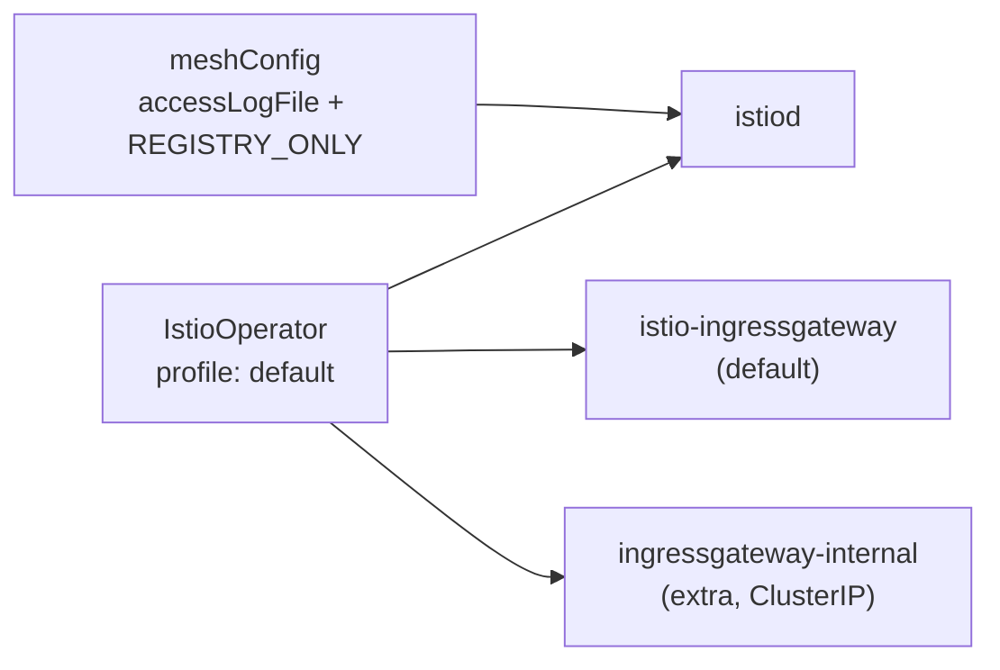

[RU version](README_RU.MD) · [Eng version](README.MD) · [Versión en español](README_ES.MD) · [Deutsche Version](README_DE.MD)

# Lab 15 - Installation & Configuration : personnalisation de l'installation d'Istio (IstioOperator + MeshConfig)

## Vue d'ensemble

Dans la plupart des labs, Istio est déjà installé pour nous. Ici, la tâche est inverse :
**installer et configurer Istio selon des exigences précises**. C'est une compétence clé
du domaine *Installation, Upgrade & Configuration* - « Customizing your Istio Installation ».

Istio s'installe via `istioctl install -f <fichier>`, où le fichier est un manifeste
`IstioOperator`. On y définit :
- **profile** - l'ensemble de base des composants (`default`, `minimal`, `demo`, ...) ;
- **meshConfig** - les réglages globaux du maillage (journalisation, politique egress, etc.) ;
- **components** - quels composants déployer et en quelle quantité (par exemple,
  plusieurs ingress gateway).

Dans ce lab, le cluster est déjà en place (control-plane + worker), mais Istio **n'est pas
installé** - l'installation est justement la tâche. `istioctl` est préinstallé sur le worker PC.



## Infrastructure

| Composant | Type | Nombre | Rôle |
|---|---|---|---|
| control-plane | `t3.medium` | 1 | master + charges de travail (istiod, gateways) |
| worker | `t3.small` | 1 | capacité supplémentaire pour deux gateways |
| worker PC | `t3.small` | 1 | poste de travail : `kubectl`, `istioctl`, `check_result` |

Région : `eu-central-1` (AZ `eu-central-1a` / `eu-central-1b`).

## Déploiement

```bash
TASK=15 make run_ica_task
```

## Tâche

1. Écrire un manifeste `IstioOperator` basé sur le profil `default`.
2. Définir dans `meshConfig` :
   - `accessLogFile: /dev/stdout` - activer les access logs Envoy dans stdout ;
   - `outboundTrafficPolicy.mode: REGISTRY_ONLY` - bloquer le trafic sortant vers les
     hôtes non décrits dans le registre du maillage.
3. Ajouter un **second** ingress gateway `ingressgateway-internal` à côté du
   `istio-ingressgateway` standard.
4. Installer Istio avec ce manifeste et vérifier que tout a bien été appliqué.

## Étape 1. Manifeste IstioOperator

```bash
cat > custom-istio.yaml <<'EOF'
apiVersion: install.istio.io/v1alpha1
kind: IstioOperator
metadata:
  name: custom-istio
spec:
  profile: default
  meshConfig:
    accessLogFile: /dev/stdout
    outboundTrafficPolicy:
      mode: REGISTRY_ONLY
  components:
    ingressGateways:
      - name: istio-ingressgateway
        enabled: true
      - name: ingressgateway-internal
        enabled: true
        label:
          istio: ingressgateway-internal
        k8s:
          service:
            type: ClusterIP
EOF
```

## Étape 2. Installation

```bash
istioctl install -f custom-istio.yaml -y
```

## Étape 3. Vérification

```bash
kubectl get pods -n istio-system
kubectl get deploy -n istio-system | grep -E 'ingressgateway'
kubectl get configmap istio -n istio-system -o jsonpath='{.data.mesh}' \
  | grep -E 'accessLogFile|outboundTrafficPolicy|REGISTRY_ONLY'
```

Résultat attendu :
- `istiod` au statut `Running` ;
- deux déploiements : `istio-ingressgateway` et `ingressgateway-internal` - tous deux prêts ;
- dans le configmap `istio` sont présents `accessLogFile: /dev/stdout` et
  `outboundTrafficPolicy.mode: REGISTRY_ONLY`.

## Analyse

- **profile: default** - déploie `istiod` et un ingress gateway. Le profil est le point
  de départ par-dessus lequel on applique nos propres modifications.
- **meshConfig** est intégré au configmap `istio` (clé `mesh`) et lu par istiod. C'est
  ainsi que l'on configure les paramètres globaux sans modifier les Deployment eux-mêmes.
- **outboundTrafficPolicy: REGISTRY_ONLY** interdit les appels vers les hôtes externes
  qui ne sont pas décrits via `ServiceEntry` (voir Lab 05). Par défaut, le mode est `ALLOW_ANY`.
- **components.ingressGateways** permet de déployer plusieurs gateways - un pattern
  typique lorsqu'on a besoin d'un gateway interne dédié (`ClusterIP`) en complément du
  gateway externe.

## Vérification du résultat

Lancez sur le worker PC :

```bash
check_result
```

## Conclusion

Vous avez installé Istio à partir d'un `IstioOperator` personnalisé : choix du profil,
définition des paramètres globaux du maillage via `meshConfig` et déploiement d'un ingress
gateway supplémentaire en tant que composant. C'est précisément la compétence « Customizing
your Istio Installation » du programme ICA.
