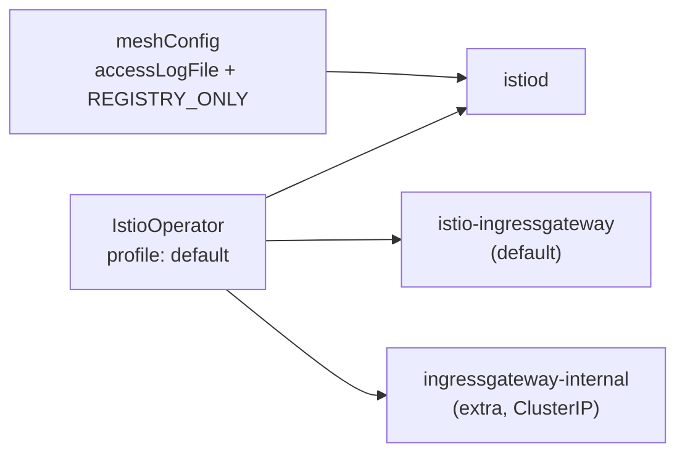

[Русская версия](README_RU.MD) · [Eng version](README.MD) · [Versión en español](README_ES.MD) · [Version française](README_FR.MD) · [Deutsche Version](README_DE.MD) · [繁體中文版](README_TW.MD) · [日本語版](README_JP.MD)

# Lab 15 - Installation & Configuration: Istio-ს ინსტალაციის მორგება (IstioOperator + MeshConfig)

> [საცნობარო გადაწყვეტა](worker/files/solutions/1_GE.MD)

## მიმოხილვა

ლაბორატორიების უმეტესობაში Istio უკვე დაინსტალირებულია. აქ ამოცანა საპირისპიროა: **Istio-ს
ინსტალაცია და კონკრეტული მოთხოვნების შესაბამისად კონფიგურაცია**. ეს *Installation,
Upgrade & Configuration* დომენის საკვანძო კომპეტენციაა - „Customizing your Istio Installation“.

Istio ინსტალირდება `istioctl install -f <ფაილი>` ბრძანებით, სადაც ფაილი
`IstioOperator`-ის მანიფესტია. მასში განვსაზღვრავთ:
- **profile** - კომპონენტების საბაზისო ნაკრებს (`default`, `minimal`, `demo`, ...);
- **meshConfig** - mesh-ის გლობალურ პარამეტრებს (ლოგირება, egress-ის პოლიტიკა და ა.შ.);
- **components** - რომელი კომპონენტები და რა რაოდენობით უნდა გაიშალოს (მაგალითად,
  რამდენიმე ingress-gateway).

ამ ლაბორატორიაში კლასტერი უკვე გაშვებულია (control-plane + worker), მაგრამ Istio **არ არის დაინსტალირებული** -
მისი ინსტალაცია თავად დავალებაა. `istioctl` წინასწარ არის დაინსტალირებული worker PC-ზე.



## ინფრასტრუქტურა

| კომპონენტი | ტიპი | რაოდენობა | როლი |
|---|---|---|---|
| control-plane | `t3.medium` | 1 | master + სამუშაო დატვირთვები (istiod, gateways) |
| worker | `t3.small` | 1 | დამატებითი რესურსი ორი gateway-სთვის |
| worker PC | `t3.small` | 1 | სამუშაო ადგილი: `kubectl`, `istioctl`, `check_result` |

რეგიონი: `eu-central-1` (AZ `eu-central-1a` / `eu-central-1b`).

## გაშლა

```bash
TASK=15 make run_ica_task
```

## დავალება

1. დაწერეთ `IstioOperator`-ის მანიფესტი `default` პროფილის საფუძველზე.
2. `meshConfig`-ში მიუთითეთ:
   - `accessLogFile: /dev/stdout` - Envoy-ის access-ლოგების stdout-ში ჩართვა;
   - `outboundTrafficPolicy.mode: REGISTRY_ONLY` - mesh-ის რეესტრში აღუწერელი
     ჰოსტებისკენ გამავალი ტრაფიკის დაბლოკვა.
3. სტანდარტული `istio-ingressgateway`-ის გვერდით დაამატეთ **მეორე** ingress-gateway
   `ingressgateway-internal`.
4. ამ მანიფესტით დააინსტალირეთ Istio და დარწმუნდით, რომ ყველაფერი გამოყენებულია.

## ნაბიჯი 1. IstioOperator-ის მანიფესტი

```bash
cat > custom-istio.yaml <<'EOF'
apiVersion: install.istio.io/v1alpha1
kind: IstioOperator
metadata:
  name: custom-istio
spec:
  profile: default
  meshConfig:
    accessLogFile: /dev/stdout
    outboundTrafficPolicy:
      mode: REGISTRY_ONLY
  components:
    ingressGateways:
      - name: istio-ingressgateway
        enabled: true
      - name: ingressgateway-internal
        enabled: true
        label:
          istio: ingressgateway-internal
        k8s:
          service:
            type: ClusterIP
EOF
```

## ნაბიჯი 2. ინსტალაცია

```bash
istioctl install -f custom-istio.yaml -y
```

## ნაბიჯი 3. შემოწმება

```bash
kubectl get pods -n istio-system
kubectl get deploy -n istio-system | grep -E 'ingressgateway'
kubectl get configmap istio -n istio-system -o jsonpath='{.data.mesh}' \
  | grep -E 'accessLogFile|outboundTrafficPolicy|REGISTRY_ONLY'
```

მოსალოდნელი შედეგი:
- `istiod` არის `Running` სტატუსში;
- ორი Deployment: `istio-ingressgateway` და `ingressgateway-internal` - ორივე მზადაა;
- configmap `istio`-ში არის `accessLogFile: /dev/stdout` და
  `outboundTrafficPolicy.mode: REGISTRY_ONLY`.

## განხილვა

- **profile: default** - გაშლის `istiod`-სა და ერთ ingress-gateway-ს. პროფილი
  საწყისი წერტილია, რომელზეც ჩვენს ცვლილებებს ვაშენებთ.
- **meshConfig** ხვდება configmap `istio`-ში (`mesh` გასაღები) და მას istiod კითხულობს. ამგვარად
  გლობალური პარამეტრები თავად Deployment-ების შეცვლის გარეშე კონფიგურირდება.
- **outboundTrafficPolicy: REGISTRY_ONLY** კრძალავს იმ გარე ჰოსტების გამოძახებას, რომლებიც
  `ServiceEntry`-ის საშუალებით არ არის აღწერილი (იხ. Lab 05). ნაგულისხმევი რეჟიმია `ALLOW_ANY`.
- **components.ingressGateways** რამდენიმე gateway-ს გაშლის საშუალებას იძლევა - ტიპური
  პატერნია, როდესაც გარესთან ერთად ცალკე შიდა gateway (`ClusterIP`) არის საჭირო.

## შედეგის შემოწმება

worker PC-ზე გაუშვით:

```bash
check_result
```

## შეჯამება

თქვენ Istio მორგებული `IstioOperator`-იდან დააინსტალირეთ: აირჩიეთ პროფილი, `meshConfig`-ის
საშუალებით mesh-ის გლობალური პარამეტრები განსაზღვრეთ და დამატებითი ingress-gateway
კომპონენტის სახით გაშალეთ. სწორედ ეს არის ICA პროგრამის უნარი „Customizing your Istio Installation“.
