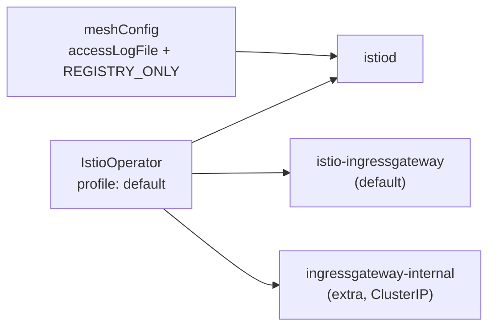

[Русская версия](README_RU.MD) · [Eng version](README.MD) · [Versión en español](README_ES.MD) · [Version française](README_FR.MD) · [Deutsche Version](README_DE.MD) · [ქართული ვერსია](README_GE.MD) · [繁體中文版](README_TW.MD)

# Lab 15 - インストールと設定: Istio インストールのカスタマイズ（IstioOperator + MeshConfig）

> [リファレンス解答](worker/files/solutions/1_JP.MD)

## 概要

ほとんどの Lab では Istio はすでにインストールされています。この Lab では逆に、**特定の要件に合わせて Istio をインストールおよび設定する**ことが課題です。これは
*Installation, Upgrade & Configuration* ドメインの「Customizing your Istio Installation」における重要なスキルです。

Istio は `istioctl install -f <ファイル>` でインストールします。ここでファイルは
`IstioOperator` マニフェストです。以下を指定します。
- **profile** - コンポーネントのベースセット（`default`、`minimal`、`demo`、...）。
- **meshConfig** - mesh のグローバル設定（ロギング、egress ポリシーなど）。
- **components** - デプロイするコンポーネントとその数（たとえば複数の ingress-gateway）。

この Lab ではクラスター（control-plane + worker）はすでに起動していますが、Istio は**インストールされていません**。
インストール自体が課題です。`istioctl` は worker PC に事前インストールされています。



## インフラストラクチャ

| コンポーネント | タイプ | 数 | 役割 |
|---|---|---|---|
| control-plane | `t3.medium` | 1 | master + ワークロード（istiod、gateways） |
| worker | `t3.small` | 1 | 2 つの gateway のための追加キャパシティ |
| worker PC | `t3.small` | 1 | ワークステーション: `kubectl`、`istioctl`、`check_result` |

リージョン: `eu-central-1`（AZ `eu-central-1a` / `eu-central-1b`）。

## デプロイ

```bash
TASK=15 make run_ica_task
```

## 課題

1. `default` プロファイルをベースに `IstioOperator` マニフェストを作成する。
2. `meshConfig` に以下を設定する。
   - `accessLogFile: /dev/stdout` - Envoy の access ログを stdout に出力する。
   - `outboundTrafficPolicy.mode: REGISTRY_ONLY` - mesh レジストリに記述されていない
     ホストへのアウトバウンドトラフィックをブロックする。
3. 標準の `istio-ingressgateway` に加えて、**2 つ目の** ingress-gateway
   `ingressgateway-internal` を追加する。
4. このマニフェストで Istio をインストールし、すべてが適用されたことを確認する。

## ステップ 1. IstioOperator マニフェスト

```bash
cat > custom-istio.yaml <<'EOF'
apiVersion: install.istio.io/v1alpha1
kind: IstioOperator
metadata:
  name: custom-istio
spec:
  profile: default
  meshConfig:
    accessLogFile: /dev/stdout
    outboundTrafficPolicy:
      mode: REGISTRY_ONLY
  components:
    ingressGateways:
      - name: istio-ingressgateway
        enabled: true
      - name: ingressgateway-internal
        enabled: true
        label:
          istio: ingressgateway-internal
        k8s:
          service:
            type: ClusterIP
EOF
```

## ステップ 2. インストール

```bash
istioctl install -f custom-istio.yaml -y
```

## ステップ 3. 確認

```bash
kubectl get pods -n istio-system
kubectl get deploy -n istio-system | grep -E 'ingressgateway'
kubectl get configmap istio -n istio-system -o jsonpath='{.data.mesh}' \
  | grep -E 'accessLogFile|outboundTrafficPolicy|REGISTRY_ONLY'
```

期待される結果:
- `istiod` が `Running` 状態である。
- 2 つの Deployment、`istio-ingressgateway` と `ingressgateway-internal` があり、両方とも準備完了している。
- configmap `istio` に `accessLogFile: /dev/stdout` および
  `outboundTrafficPolicy.mode: REGISTRY_ONLY` が存在する。

## 解説

- **profile: default** - `istiod` と 1 つの ingress-gateway をデプロイします。プロファイルは、
  その上に独自の変更を加えるための出発点です。
- **meshConfig** は configmap `istio`（キー `mesh`）に格納され、istiod によって読み取られます。これにより、
  Deployment 自体を編集せずにグローバルパラメータを設定できます。
- **outboundTrafficPolicy: REGISTRY_ONLY** は、`ServiceEntry`（Lab 05 を参照）で記述されていない
  外部ホストへの呼び出しを禁止します。デフォルトのモードは `ALLOW_ANY` です。
- **components.ingressGateways** では複数の gateway をデプロイできます。これは、外部向けに加えて
  専用の内部 gateway（`ClusterIP`）が必要な場合の典型的なパターンです。

## 結果の確認

worker PC で実行します。

```bash
check_result
```

## まとめ

カスタム `IstioOperator` から Istio をインストールしました。プロファイルを選択し、`meshConfig` で
mesh のグローバルパラメータを設定し、追加の ingress-gateway コンポーネントをデプロイしました。
これが ICA カリキュラムにおける「Customizing your Istio Installation」のスキルです。