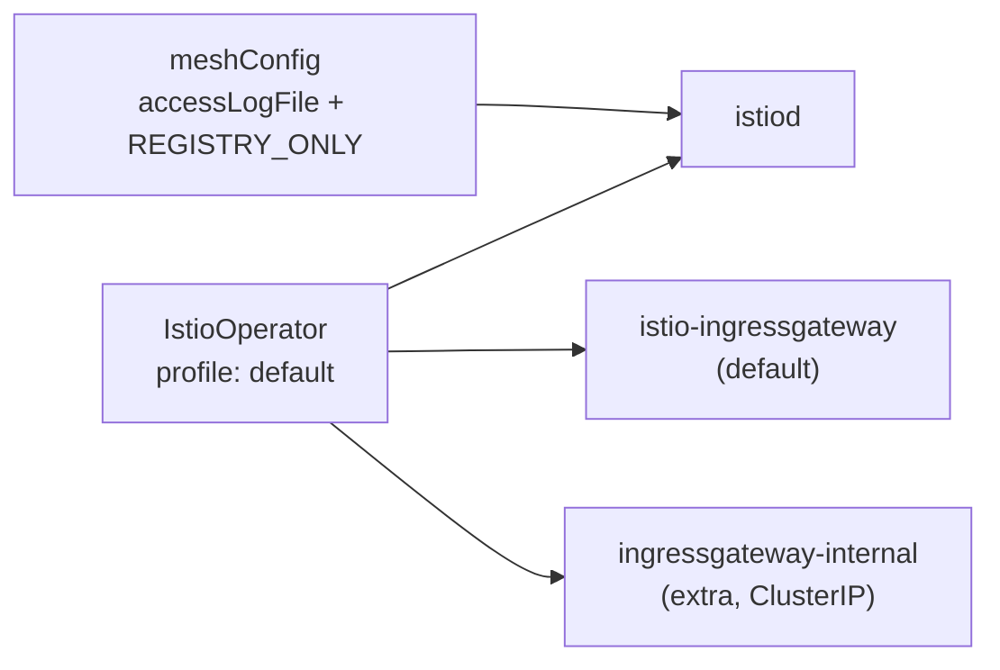

[Eng version](README.MD)

# Lab 15 — Installation & Configuration: кастомизация установки Istio (IstioOperator + MeshConfig)

## Обзор

В большинстве лаб Istio уже установлен за нас. Здесь задача обратная: **установить и
настроить Istio под конкретные требования**. Это ключевая компетенция домена
*Installation, Upgrade & Configuration* — «Customizing your Istio Installation».

Istio устанавливается через `istioctl install -f <файл>`, где файл — это манифест
`IstioOperator`. В нём мы задаём:
- **profile** — базовый набор компонентов (`default`, `minimal`, `demo`, ...);
- **meshConfig** — глобальные настройки mesh (логирование, политика egress и т.д.);
- **components** — какие компоненты и в каком количестве разворачивать (например,
  несколько ingress-gateway).

В этой лабе кластер уже поднят (control-plane + worker), но Istio **не установлен** —
установка это и есть задание. `istioctl` предустановлен на worker PC.



## Задание

1. Написать манифест `IstioOperator` на базе профиля `default`.
2. Задать в `meshConfig`:
   - `accessLogFile: /dev/stdout` — включить access-логи Envoy в stdout;
   - `outboundTrafficPolicy.mode: REGISTRY_ONLY` — блокировать исходящий трафик к
     хостам, не описанным в реестре mesh.
3. Добавить **второй** ingress-gateway `ingressgateway-internal` рядом со стандартным
   `istio-ingressgateway`.
4. Установить Istio этим манифестом и убедиться, что всё применилось.

## Шаг 1. Манифест IstioOperator

```bash
cat > custom-istio.yaml <<'EOF'
apiVersion: install.istio.io/v1alpha1
kind: IstioOperator
metadata:
  name: custom-istio
spec:
  profile: default
  meshConfig:
    accessLogFile: /dev/stdout
    outboundTrafficPolicy:
      mode: REGISTRY_ONLY
  components:
    ingressGateways:
      - name: istio-ingressgateway
        enabled: true
      - name: ingressgateway-internal
        enabled: true
        label:
          istio: ingressgateway-internal
        k8s:
          service:
            type: ClusterIP
EOF
```

## Шаг 2. Установка

```bash
istioctl install -f custom-istio.yaml -y
```

## Шаг 3. Проверка

```bash
kubectl get pods -n istio-system
kubectl get deploy -n istio-system | grep -E 'ingressgateway'
kubectl get configmap istio -n istio-system -o jsonpath='{.data.mesh}' \
  | grep -E 'accessLogFile|outboundTrafficPolicy|REGISTRY_ONLY'
```

Ожидаем:
- `istiod` в статусе `Running`;
- два деплоймента: `istio-ingressgateway` и `ingressgateway-internal` — оба готовы;
- в configmap `istio` присутствуют `accessLogFile: /dev/stdout` и
  `outboundTrafficPolicy.mode: REGISTRY_ONLY`.

## Разбор

- **profile: default** — разворачивает `istiod` и один ingress-gateway. Профиль —
  это стартовая точка, поверх которой мы накладываем свои изменения.
- **meshConfig** попадает в configmap `istio` (ключ `mesh`) и читается istiod-ом. Так
  настраиваются глобальные параметры без правки самих Deployment'ов.
- **outboundTrafficPolicy: REGISTRY_ONLY** запрещает вызовы к внешним хостам, которые
  не описаны через `ServiceEntry` (см. Lab 05). По умолчанию режим `ALLOW_ANY`.
- **components.ingressGateways** позволяет развернуть несколько шлюзов — типичный
  паттерн, когда нужен отдельный внутренний шлюз (`ClusterIP`) в дополнение к внешнему.

## Проверка результата

Запустите на worker PC:

```bash
check_result
```

## Итог

Вы установили Istio из кастомного `IstioOperator`: выбрали профиль, задали глобальные
параметры mesh через `meshConfig` и развернули дополнительный ingress-gateway
компонентом. Это и есть навык «Customizing your Istio Installation» из программы ICA.

## Инфраструктура

| Компонент | Тип | Кол-во | Роль |
|---|---|---|---|
| control-plane | `t3.medium` | 1 | master + рабочие нагрузки (istiod, gateways) |
| worker | `t3.small` | 1 | дополнительная ёмкость для двух gateway |
| worker PC | `t3.small` | 1 | рабочее место: `kubectl`, `istioctl`, `check_result` |

Регион: `eu-central-1` (AZ `eu-central-1a` / `eu-central-1b`).
