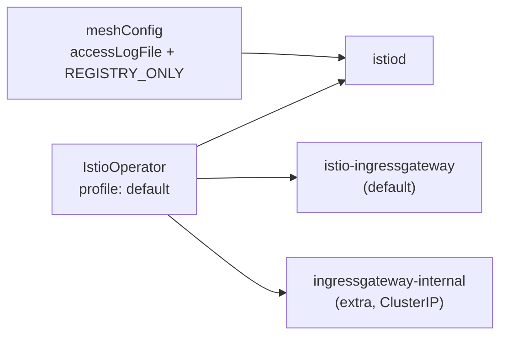

[Русская версия](README_RU.MD) · [Eng version](README.MD) · [Versión en español](README_ES.MD) · [Version française](README_FR.MD) · [Deutsche Version](README_DE.MD) · [ქართული ვერსია](README_GE.MD) · [日本語版](README_JP.MD)

# Lab 15 - 安裝與設定：自訂 Istio 安裝（IstioOperator + MeshConfig）

> [參考解答](worker/files/solutions/1_TW.MD)

## 概述

在大多數 lab 中，Istio 都已經預先安裝完成。這裡的任務正好相反：**依照特定需求安裝並設定 Istio**。這是 *Installation, Upgrade & Configuration* 領域中的一項關鍵能力--「Customizing your Istio Installation」。

Istio 透過 `istioctl install -f <檔案>` 安裝，其中的檔案是 `IstioOperator` 
manifest。在其中我們設定：
- **profile**--元件的基礎組合（`default`、`minimal`、`demo`、...）；
- **meshConfig**--mesh 的全域設定（記錄、egress 政策等）；
- **components**--要部署哪些元件以及部署數量（例如，多個 ingress-gateway）。

在此 lab 中，叢集已經啟動（control-plane + worker），但 Istio **尚未安裝**--安裝本身就是作業。`istioctl` 已預先安裝在 worker PC 上。



## 基礎設施

| 元件 | 類型 | 數量 | 角色 |
|---|---|---|---|
| control-plane | `t3.medium` | 1 | master + 工作負載（istiod、gateways） |
| worker | `t3.small` | 1 | 為兩個 gateway 提供額外容量 |
| worker PC | `t3.small` | 1 | 工作站：`kubectl`、`istioctl`、`check_result` |

區域：`eu-central-1`（AZ `eu-central-1a` / `eu-central-1b`）。

## 部署

```bash
TASK=15 make run_ica_task
```

## 作業

1. 以 `default` profile 為基礎撰寫 `IstioOperator` manifest。
2. 在 `meshConfig` 中設定：
   - `accessLogFile: /dev/stdout`--在 stdout 中啟用 Envoy access log；
   - `outboundTrafficPolicy.mode: REGISTRY_ONLY`--封鎖前往未在 mesh registry 中
     描述之主機的傳出流量。
3. 在標準 `istio-ingressgateway` 旁新增**第二個** ingress-gateway
   `ingressgateway-internal`。
4. 使用此 manifest 安裝 Istio，並確認所有設定皆已套用。

## 步驟 1：IstioOperator manifest

```bash
cat > custom-istio.yaml <<'EOF'
apiVersion: install.istio.io/v1alpha1
kind: IstioOperator
metadata:
  name: custom-istio
spec:
  profile: default
  meshConfig:
    accessLogFile: /dev/stdout
    outboundTrafficPolicy:
      mode: REGISTRY_ONLY
  components:
    ingressGateways:
      - name: istio-ingressgateway
        enabled: true
      - name: ingressgateway-internal
        enabled: true
        label:
          istio: ingressgateway-internal
        k8s:
          service:
            type: ClusterIP
EOF
```

## 步驟 2：安裝

```bash
istioctl install -f custom-istio.yaml -y
```

## 步驟 3：驗證

```bash
kubectl get pods -n istio-system
kubectl get deploy -n istio-system | grep -E 'ingressgateway'
kubectl get configmap istio -n istio-system -o jsonpath='{.data.mesh}' \
  | grep -E 'accessLogFile|outboundTrafficPolicy|REGISTRY_ONLY'
```

預期結果：
- `istiod` 處於 `Running` 狀態；
- 兩個 deployment：`istio-ingressgateway` 與 `ingressgateway-internal`--兩者均已就緒；
- configmap `istio` 中存在 `accessLogFile: /dev/stdout` 與
  `outboundTrafficPolicy.mode: REGISTRY_ONLY`。

## 說明

- **profile: default**--部署 `istiod` 和一個 ingress-gateway。profile 是我們在其上套用自身變更的起點。
- **meshConfig** 會寫入 configmap `istio`（鍵為 `mesh`），並由 istiod 讀取。藉此可在不修改 Deployment 本身的情況下設定全域參數。
- **outboundTrafficPolicy: REGISTRY_ONLY** 禁止呼叫未透過 `ServiceEntry` 描述的外部主機（請參閱 Lab 05）。預設模式為 `ALLOW_ANY`。
- **components.ingressGateways** 可部署多個 gateway--當除了外部 gateway 外還需要獨立的內部 gateway（`ClusterIP`）時，這是一種常見模式。

## 結果驗證

在 worker PC 上執行：

```bash
check_result
```

## 總結

您已透過自訂 `IstioOperator` 安裝 Istio：選擇 profile、透過 `meshConfig` 設定 mesh 的全域參數，並以元件方式部署額外的 ingress-gateway。這正是 ICA 課程中「Customizing your Istio Installation」的技能。
