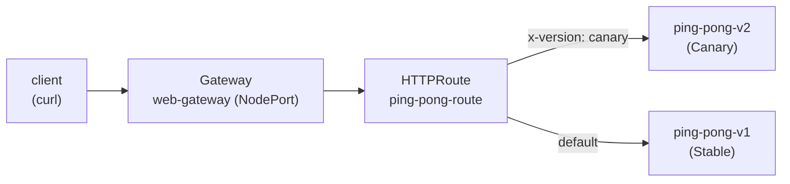

[RU version](README_RU.MD) · [Versión en español](README_ES.MD) · [Version française](README_FR.MD) · [Deutsche Version](README_DE.MD)

# Lab 16 - Kubernetes Gateway API: ingress routing with Gateway + HTTPRoute

## Overview

Istio has traditionally managed ingress traffic through its own CRDs - `Gateway`
(networking.istio.io) and `VirtualService`. The industry is gradually moving to the
**Kubernetes Gateway API** - a vendor-neutral standard (`gateway.networking.k8s.io`)
that Istio fully implements and considers the future API for traffic management.

In this lab you configure the same ingress routing, but with the Gateway API:
- `Gateway` - the entry point (a listener on a port/protocol);
- `HTTPRoute` - routing rules (by host, path, headers, weights).

Istio is already installed (`default` profile), the Gateway API CRDs (`v1.2.1`) are
applied, and the `ping-pong` app (two versions v1/v2) is deployed in namespace `app`.



## Infrastructure

| Component | Type | Count | Role |
|---|---|---|---|
| control-plane | `t3.medium` | 1 | master + istiod + gateway pod |
| worker | `t3.small` | 1 | capacity for the app and the gateway |
| worker PC | `t3.small` | 1 | workstation: `kubectl`, `check_result` |

Region: `eu-central-1` (AZ `eu-central-1a` / `eu-central-1b`).

## Provisioning

```bash
TASK=16 make run_ica_task
```

## Task

1. Deploy the application (manifest `1.yaml`).
2. Create a `Gateway` named `web-gateway` in namespace `app` with
   `gatewayClassName: istio` and an HTTP listener on port 80. Annotate it so Istio
   provisions a **NodePort** Service (this environment has no cloud load balancer).
3. Create an `HTTPRoute` named `ping-pong-route` attached to `web-gateway`:
   - requests with header `x-version: canary` → service `ping-pong-v2`;
   - all other requests → service `ping-pong-v1`.
4. Verify the routing through the NodePort.

## Step 1. Deploy the application

```bash
kubectl apply -f https://raw.githubusercontent.com/ViktorUJ/cks/refs/heads/master/tasks/ica/labs/16/k8s-1/scripts/1.yaml
kubectl get pods -n app
```

Each pod should be `2/2` (app + istio-proxy sidecar).

## Step 2. Create a Gateway

```bash
cat > gateway.yaml <<'EOF'
apiVersion: gateway.networking.k8s.io/v1
kind: Gateway
metadata:
  name: web-gateway
  namespace: app
  annotations:
    networking.istio.io/service-type: NodePort
spec:
  gatewayClassName: istio
  listeners:
    - name: http
      protocol: HTTP
      port: 80
      allowedRoutes:
        namespaces:
          from: Same
EOF

kubectl apply -f gateway.yaml
```

Istio auto-provisions a Deployment and Service named `web-gateway-istio` in the `app`
namespace:

```bash
kubectl get gateway web-gateway -n app
kubectl get deploy,svc web-gateway-istio -n app
```

## Step 3. Create an HTTPRoute

```bash
cat > httproute.yaml <<'EOF'
apiVersion: gateway.networking.k8s.io/v1
kind: HTTPRoute
metadata:
  name: ping-pong-route
  namespace: app
spec:
  parentRefs:
    - name: web-gateway
  rules:
    - matches:
        - headers:
            - name: x-version
              value: canary
      backendRefs:
        - name: ping-pong-v2
          port: 8080
    - backendRefs:
        - name: ping-pong-v1
          port: 8080
EOF

kubectl apply -f httproute.yaml
```

## Step 4. Verify routing

```bash
NODEPORT=$(kubectl get svc web-gateway-istio -n app -o jsonpath='{.spec.ports[?(@.port==80)].nodePort}')

# default -> v1
curl -s http://myapp.local:${NODEPORT}/

# canary header -> v2
curl -s -H "x-version: canary" http://myapp.local:${NODEPORT}/
```

Expected: the default request returns `Ping-Pong-V1 (Stable)`, and the request with the
`x-version: canary` header returns `Ping-Pong-V2 (Canary)`.

## Istio API vs Gateway API

| Concept | Istio API | Kubernetes Gateway API |
|---|---|---|
| Entry point | `Gateway` (networking.istio.io) | `Gateway` (gateway.networking.k8s.io) |
| Routing rules | `VirtualService` | `HTTPRoute` |
| Backend | `host` + `subset` (+ `DestinationRule`) | `backendRefs` |
| Gateway pod | shared `istio-ingressgateway` | auto-provisioned per `Gateway` |
| Portability | Istio-specific | vendor-neutral standard |

## Check the result

Run on the worker PC:

```bash
check_result
```

## Summary

You configured ingress routing with the Kubernetes Gateway API: a `Gateway` as the
entry point and an `HTTPRoute` with header-based routing. Istio provisioned the gateway
pod for that `Gateway` automatically. This is the modern, portable way to manage
ingress traffic that the whole ecosystem is moving toward.
