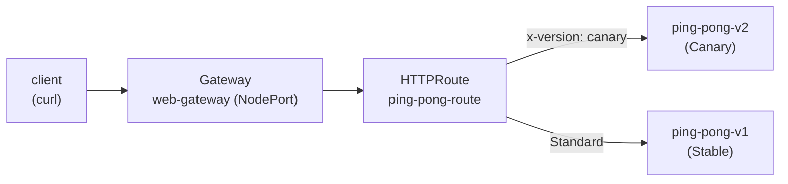

[RU version](README_RU.MD) · [Eng version](README.MD) · [Versión en español](README_ES.MD) · [Version française](README_FR.MD)

# Lab 16 - Kubernetes Gateway API: Ingress-Routing über Gateway + HTTPRoute

## Überblick

Istio steuert eingehenden Traffic historisch über seine eigenen CRDs - `Gateway`
(networking.istio.io) und `VirtualService`. Die Branche wechselt schrittweise zur
**Kubernetes Gateway API** - einem herstellerneutralen Standard (`gateway.networking.k8s.io`),
den Istio vollständig implementiert und als zukünftiges API für Traffic Management betrachtet.

In diesem Lab richten Sie dasselbe Ingress-Routing ein, aber mit den Mitteln der Gateway API:
- `Gateway` - der Einstiegspunkt (Listener auf Port/Protokoll);
- `HTTPRoute` - Routing-Regeln (nach Host, Pfad, Header, Gewichtung).

Istio ist bereits installiert (Profil `default`), die CRDs der Gateway API (`v1.2.1`) sind
angewendet, und die Anwendung `ping-pong` (zwei Versionen v1/v2) ist im Namespace `app` ausgerollt.



## Infrastruktur

| Komponente | Typ | Anzahl | Rolle |
|---|---|---|---|
| control-plane | `t3.medium` | 1 | master + istiod + Gateway-Pod |
| worker | `t3.small` | 1 | Kapazität für Anwendung und Gateway |
| worker PC | `t3.small` | 1 | Arbeitsplatz: `kubectl`, `check_result` |

Region: `eu-central-1` (AZ `eu-central-1a` / `eu-central-1b`).

## Deployment

```bash
TASK=16 make run_ica_task
```

## Aufgabe

1. Die Anwendung ausrollen (Manifest `1.yaml`).
2. Ein `Gateway` `web-gateway` im Namespace `app` mit `gatewayClassName: istio` erstellen,
   HTTP-Listener auf Port 80. Es so annotieren, dass Istio einen Service vom Typ
   **NodePort** erstellt (im Stand gibt es keinen Cloud-Load-Balancer).
3. Ein `HTTPRoute` `ping-pong-route` erstellen, das an `web-gateway` gebunden ist:
   - Anfragen mit dem Header `x-version: canary` → Service `ping-pong-v2`;
   - übrige Anfragen → Service `ping-pong-v1`.
4. Das Routing über NodePort prüfen.

## Schritt 1. Anwendung ausrollen

```bash
kubectl apply -f https://raw.githubusercontent.com/ViktorUJ/cks/refs/heads/master/tasks/ica/labs/16/k8s-1/scripts/1.yaml
kubectl get pods -n app
```

Jeder Pod sollte `2/2` sein (Anwendung + Sidecar istio-proxy).

## Schritt 2. Gateway erstellen

```bash
cat > gateway.yaml <<'EOF'
apiVersion: gateway.networking.k8s.io/v1
kind: Gateway
metadata:
  name: web-gateway
  namespace: app
  annotations:
    networking.istio.io/service-type: NodePort
spec:
  gatewayClassName: istio
  listeners:
    - name: http
      protocol: HTTP
      port: 80
      allowedRoutes:
        namespaces:
          from: Same
EOF

kubectl apply -f gateway.yaml
```

Istio rollt automatisch ein Deployment und einen Service `web-gateway-istio` im Namespace
`app` aus:

```bash
kubectl get gateway web-gateway -n app
kubectl get deploy,svc web-gateway-istio -n app
```

## Schritt 3. HTTPRoute erstellen

```bash
cat > httproute.yaml <<'EOF'
apiVersion: gateway.networking.k8s.io/v1
kind: HTTPRoute
metadata:
  name: ping-pong-route
  namespace: app
spec:
  parentRefs:
    - name: web-gateway
  rules:
    - matches:
        - headers:
            - name: x-version
              value: canary
      backendRefs:
        - name: ping-pong-v2
          port: 8080
    - backendRefs:
        - name: ping-pong-v1
          port: 8080
EOF

kubectl apply -f httproute.yaml
```

## Schritt 4. Routing prüfen

```bash
NODEPORT=$(kubectl get svc web-gateway-istio -n app -o jsonpath='{.spec.ports[?(@.port==80)].nodePort}')

# Standard -> v1
curl -s http://myapp.local:${NODEPORT}/

# Header canary -> v2
curl -s -H "x-version: canary" http://myapp.local:${NODEPORT}/
```

Wir erwarten: Eine normale Anfrage liefert `Ping-Pong-V1 (Stable)`, und eine Anfrage mit dem Header
`x-version: canary` liefert `Ping-Pong-V2 (Canary)`.

## Istio API gegen Gateway API

| Konzept | Istio API | Kubernetes Gateway API |
|---|---|---|
| Einstiegspunkt | `Gateway` (networking.istio.io) | `Gateway` (gateway.networking.k8s.io) |
| Routing-Regeln | `VirtualService` | `HTTPRoute` |
| Backend | `host` + `subset` (+ `DestinationRule`) | `backendRefs` |
| Gateway-Pod | gemeinsames `istio-ingressgateway` | Auto-Ausrollen pro `Gateway` |
| Portabilität | spezifisch für Istio | herstellerneutraler Standard |

## Ergebnisprüfung

Führen Sie auf dem worker PC aus:

```bash
check_result
```

## Fazit

Sie haben das Ingress-Routing über die Kubernetes Gateway API eingerichtet: `Gateway` als
Einstiegspunkt und `HTTPRoute` mit header-basiertem Routing. Istio hat den Gateway-Pod für dieses
`Gateway` selbst ausgerollt. Das ist die moderne, portable Art, eingehenden Traffic zu verwalten,
in deren Richtung sich das gesamte Ökosystem bewegt.
