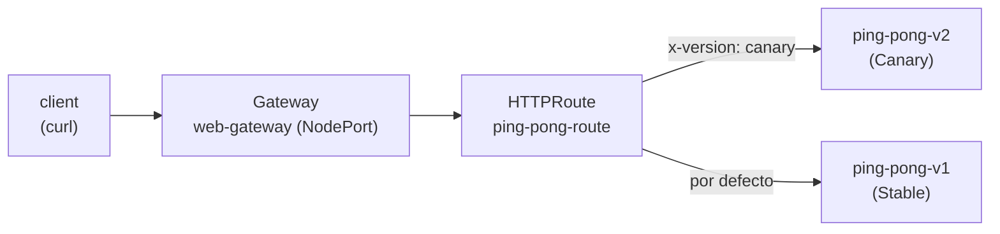

[RU version](README_RU.MD) · [Eng version](README.MD) · [Version française](README_FR.MD) · [Deutsche Version](README_DE.MD)

# Lab 16 - Kubernetes Gateway API: enrutamiento de ingress con Gateway + HTTPRoute

## Descripción general

Históricamente Istio gestiona el tráfico entrante mediante sus propios CRD - `Gateway`
(networking.istio.io) y `VirtualService`. La industria migra progresivamente hacia la
**Kubernetes Gateway API** - un estándar neutral respecto al proveedor (`gateway.networking.k8s.io`),
que Istio implementa por completo y considera la API del futuro para la gestión del tráfico.

En este lab configurarás el mismo enrutamiento de ingress, pero con la Gateway API:
- `Gateway` - punto de entrada (listener en un puerto/protocolo);
- `HTTPRoute` - reglas de enrutamiento (por host, ruta, cabeceras, pesos).

Istio ya está instalado (perfil `default`), los CRD de la Gateway API (`v1.2.1`) están
aplicados y la aplicación `ping-pong` (dos versiones v1/v2) está desplegada en el namespace `app`.



## Tarea

1. Desplegar la aplicación (manifiesto `1.yaml`).
2. Crear un `Gateway` `web-gateway` en el namespace `app` con `gatewayClassName: istio`,
   un listener HTTP en el puerto 80. Anotarlo de modo que Istio cree un servicio de tipo
   **NodePort** (el entorno no tiene un balanceador de carga en la nube).
3. Crear un `HTTPRoute` `ping-pong-route`, vinculado a `web-gateway`:
   - las peticiones con la cabecera `x-version: canary` → servicio `ping-pong-v2`;
   - el resto de las peticiones → servicio `ping-pong-v1`.
4. Verificar el enrutamiento a través de NodePort.

## Paso 1. Desplegar la aplicación

```bash
kubectl apply -f https://raw.githubusercontent.com/ViktorUJ/cks/refs/heads/master/tasks/ica/labs/16/k8s-1/scripts/1.yaml
kubectl get pods -n app
```

Cada pod debe estar `2/2` (aplicación + sidecar istio-proxy).

## Paso 2. Crear el Gateway

```bash
cat > gateway.yaml <<'EOF'
apiVersion: gateway.networking.k8s.io/v1
kind: Gateway
metadata:
  name: web-gateway
  namespace: app
  annotations:
    networking.istio.io/service-type: NodePort
spec:
  gatewayClassName: istio
  listeners:
    - name: http
      protocol: HTTP
      port: 80
      allowedRoutes:
        namespaces:
          from: Same
EOF

kubectl apply -f gateway.yaml
```

Istio desplegará automáticamente un Deployment y un Service `web-gateway-istio` en el
namespace `app`:

```bash
kubectl get gateway web-gateway -n app
kubectl get deploy,svc web-gateway-istio -n app
```

## Paso 3. Crear el HTTPRoute

```bash
cat > httproute.yaml <<'EOF'
apiVersion: gateway.networking.k8s.io/v1
kind: HTTPRoute
metadata:
  name: ping-pong-route
  namespace: app
spec:
  parentRefs:
    - name: web-gateway
  rules:
    - matches:
        - headers:
            - name: x-version
              value: canary
      backendRefs:
        - name: ping-pong-v2
          port: 8080
    - backendRefs:
        - name: ping-pong-v1
          port: 8080
EOF

kubectl apply -f httproute.yaml
```

## Paso 4. Verificar el enrutamiento

```bash
NODEPORT=$(kubectl get svc web-gateway-istio -n app -o jsonpath='{.spec.ports[?(@.port==80)].nodePort}')

# por defecto -> v1
curl -s http://myapp.local:${NODEPORT}/

# cabecera canary -> v2
curl -s -H "x-version: canary" http://myapp.local:${NODEPORT}/
```

Esperamos: la petición normal devuelve `Ping-Pong-V1 (Stable)`, y la petición con la cabecera
`x-version: canary` - `Ping-Pong-V2 (Canary)`.

## Istio API frente a Gateway API

| Concepto | Istio API | Kubernetes Gateway API |
|---|---|---|
| Punto de entrada | `Gateway` (networking.istio.io) | `Gateway` (gateway.networking.k8s.io) |
| Reglas de enrutamiento | `VirtualService` | `HTTPRoute` |
| Backend | `host` + `subset` (+ `DestinationRule`) | `backendRefs` |
| Pod del gateway | `istio-ingressgateway` compartido | despliegue automático por cada `Gateway` |
| Portabilidad | específico de Istio | estándar neutral respecto al proveedor |

## Verificación del resultado

Ejecuta en el worker PC:

```bash
check_result
```

## Conclusión

Configuraste el enrutamiento de ingress mediante la Kubernetes Gateway API: `Gateway` como punto
de entrada y `HTTPRoute` con enrutamiento basado en cabeceras. Istio desplegó por sí mismo el pod del
gateway para este `Gateway`. Es la forma moderna y portable de gestionar el tráfico entrante, hacia
la que se mueve todo el ecosistema.

## Infraestructura

| Componente | Tipo | Cantidad | Rol |
|---|---|---|---|
| control-plane | `t3.medium` | 1 | master + istiod + pod del gateway |
| worker | `t3.small` | 1 | capacidad para la aplicación y el gateway |
| worker PC | `t3.small` | 1 | puesto de trabajo: `kubectl`, `check_result` |

Región: `eu-central-1` (AZ `eu-central-1a` / `eu-central-1b`).
