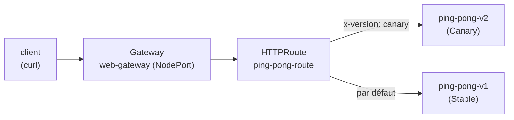

[RU version](README_RU.MD) · [Eng version](README.MD) · [Versión en español](README_ES.MD) · [Deutsche Version](README_DE.MD)

# Lab 16 - Kubernetes Gateway API : routage ingress via Gateway + HTTPRoute

## Vue d'ensemble

Historiquement, Istio gère le trafic entrant via ses propres CRD - `Gateway`
(networking.istio.io) et `VirtualService`. L'industrie migre progressivement vers le
**Kubernetes Gateway API** - un standard neutre vis-à-vis des fournisseurs
(`gateway.networking.k8s.io`), qu'Istio implémente pleinement et considère comme l'API
d'avenir pour le traffic management.

Dans ce lab, vous configurerez le même routage ingress, mais avec les moyens du Gateway API :
- `Gateway` - point d'entrée (écouteur sur un port/protocole) ;
- `HTTPRoute` - règles de routage (par hôte, chemin, en-têtes, poids).

Istio est déjà installé (profil `default`), les CRD du Gateway API (`v1.2.1`) sont
appliquées, l'application `ping-pong` (deux versions v1/v2) est déployée dans le namespace `app`.



## Tâche

1. Déployer l'application (manifeste `1.yaml`).
2. Créer un `Gateway` `web-gateway` dans le namespace `app` avec `gatewayClassName: istio`,
   un écouteur HTTP sur le port 80. L'annoter de sorte qu'Istio crée un service de type
   **NodePort** (il n'y a pas de load balancer cloud dans l'environnement).
3. Créer un `HTTPRoute` `ping-pong-route`, rattaché à `web-gateway` :
   - les requêtes avec l'en-tête `x-version: canary` → service `ping-pong-v2` ;
   - les autres requêtes → service `ping-pong-v1`.
4. Vérifier le routage via NodePort.

## Étape 1. Déployer l'application

```bash
kubectl apply -f https://raw.githubusercontent.com/ViktorUJ/cks/refs/heads/master/tasks/ica/labs/16/k8s-1/scripts/1.yaml
kubectl get pods -n app
```

Chaque pod doit être `2/2` (application + sidecar istio-proxy).

## Étape 2. Créer le Gateway

```bash
cat > gateway.yaml <<'EOF'
apiVersion: gateway.networking.k8s.io/v1
kind: Gateway
metadata:
  name: web-gateway
  namespace: app
  annotations:
    networking.istio.io/service-type: NodePort
spec:
  gatewayClassName: istio
  listeners:
    - name: http
      protocol: HTTP
      port: 80
      allowedRoutes:
        namespaces:
          from: Same
EOF

kubectl apply -f gateway.yaml
```

Istio déploie automatiquement le Deployment et le Service `web-gateway-istio` dans le
namespace `app` :

```bash
kubectl get gateway web-gateway -n app
kubectl get deploy,svc web-gateway-istio -n app
```

## Étape 3. Créer le HTTPRoute

```bash
cat > httproute.yaml <<'EOF'
apiVersion: gateway.networking.k8s.io/v1
kind: HTTPRoute
metadata:
  name: ping-pong-route
  namespace: app
spec:
  parentRefs:
    - name: web-gateway
  rules:
    - matches:
        - headers:
            - name: x-version
              value: canary
      backendRefs:
        - name: ping-pong-v2
          port: 8080
    - backendRefs:
        - name: ping-pong-v1
          port: 8080
EOF

kubectl apply -f httproute.yaml
```

## Étape 4. Vérification du routage

```bash
NODEPORT=$(kubectl get svc web-gateway-istio -n app -o jsonpath='{.spec.ports[?(@.port==80)].nodePort}')

# par défaut -> v1
curl -s http://myapp.local:${NODEPORT}/

# en-tête canary -> v2
curl -s -H "x-version: canary" http://myapp.local:${NODEPORT}/
```

Résultat attendu : une requête normale renvoie `Ping-Pong-V1 (Stable)`, tandis qu'une
requête avec l'en-tête `x-version: canary` renvoie `Ping-Pong-V2 (Canary)`.

## Istio API contre Gateway API

| Concept | Istio API | Kubernetes Gateway API |
|---|---|---|
| Point d'entrée | `Gateway` (networking.istio.io) | `Gateway` (gateway.networking.k8s.io) |
| Règles de routage | `VirtualService` | `HTTPRoute` |
| Backend | `host` + `subset` (+ `DestinationRule`) | `backendRefs` |
| Pod du gateway | `istio-ingressgateway` partagé | auto-déploiement par `Gateway` |
| Portabilité | spécifique à Istio | standard neutre vis-à-vis des fournisseurs |

## Vérification du résultat

Lancez sur le worker PC :

```bash
check_result
```

## Conclusion

Vous avez configuré le routage ingress via le Kubernetes Gateway API : `Gateway` comme
point d'entrée et `HTTPRoute` avec un routage basé sur les en-têtes. Istio a lui-même
déployé le pod du gateway pour ce `Gateway`. C'est une façon moderne et portable de gérer
le trafic entrant, vers laquelle se dirige tout l'écosystème.

## Infrastructure

| Composant | Type | Nombre | Rôle |
|---|---|---|---|
| control-plane | `t3.medium` | 1 | master + istiod + pod du gateway |
| worker | `t3.small` | 1 | capacité pour l'application et le gateway |
| worker PC | `t3.small` | 1 | poste de travail : `kubectl`, `check_result` |

Région : `eu-central-1` (AZ `eu-central-1a` / `eu-central-1b`).
