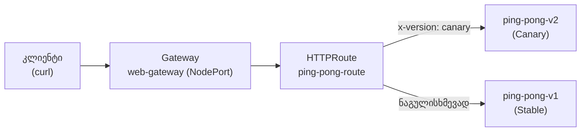

[Русская версия](README_RU.MD) · [Eng version](README.MD) · [Versión en español](README_ES.MD) · [Version française](README_FR.MD) · [Deutsche Version](README_DE.MD) · [繁體中文版](README_TW.MD) · [日本語版](README_JP.MD)

# Lab 16 - Kubernetes Gateway API: ingress-როუტინგი Gateway + HTTPRoute-ის საშუალებით

> [საცნობარო გადაწყვეტა](worker/files/solutions/1_GE.MD)

## მიმოხილვა

ისტორიულად Istio შემომავალ ტრაფიკს საკუთარი CRD-ების - `Gateway`-ის
(networking.istio.io) და `VirtualService`-ის საშუალებით მართავს. ინდუსტრია თანდათან გადადის
**Kubernetes Gateway API**-ზე - მომწოდებლისგან დამოუკიდებელ სტანდარტზე (`gateway.networking.k8s.io`),
რომელსაც Istio სრულად ახორციელებს და traffic management-ის მომავალ API-დ მიიჩნევს.

ამ ლაბორატორიაში იმავე ingress-როუტინგს Gateway API-ის საშუალებებით დააკონფიგურირებთ:
- `Gateway` - შესვლის წერტილი (მსმენელი პორტზე/პროტოკოლზე);
- `HTTPRoute` - მარშრუტიზაციის წესები (ჰოსტის, გზის, სათაურების, წონების მიხედვით).

Istio უკვე დაინსტალირებულია (`default` პროფილი), Gateway API-ის CRD-ები (`v1.2.1`) გამოყენებულია,
ხოლო `ping-pong` აპლიკაცია (ორი ვერსია v1/v2) გაშლილია `app` namespace-ში.



## ინფრასტრუქტურა

| კომპონენტი | ტიპი | რაოდენობა | როლი |
|---|---|---|---|
| control-plane | `t3.medium` | 1 | master + istiod + gateway-პოდი |
| worker | `t3.small` | 1 | რესურსი აპლიკაციისა და gateway-სთვის |
| worker PC | `t3.small` | 1 | სამუშაო ადგილი: `kubectl`, `check_result` |

რეგიონი: `eu-central-1` (AZ `eu-central-1a` / `eu-central-1b`).

## გაშლა

```bash
TASK=16 make run_ica_task
```

## დავალება

1. გაშალეთ აპლიკაცია (მანიფესტი `1.yaml`).
2. შექმენით `Gateway` `web-gateway` `app` namespace-ში `gatewayClassName: istio`-თი და
   HTTP მსმენელით მე-80 პორტზე. დაამატეთ ისეთი ანოტაცია, რომ Istio-მ **NodePort** ტიპის
   სერვისი შექმნას (სტენდში ღრუბლოვანი დატვირთვის დამბალანსებელი არ არის).
3. შექმენით `web-gateway`-ზე მიბმული `HTTPRoute` `ping-pong-route`:
   - მოთხოვნები `x-version: canary` სათაურით → სერვისი `ping-pong-v2`;
   - დანარჩენი მოთხოვნები → სერვისი `ping-pong-v1`.
4. შეამოწმეთ მარშრუტიზაცია NodePort-ის საშუალებით.

## ნაბიჯი 1. აპლიკაციის გაშლა

```bash
kubectl apply -f https://raw.githubusercontent.com/ViktorUJ/cks/refs/heads/master/tasks/ica/labs/16/k8s-1/scripts/1.yaml
kubectl get pods -n app
```

თითოეული პოდი უნდა იყოს `2/2` (აპლიკაცია + sidecar istio-proxy).

## ნაბიჯი 2. Gateway-ის შექმნა

```bash
cat > gateway.yaml <<'EOF'
apiVersion: gateway.networking.k8s.io/v1
kind: Gateway
metadata:
  name: web-gateway
  namespace: app
  annotations:
    networking.istio.io/service-type: NodePort
spec:
  gatewayClassName: istio
  listeners:
    - name: http
      protocol: HTTP
      port: 80
      allowedRoutes:
        namespaces:
          from: Same
EOF

kubectl apply -f gateway.yaml
```

Istio ავტომატურად გაშლის Deployment-სა და Service-ს `web-gateway-istio` `app`
namespace-ში:

```bash
kubectl get gateway web-gateway -n app
kubectl get deploy,svc web-gateway-istio -n app
```

## ნაბიჯი 3. HTTPRoute-ის შექმნა

```bash
cat > httproute.yaml <<'EOF'
apiVersion: gateway.networking.k8s.io/v1
kind: HTTPRoute
metadata:
  name: ping-pong-route
  namespace: app
spec:
  parentRefs:
    - name: web-gateway
  rules:
    - matches:
        - headers:
            - name: x-version
              value: canary
      backendRefs:
        - name: ping-pong-v2
          port: 8080
    - backendRefs:
        - name: ping-pong-v1
          port: 8080
EOF

kubectl apply -f httproute.yaml
```

## ნაბიჯი 4. მარშრუტიზაციის შემოწმება

```bash
NODEPORT=$(kubectl get svc web-gateway-istio -n app -o jsonpath='{.spec.ports[?(@.port==80)].nodePort}')

# ნაგულისხმევად -> v1
curl -s http://myapp.local:${NODEPORT}/

# canary სათაური -> v2
curl -s -H "x-version: canary" http://myapp.local:${NODEPORT}/
```

მოსალოდნელია: ჩვეულებრივი მოთხოვნა დააბრუნებს `Ping-Pong-V1 (Stable)`-ს, ხოლო მოთხოვნა
`x-version: canary` სათაურით - `Ping-Pong-V2 (Canary)`-ს.

## Istio API და Gateway API

| ცნება | Istio API | Kubernetes Gateway API |
|---|---|---|
| შესვლის წერტილი | `Gateway` (networking.istio.io) | `Gateway` (gateway.networking.k8s.io) |
| როუტინგის წესები | `VirtualService` | `HTTPRoute` |
| ბეკენდი | `host` + `subset` (+ `DestinationRule`) | `backendRefs` |
| gateway-ს პოდი | საერთო `istio-ingressgateway` | ავტომატური გაშლა თითოეული `Gateway`-სთვის |
| პორტაბელურობა | სპეციფიკურია Istio-სთვის | მომწოდებლისგან დამოუკიდებელი სტანდარტი |

## შედეგის შემოწმება

გაუშვით worker PC-ზე:

```bash
check_result
```

## შედეგი

თქვენ ingress-მარშრუტიზაცია Kubernetes Gateway API-ის საშუალებით დააკონფიგურირეთ: `Gateway`,
როგორც შესვლის წერტილი, და `HTTPRoute` სათაურზე დაფუძნებული როუტინგით. Istio-მ თავად გაშალა
ამ `Gateway`-სთვის განკუთვნილი gateway-ს პოდი. ეს შემომავალი ტრაფიკის მართვის თანამედროვე,
პორტაბელური მეთოდია, რომლისკენაც მთელი ეკოსისტემა ვითარდება.
