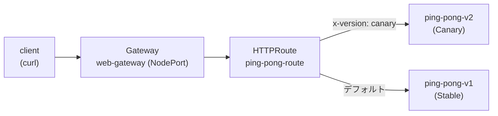

[Русская версия](README_RU.MD) · [Eng version](README.MD) · [Versión en español](README_ES.MD) · [Version française](README_FR.MD) · [Deutsche Version](README_DE.MD) · [ქართული ვერსია](README_GE.MD) · [繁體中文版](README_TW.MD)

# Lab 16 - Kubernetes Gateway API: Gateway + HTTPRoute による ingress ルーティング

> [リファレンス解答](worker/files/solutions/1_JP.MD)

## 概要

Istio は歴史的に、独自の CRD である `Gateway`
(networking.istio.io) と `VirtualService` によって受信トラフィックを管理してきました。業界は徐々に
**Kubernetes Gateway API**、すなわちベンダー中立の標準 (`gateway.networking.k8s.io`) へ移行しており、
Istio はこれを完全に実装し、traffic management の将来の API と位置付けています。

このラボでは、Gateway API を使用して同じ ingress ルーティングを設定します。
- `Gateway` - エントリーポイント（ポート/プロトコルのリスナー）。
- `HTTPRoute` - ルーティングルール（ホスト、パス、ヘッダー、重みによる）。

Istio はすでにインストール済み（プロファイル `default`）、Gateway API の CRD (`v1.2.1`) は適用済みであり、
アプリケーション `ping-pong`（v1/v2 の 2 バージョン）は namespace `app` にデプロイされています。



## インフラストラクチャ

| コンポーネント | タイプ | 数 | 役割 |
|---|---|---|---|
| control-plane | `t3.medium` | 1 | master + istiod + gateway-pod |
| worker | `t3.small` | 1 | アプリケーションとゲートウェイの容量 |
| worker PC | `t3.small` | 1 | ワークステーション: `kubectl`、`check_result` |

リージョン: `eu-central-1` (AZ `eu-central-1a` / `eu-central-1b`)。

## デプロイ

```bash
TASK=16 make run_ica_task
```

## 課題

1. アプリケーションをデプロイする（マニフェスト `1.yaml`）。
2. namespace `app` に `gatewayClassName: istio` を持つ `Gateway` `web-gateway` を作成し、
   ポート 80 に HTTP リスナーを設定する。Istio が **NodePort** タイプの Service を作成するよう
   アノテーションを付与する（この環境にはクラウドロードバランサーがありません）。
3. `web-gateway` に関連付けた `HTTPRoute` `ping-pong-route` を作成する。
   - ヘッダー `x-version: canary` を持つリクエスト → Service `ping-pong-v2`。
   - それ以外のリクエスト → Service `ping-pong-v1`。
4. NodePort 経由でルーティングを確認する。

## ステップ 1. アプリケーションをデプロイする

```bash
kubectl apply -f https://raw.githubusercontent.com/ViktorUJ/cks/refs/heads/master/tasks/ica/labs/16/k8s-1/scripts/1.yaml
kubectl get pods -n app
```

各 Pod は `2/2`（アプリケーション + sidecar istio-proxy）になっている必要があります。

## ステップ 2. Gateway を作成する

```bash
cat > gateway.yaml <<'EOF'
apiVersion: gateway.networking.k8s.io/v1
kind: Gateway
metadata:
  name: web-gateway
  namespace: app
  annotations:
    networking.istio.io/service-type: NodePort
spec:
  gatewayClassName: istio
  listeners:
    - name: http
      protocol: HTTP
      port: 80
      allowedRoutes:
        namespaces:
          from: Same
EOF

kubectl apply -f gateway.yaml
```

Istio は namespace `app` に Deployment と Service `web-gateway-istio` を自動的に
デプロイします。

```bash
kubectl get gateway web-gateway -n app
kubectl get deploy,svc web-gateway-istio -n app
```

## ステップ 3. HTTPRoute を作成する

```bash
cat > httproute.yaml <<'EOF'
apiVersion: gateway.networking.k8s.io/v1
kind: HTTPRoute
metadata:
  name: ping-pong-route
  namespace: app
spec:
  parentRefs:
    - name: web-gateway
  rules:
    - matches:
        - headers:
            - name: x-version
              value: canary
      backendRefs:
        - name: ping-pong-v2
          port: 8080
    - backendRefs:
        - name: ping-pong-v1
          port: 8080
EOF

kubectl apply -f httproute.yaml
```

## ステップ 4. ルーティングを確認する

```bash
NODEPORT=$(kubectl get svc web-gateway-istio -n app -o jsonpath='{.spec.ports[?(@.port==80)].nodePort}')

# デフォルト -> v1
curl -s http://myapp.local:${NODEPORT}/

# canary ヘッダー -> v2
curl -s -H "x-version: canary" http://myapp.local:${NODEPORT}/
```

期待結果: 通常のリクエストは `Ping-Pong-V1 (Stable)` を返し、ヘッダー
`x-version: canary` を持つリクエストは `Ping-Pong-V2 (Canary)` を返します。

## Istio API と Gateway API

| 概念 | Istio API | Kubernetes Gateway API |
|---|---|---|
| エントリーポイント | `Gateway` (networking.istio.io) | `Gateway` (gateway.networking.k8s.io) |
| ルーティングルール | `VirtualService` | `HTTPRoute` |
| バックエンド | `host` + `subset` (+ `DestinationRule`) | `backendRefs` |
| ゲートウェイ Pod | 共有の `istio-ingressgateway` | 各 `Gateway` に自動デプロイ |
| ポータビリティ | Istio 固有 | ベンダー中立の標準 |

## 結果の確認

worker PC で次を実行します。

```bash
check_result
```

## まとめ

Kubernetes Gateway API による ingress ルーティングを設定しました。`Gateway` をエントリーポイントとして使用し、
ヘッダーベースのルーティングを持つ `HTTPRoute` を設定しました。Istio はこの
`Gateway` 用の gateway Pod を自動的にデプロイします。これは、エコシステム全体が移行しつつある、
受信トラフィックを管理するためのモダンでポータブルな方法です。
