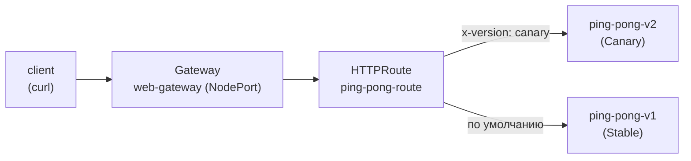

[Eng version](README.MD) · [Versión en español](README_ES.MD) · [Version française](README_FR.MD) · [Deutsche Version](README_DE.MD)

# Lab 16 - Kubernetes Gateway API: ingress-роутинг через Gateway + HTTPRoute

## Обзор

Istio исторически управляет входящим трафиком через свои CRD - `Gateway`
(networking.istio.io) и `VirtualService`. Индустрия постепенно переходит на
**Kubernetes Gateway API** - вендор-нейтральный стандарт (`gateway.networking.k8s.io`),
который Istio полноценно реализует и считает будущим API для traffic management.

В этой лабе вы настроите тот же ingress-роутинг, но средствами Gateway API:
- `Gateway` - точка входа (слушатель на порту/протоколе);
- `HTTPRoute` - правила маршрутизации (по хосту, пути, заголовкам, весам).

Istio уже установлен (профиль `default`), CRD Gateway API (`v1.2.1`) применены,
приложение `ping-pong` (две версии v1/v2) развёрнуто в namespace `app`.



## Задание

1. Развернуть приложение (манифест `1.yaml`).
2. Создать `Gateway` `web-gateway` в namespace `app` с `gatewayClassName: istio`,
   слушатель HTTP на порту 80. Аннотировать его так, чтобы Istio создал сервис типа
   **NodePort** (в стенде нет облачного балансировщика).
3. Создать `HTTPRoute` `ping-pong-route`, привязанный к `web-gateway`:
   - запросы с заголовком `x-version: canary` → сервис `ping-pong-v2`;
   - остальные запросы → сервис `ping-pong-v1`.
4. Проверить маршрутизацию через NodePort.

## Шаг 1. Развернуть приложение

```bash
kubectl apply -f https://raw.githubusercontent.com/ViktorUJ/cks/refs/heads/master/tasks/ica/labs/16/k8s-1/scripts/1.yaml
kubectl get pods -n app
```

Каждый под должен быть `2/2` (приложение + sidecar istio-proxy).

## Шаг 2. Создать Gateway

```bash
cat > gateway.yaml <<'EOF'
apiVersion: gateway.networking.k8s.io/v1
kind: Gateway
metadata:
  name: web-gateway
  namespace: app
  annotations:
    networking.istio.io/service-type: NodePort
spec:
  gatewayClassName: istio
  listeners:
    - name: http
      protocol: HTTP
      port: 80
      allowedRoutes:
        namespaces:
          from: Same
EOF

kubectl apply -f gateway.yaml
```

Istio автоматически развернёт Deployment и Service `web-gateway-istio` в namespace
`app`:

```bash
kubectl get gateway web-gateway -n app
kubectl get deploy,svc web-gateway-istio -n app
```

## Шаг 3. Создать HTTPRoute

```bash
cat > httproute.yaml <<'EOF'
apiVersion: gateway.networking.k8s.io/v1
kind: HTTPRoute
metadata:
  name: ping-pong-route
  namespace: app
spec:
  parentRefs:
    - name: web-gateway
  rules:
    - matches:
        - headers:
            - name: x-version
              value: canary
      backendRefs:
        - name: ping-pong-v2
          port: 8080
    - backendRefs:
        - name: ping-pong-v1
          port: 8080
EOF

kubectl apply -f httproute.yaml
```

## Шаг 4. Проверка маршрутизации

```bash
NODEPORT=$(kubectl get svc web-gateway-istio -n app -o jsonpath='{.spec.ports[?(@.port==80)].nodePort}')

# по умолчанию -> v1
curl -s http://myapp.local:${NODEPORT}/

# заголовок canary -> v2
curl -s -H "x-version: canary" http://myapp.local:${NODEPORT}/
```

Ожидаем: обычный запрос вернёт `Ping-Pong-V1 (Stable)`, а запрос с заголовком
`x-version: canary` - `Ping-Pong-V2 (Canary)`.

## Istio API против Gateway API

| Понятие | Istio API | Kubernetes Gateway API |
|---|---|---|
| Точка входа | `Gateway` (networking.istio.io) | `Gateway` (gateway.networking.k8s.io) |
| Правила роутинга | `VirtualService` | `HTTPRoute` |
| Бэкенд | `host` + `subset` (+ `DestinationRule`) | `backendRefs` |
| Под шлюза | общий `istio-ingressgateway` | авто-развёртывание на каждый `Gateway` |
| Переносимость | специфично для Istio | вендор-нейтральный стандарт |

## Проверка результата

Запустите на worker PC:

```bash
check_result
```

## Итог

Вы настроили ingress-маршрутизацию через Kubernetes Gateway API: `Gateway` как точку
входа и `HTTPRoute` с header-based роутингом. Istio сам развернул под шлюза под этот
`Gateway`. Это современный, переносимый способ управления входящим трафиком, на который
двигается вся экосистема.

## Инфраструктура

| Компонент | Тип | Кол-во | Роль |
|---|---|---|---|
| control-plane | `t3.medium` | 1 | master + istiod + gateway-под |
| worker | `t3.small` | 1 | ёмкость для приложения и шлюза |
| worker PC | `t3.small` | 1 | рабочее место: `kubectl`, `check_result` |

Регион: `eu-central-1` (AZ `eu-central-1a` / `eu-central-1b`).
