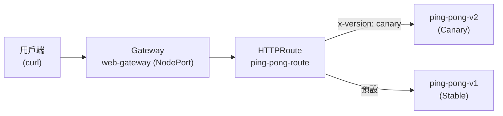

[Русская версия](README_RU.MD) · [Eng version](README.MD) · [Versión en español](README_ES.MD) · [Version française](README_FR.MD) · [Deutsche Version](README_DE.MD) · [ქართული ვერსია](README_GE.MD) · [日本語版](README_JP.MD)

# Lab 16 - Kubernetes Gateway API：透過 Gateway + HTTPRoute 進行 Ingress 路由

> [參考解答](worker/files/solutions/1_TW.MD)

## 概覽

Istio 歷來透過自身的 CRD--`Gateway`
(networking.istio.io) 與 `VirtualService`--管理傳入流量。業界正逐步轉向
**Kubernetes Gateway API**--一個供應商中立的標準（`gateway.networking.k8s.io`），
Istio 已完整實作，並將其視為流量管理的未來 API。

在本實驗中，您將使用 Gateway API 設定相同的 Ingress 路由：
- `Gateway`--入口點（指定連接埠／協定的監聽器）；
- `HTTPRoute`--路由規則（依主機、路徑、標頭、權重）。

Istio 已安裝（`default` 設定檔），Gateway API CRD（`v1.2.1`）已套用，
`ping-pong` 應用程式（兩個版本 v1/v2）已部署在 namespace `app` 中。



## 基礎設施

| 元件 | 類型 | 數量 | 角色 |
|---|---|---|---|
| control-plane | `t3.medium` | 1 | master + istiod + gateway-pod |
| worker | `t3.small` | 1 | 應用程式與閘道的容量 |
| worker PC | `t3.small` | 1 | 工作站：`kubectl`、`check_result` |

區域：`eu-central-1`（AZ `eu-central-1a` / `eu-central-1b`）。

## 部署

```bash
TASK=16 make run_ica_task
```

## 任務

1. 部署應用程式（manifest `1.yaml`）。
2. 在 namespace `app` 中建立 `Gateway` `web-gateway`，並設定 `gatewayClassName: istio`，
   使用連接埠 80 上的 HTTP 監聽器。為其新增註解，讓 Istio 建立 **NodePort** 類型的服務
   （此環境沒有雲端負載平衡器）。
3. 建立綁定至 `web-gateway` 的 `HTTPRoute` `ping-pong-route`：
   - 帶有 `x-version: canary` 標頭的請求 → 服務 `ping-pong-v2`；
   - 其他請求 → 服務 `ping-pong-v1`。
4. 透過 NodePort 驗證路由。

## 步驟 1：部署應用程式

```bash
kubectl apply -f https://raw.githubusercontent.com/ViktorUJ/cks/refs/heads/master/tasks/ica/labs/16/k8s-1/scripts/1.yaml
kubectl get pods -n app
```

每個 Pod 都應為 `2/2`（應用程式 + istio-proxy sidecar）。

## 步驟 2：建立 Gateway

```bash
cat > gateway.yaml <<'EOF'
apiVersion: gateway.networking.k8s.io/v1
kind: Gateway
metadata:
  name: web-gateway
  namespace: app
  annotations:
    networking.istio.io/service-type: NodePort
spec:
  gatewayClassName: istio
  listeners:
    - name: http
      protocol: HTTP
      port: 80
      allowedRoutes:
        namespaces:
          from: Same
EOF

kubectl apply -f gateway.yaml
```

Istio 會在 namespace `app` 中自動部署 Deployment 與 Service `web-gateway-istio`：

```bash
kubectl get gateway web-gateway -n app
kubectl get deploy,svc web-gateway-istio -n app
```

## 步驟 3：建立 HTTPRoute

```bash
cat > httproute.yaml <<'EOF'
apiVersion: gateway.networking.k8s.io/v1
kind: HTTPRoute
metadata:
  name: ping-pong-route
  namespace: app
spec:
  parentRefs:
    - name: web-gateway
  rules:
    - matches:
        - headers:
            - name: x-version
              value: canary
      backendRefs:
        - name: ping-pong-v2
          port: 8080
    - backendRefs:
        - name: ping-pong-v1
          port: 8080
EOF

kubectl apply -f httproute.yaml
```

## 步驟 4：驗證路由

```bash
NODEPORT=$(kubectl get svc web-gateway-istio -n app -o jsonpath='{.spec.ports[?(@.port==80)].nodePort}')

# 預設 -> v1
curl -s http://myapp.local:${NODEPORT}/

# canary 標頭 -> v2
curl -s -H "x-version: canary" http://myapp.local:${NODEPORT}/
```

預期結果：一般請求將回傳 `Ping-Pong-V1 (Stable)`，而帶有
`x-version: canary` 標頭的請求將回傳 `Ping-Pong-V2 (Canary)`。

## Istio API 與 Gateway API 的比較

| 概念 | Istio API | Kubernetes Gateway API |
|---|---|---|
| 入口點 | `Gateway` (networking.istio.io) | `Gateway` (gateway.networking.k8s.io) |
| 路由規則 | `VirtualService` | `HTTPRoute` |
| 後端 | `host` + `subset` (+ `DestinationRule`) | `backendRefs` |
| 閘道 Pod | 共用的 `istio-ingressgateway` | 每個 `Gateway` 自動部署 |
| 可攜性 | Istio 特有 | 供應商中立標準 |

## 結果驗證

請在 worker PC 上執行：

```bash
check_result
```

## 總結

您已透過 Kubernetes Gateway API 設定 Ingress 路由：以 `Gateway` 作為入口點，
並使用具備以標頭為基礎路由的 `HTTPRoute`。Istio 會自行為此 `Gateway` 部署閘道 Pod。
這是現代、可攜的傳入流量管理方式，整個生態系統正朝此方向發展。