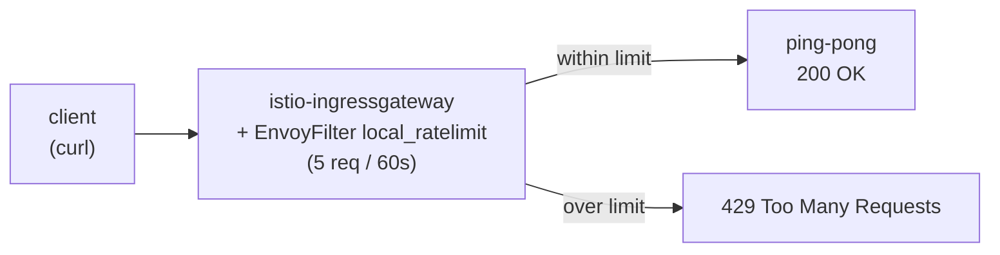

[RU version](README_RU.MD) · [Versión en español](README_ES.MD)

# Lab 17 - Rate Limiting: local rate limit with EnvoyFilter

## Overview

Rate limiting protects services from overload, abuse, and DoS. Istio offers two
approaches:

- **Local rate limit** - each Envoy keeps its own token bucket. Simple, no external
  dependencies, configured via an `EnvoyFilter`.
- **Global rate limit** - Envoy calls an external rate-limit service (usually backed by
  Redis) so the limit is shared across all replicas.

In this lab you configure a **local** rate limit on the ingress gateway: at most 5
requests per minute, everything else gets `429 Too Many Requests`.

Istio is already installed (ingress gateway on NodePort `32080`), the `ping-pong` app
is deployed in namespace `app` and exposed through the gateway at
`http://myapp.local:32080/`.



## Task

1. Confirm the app is reachable (`200`).
2. Apply an `EnvoyFilter` with the `envoy.filters.http.local_ratelimit` filter on the
   ingress gateway (`workloadSelector: istio=ingressgateway`, `context: GATEWAY`) with a
   token bucket of 5 tokens, refilling 5 every 60 seconds.
3. Confirm that once the tokens are exhausted, requests are rejected with `429`.

## Step 1. Baseline

```bash
curl -s -o /dev/null -w "%{http_code}\n" http://myapp.local:32080/
# -> 200
```

## Step 2. Apply the local rate limit

```bash
cat > ratelimit.yaml <<'EOF'
apiVersion: networking.istio.io/v1alpha3
kind: EnvoyFilter
metadata:
  name: ingress-local-rate-limit
  namespace: istio-system
spec:
  workloadSelector:
    labels:
      istio: ingressgateway
  configPatches:
    - applyTo: HTTP_FILTER
      match:
        context: GATEWAY
        listener:
          filterChain:
            filter:
              name: envoy.filters.network.http_connection_manager
      patch:
        operation: INSERT_BEFORE
        value:
          name: envoy.filters.http.local_ratelimit
          typed_config:
            "@type": type.googleapis.com/udpa.type.v1.TypedStruct
            type_url: type.googleapis.com/envoy.extensions.filters.http.local_ratelimit.v3.LocalRateLimit
            value:
              stat_prefix: http_local_rate_limiter
              token_bucket:
                max_tokens: 5
                tokens_per_fill: 5
                fill_interval: 60s
              filter_enabled:
                runtime_key: local_rate_limit_enabled
                default_value:
                  numerator: 100
                  denominator: HUNDRED
              filter_enforced:
                runtime_key: local_rate_limit_enforced
                default_value:
                  numerator: 100
                  denominator: HUNDRED
              response_headers_to_add:
                - append_action: OVERWRITE_IF_EXISTS_OR_ADD
                  header:
                    key: x-local-rate-limit
                    value: "true"
EOF

kubectl apply -f ratelimit.yaml
```

## Step 3. Verify

```bash
for i in $(seq 10); do
  curl -s -o /dev/null -w "%{http_code}\n" http://myapp.local:32080/
done
# first ~5 -> 200, the rest -> 429
```

## How it works

- **`token_bucket`** - `max_tokens: 5`, `tokens_per_fill: 5`, `fill_interval: 60s`:
  the bucket holds 5 tokens and refills to 5 every 60 seconds. Each request consumes a
  token; when the bucket is empty, requests are rejected with `429`.
- **`filter_enabled` / `filter_enforced`** - the fraction of requests the filter is
  active on and actually enforces (both `100%` here).
- **context: GATEWAY** - the filter is inserted into the ingress gateway's listener, so
  the limit applies to all inbound traffic at the edge.

## Local vs Global

- **Local** (this lab) - a token bucket per Envoy. Simple, but with multiple gateway
  replicas the effective limit multiplies by their count.
- **Global** - Envoy calls an external rate-limit service (with Redis), so the limit is
  shared across all replicas. It uses the `envoy.filters.http.ratelimit` filter plus a
  ConfigMap of descriptors and a deployed ratelimit service. Use it when you need an
  exact cluster-wide quota.

## Check the result

Run on the worker PC:

```bash
check_result
```

## Summary

You configured a local rate limit on the ingress gateway with an `EnvoyFilter` - a
basic overload-protection mechanism with no external dependencies - and learned how it
differs from global rate limiting. Working with `EnvoyFilter` is a key senior skill for
fine-tuning the Envoy data plane beyond Istio's standard CRDs.

## Infrastructure

| Component | Type | Count | Role |
|---|---|---|---|
| control-plane | `t3.medium` | 1 | master + istiod + ingress gateway |
| worker | `t3.small` | 1 | capacity for the app |
| worker PC | `t3.small` | 1 | workstation: `kubectl`, `curl`, `check_result` |

Region: `eu-central-1` (AZ `eu-central-1a` / `eu-central-1b`).
