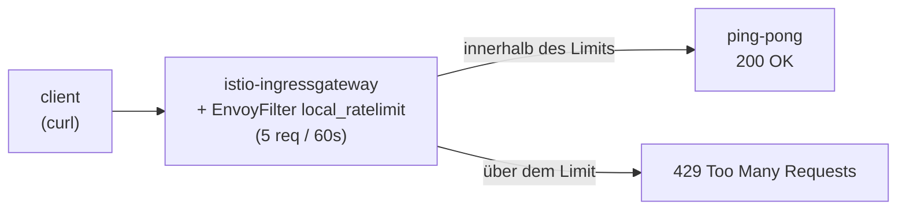

[RU version](README_RU.MD) · [Eng version](README.MD) · [Versión en español](README_ES.MD) · [Version française](README_FR.MD)

# Lab 17 - Rate Limiting: lokale Anfragebegrenzung über EnvoyFilter

## Überblick

Rate Limiting (Begrenzung der Anfragehäufigkeit) schützt Services vor Überlast, Missbrauch und
DoS. In Istio gibt es zwei Ansätze:

- **Local rate limit** - jeder Envoy hält seinen eigenen Token Bucket. Einfach, ohne
  externe Abhängigkeiten, konfiguriert über `EnvoyFilter`.
- **Global rate limit** - Envoy wendet sich an einen externen Rate-Limit-Service (in der Regel mit
  Redis), das Limit gilt gemeinsam für alle Replicas.

In diesem Lab konfigurieren Sie ein **lokales** Rate Limit am Ingress-Gateway: nicht mehr als 5
Anfragen pro Minute, der Rest wird mit `429 Too Many Requests` abgewiesen.

Istio ist bereits installiert (Ingress Gateway auf NodePort `32080`), die Anwendung `ping-pong` ist
im Namespace `app` ausgerollt und über das Gateway unter `http://myapp.local:32080/` veröffentlicht.



## Infrastruktur

| Komponente | Typ | Anzahl | Rolle |
|---|---|---|---|
| control-plane | `t3.medium` | 1 | master + istiod + Ingress Gateway |
| worker | `t3.small` | 1 | Kapazität für die Anwendung |
| worker PC | `t3.small` | 1 | Arbeitsplatz: `kubectl`, `curl`, `check_result` |

Region: `eu-central-1` (AZ `eu-central-1a` / `eu-central-1b`).

## Deployment

```bash
TASK=17 make run_ica_task
```

## Aufgabe

1. Prüfen, dass die Anwendung erreichbar ist (`200`).
2. Einen `EnvoyFilter` mit dem Filter `envoy.filters.http.local_ratelimit` am
   Ingress-Gateway anwenden (`workloadSelector: istio=ingressgateway`, `context: GATEWAY`) mit
   Token Bucket: 5 Tokens, Refill 5 alle 60 Sekunden.
3. Sicherstellen, dass Anfragen nach dem Aufbrauchen der Tokens mit `429` abgewiesen werden.

## Schritt 1. Basisprüfung

```bash
curl -s -o /dev/null -w "%{http_code}\n" http://myapp.local:32080/
# -> 200
```

## Schritt 2. Lokales Rate Limit anwenden

```bash
cat > ratelimit.yaml <<'EOF'
apiVersion: networking.istio.io/v1alpha3
kind: EnvoyFilter
metadata:
  name: ingress-local-rate-limit
  namespace: istio-system
spec:
  workloadSelector:
    labels:
      istio: ingressgateway
  configPatches:
    - applyTo: HTTP_FILTER
      match:
        context: GATEWAY
        listener:
          filterChain:
            filter:
              name: envoy.filters.network.http_connection_manager
      patch:
        operation: INSERT_BEFORE
        value:
          name: envoy.filters.http.local_ratelimit
          typed_config:
            "@type": type.googleapis.com/udpa.type.v1.TypedStruct
            type_url: type.googleapis.com/envoy.extensions.filters.http.local_ratelimit.v3.LocalRateLimit
            value:
              stat_prefix: http_local_rate_limiter
              token_bucket:
                max_tokens: 5
                tokens_per_fill: 5
                fill_interval: 60s
              filter_enabled:
                runtime_key: local_rate_limit_enabled
                default_value:
                  numerator: 100
                  denominator: HUNDRED
              filter_enforced:
                runtime_key: local_rate_limit_enforced
                default_value:
                  numerator: 100
                  denominator: HUNDRED
              response_headers_to_add:
                - append_action: OVERWRITE_IF_EXISTS_OR_ADD
                  header:
                    key: x-local-rate-limit
                    value: "true"
EOF

kubectl apply -f ratelimit.yaml
```

## Schritt 3. Prüfung

```bash
for i in $(seq 10); do
  curl -s -o /dev/null -w "%{http_code}\n" http://myapp.local:32080/
done
# die ersten ~5 -> 200, der Rest -> 429
```

## Wie das funktioniert

- **`token_bucket`** - `max_tokens: 5`, `tokens_per_fill: 5`, `fill_interval: 60s`:
  im Bucket liegen 5 Tokens, alle 60s wird er wieder auf 5 aufgefüllt. Jede Anfrage nimmt ein Token;
  wenn keine Tokens vorhanden sind - `429`.
- **`filter_enabled` / `filter_enforced`** - der Anteil der Anfragen, bei denen der Filter aktiviert
  ist und tatsächlich angewendet wird (hier jeweils 100%).
- **context: GATEWAY** - der Filter wird in den Listener des Ingress-Gateways eingebettet, daher gilt
  das Limit für den gesamten eingehenden Traffic an der Mesh-Grenze.

## Local gegen Global

- **Local** (dieses Lab) - eigener Token Bucket bei jedem Envoy. Einfach, aber bei mehreren
  Gateway-Replicas multipliziert sich das tatsächliche Limit mit deren Anzahl.
- **Global** - Envoy ruft einen externen Rate-Limit-Service (mit Redis) auf, das Limit gilt gemeinsam
  für alle Replicas. Nutzt den Filter `envoy.filters.http.ratelimit` + ConfigMap mit Deskriptoren
  und einen ausgerollten Ratelimit-Service. Notwendig, wenn eine exakte Quote für den gesamten
  Cluster erforderlich ist.

## Ergebnisprüfung

Führen Sie auf dem worker PC aus:

```bash
check_result
```

## Fazit

Sie haben ein lokales Rate Limit am Ingress-Gateway über `EnvoyFilter` konfiguriert - ein
grundlegender Mechanismus zum Schutz vor Überlast ohne externe Abhängigkeiten - und verstanden,
worin es sich vom globalen unterscheidet. Die Arbeit mit `EnvoyFilter` ist eine wichtige
Senior-Fähigkeit für die Feinabstimmung des Envoy Data Plane jenseits der Standard-CRDs von Istio.
