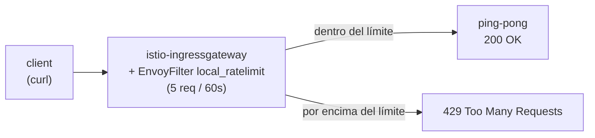

[RU version](README_RU.MD) · [Eng version](README.MD) · [Version française](README_FR.MD) · [Deutsche Version](README_DE.MD)

# Lab 17 - Rate Limiting: limitación local de peticiones mediante EnvoyFilter

## Descripción general

El rate limiting (limitación de la frecuencia de peticiones) protege los servicios contra la
sobrecarga, el abuso y el DoS. En Istio hay dos enfoques:

- **Local rate limit** - cada Envoy mantiene su propio token bucket. Es sencillo, sin
  dependencias externas, y se configura mediante `EnvoyFilter`.
- **Global rate limit** - Envoy consulta a un servicio externo de rate limit (habitualmente con
  Redis); el límite es común para todas las réplicas.

En este lab configurarás un rate limit **local** en el ingress gateway: no más de 5
peticiones por minuto, el resto - `429 Too Many Requests`.

Istio ya está instalado (ingress gateway en NodePort `32080`), la aplicación `ping-pong`
está desplegada en el namespace `app` y publicada a través del gateway en `http://myapp.local:32080/`.



## Tarea

1. Comprobar que la aplicación está accesible (`200`).
2. Aplicar un `EnvoyFilter` con el filtro `envoy.filters.http.local_ratelimit` en el
   ingress gateway (`workloadSelector: istio=ingressgateway`, `context: GATEWAY`) con un
   token bucket: 5 tokens, refill de 5 cada 60 segundos.
3. Asegurarte de que, tras agotar los tokens, las peticiones se rechazan con `429`.

## Paso 1. Comprobación básica

```bash
curl -s -o /dev/null -w "%{http_code}\n" http://myapp.local:32080/
# -> 200
```

## Paso 2. Aplicar el rate limit local

```bash
cat > ratelimit.yaml <<'EOF'
apiVersion: networking.istio.io/v1alpha3
kind: EnvoyFilter
metadata:
  name: ingress-local-rate-limit
  namespace: istio-system
spec:
  workloadSelector:
    labels:
      istio: ingressgateway
  configPatches:
    - applyTo: HTTP_FILTER
      match:
        context: GATEWAY
        listener:
          filterChain:
            filter:
              name: envoy.filters.network.http_connection_manager
      patch:
        operation: INSERT_BEFORE
        value:
          name: envoy.filters.http.local_ratelimit
          typed_config:
            "@type": type.googleapis.com/udpa.type.v1.TypedStruct
            type_url: type.googleapis.com/envoy.extensions.filters.http.local_ratelimit.v3.LocalRateLimit
            value:
              stat_prefix: http_local_rate_limiter
              token_bucket:
                max_tokens: 5
                tokens_per_fill: 5
                fill_interval: 60s
              filter_enabled:
                runtime_key: local_rate_limit_enabled
                default_value:
                  numerator: 100
                  denominator: HUNDRED
              filter_enforced:
                runtime_key: local_rate_limit_enforced
                default_value:
                  numerator: 100
                  denominator: HUNDRED
              response_headers_to_add:
                - append_action: OVERWRITE_IF_EXISTS_OR_ADD
                  header:
                    key: x-local-rate-limit
                    value: "true"
EOF

kubectl apply -f ratelimit.yaml
```

## Paso 3. Verificación

```bash
for i in $(seq 10); do
  curl -s -o /dev/null -w "%{http_code}\n" http://myapp.local:32080/
done
# las primeras ~5 -> 200, el resto -> 429
```

## Cómo funciona

- **`token_bucket`** - `max_tokens: 5`, `tokens_per_fill: 5`, `fill_interval: 60s`:
  en el bucket hay 5 tokens, y cada 60s se repone hasta 5. Cada petición retira un token;
  cuando no hay tokens - `429`.
- **`filter_enabled` / `filter_enforced`** - la fracción de peticiones sobre las que el filtro está
  activado y realmente se aplica (aquí el 100% en ambos casos).
- **context: GATEWAY** - el filtro se incorpora al listener del ingress gateway, por lo que el
  límite actúa sobre todo el tráfico entrante en el borde del mesh.

## Local frente a Global

- **Local** (este lab) - un token bucket propio en cada Envoy. Sencillo, pero con varias
  réplicas del gateway el límite efectivo se multiplica por su número.
- **Global** - Envoy invoca a un servicio externo de rate limit (con Redis); el límite es común para
  todas las réplicas. Usa el filtro `envoy.filters.http.ratelimit` + un ConfigMap con descriptores
  y un servicio de ratelimit desplegado. Es necesario cuando se requiere una cuota exacta para todo
  el clúster.

## Verificación del resultado

Ejecuta en el worker PC:

```bash
check_result
```

## Conclusión

Configuraste un rate limit local en el ingress gateway mediante `EnvoyFilter` - un mecanismo básico
de protección contra la sobrecarga sin dependencias externas, y entendiste en qué se diferencia del
global. Trabajar con `EnvoyFilter` es una habilidad senior importante para el ajuste fino del
data plane de Envoy más allá de los CRD estándar de Istio.

## Infraestructura

| Componente | Tipo | Cantidad | Rol |
|---|---|---|---|
| control-plane | `t3.medium` | 1 | master + istiod + ingress gateway |
| worker | `t3.small` | 1 | capacidad para la aplicación |
| worker PC | `t3.small` | 1 | puesto de trabajo: `kubectl`, `curl`, `check_result` |

Región: `eu-central-1` (AZ `eu-central-1a` / `eu-central-1b`).
