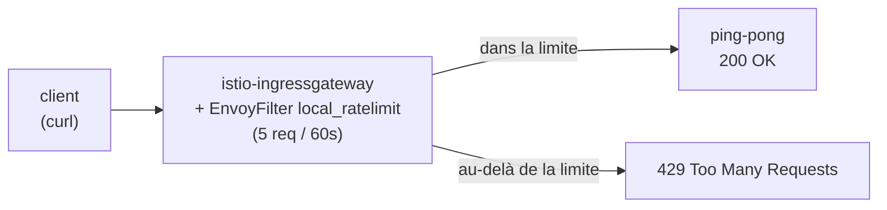

[RU version](README_RU.MD) · [Eng version](README.MD) · [Versión en español](README_ES.MD) · [Deutsche Version](README_DE.MD)

# Lab 17 - Rate Limiting : limitation locale des requêtes via EnvoyFilter

## Vue d'ensemble

Le rate limiting (limitation de la fréquence des requêtes) protège les services contre la
surcharge, l'abus et le DoS. Istio propose deux approches :

- **Local rate limit** - chaque Envoy maintient son propre token bucket. Simple, sans
  dépendances externes, se configure via `EnvoyFilter`.
- **Global rate limit** - Envoy s'adresse à un service de rate limit externe (généralement
  avec Redis), la limite est commune à toutes les répliques.

Dans ce lab, vous configurerez un rate limit **local** sur l'ingress gateway : pas plus de
5 requêtes par minute, le reste étant renvoyé en `429 Too Many Requests`.

Istio est déjà installé (ingress gateway sur le NodePort `32080`), l'application `ping-pong`
est déployée dans le namespace `app` et publiée via le gateway sur `http://myapp.local:32080/`.



## Infrastructure

| Composant | Type | Nombre | Rôle |
|---|---|---|---|
| control-plane | `t3.medium` | 1 | master + istiod + ingress gateway |
| worker | `t3.small` | 1 | capacité pour l'application |
| worker PC | `t3.small` | 1 | poste de travail : `kubectl`, `curl`, `check_result` |

Région : `eu-central-1` (AZ `eu-central-1a` / `eu-central-1b`).

## Déploiement

```bash
TASK=17 make run_ica_task
```

## Tâche

1. Vérifier que l'application est accessible (`200`).
2. Appliquer un `EnvoyFilter` avec le filtre `envoy.filters.http.local_ratelimit` sur
   l'ingress gateway (`workloadSelector: istio=ingressgateway`, `context: GATEWAY`) avec un
   token bucket : 5 tokens, refill de 5 toutes les 60 secondes.
3. Vérifier qu'une fois les tokens épuisés, les requêtes sont rejetées avec un `429`.

## Étape 1. Vérification de base

```bash
curl -s -o /dev/null -w "%{http_code}\n" http://myapp.local:32080/
# -> 200
```

## Étape 2. Appliquer le rate limit local

```bash
cat > ratelimit.yaml <<'EOF'
apiVersion: networking.istio.io/v1alpha3
kind: EnvoyFilter
metadata:
  name: ingress-local-rate-limit
  namespace: istio-system
spec:
  workloadSelector:
    labels:
      istio: ingressgateway
  configPatches:
    - applyTo: HTTP_FILTER
      match:
        context: GATEWAY
        listener:
          filterChain:
            filter:
              name: envoy.filters.network.http_connection_manager
      patch:
        operation: INSERT_BEFORE
        value:
          name: envoy.filters.http.local_ratelimit
          typed_config:
            "@type": type.googleapis.com/udpa.type.v1.TypedStruct
            type_url: type.googleapis.com/envoy.extensions.filters.http.local_ratelimit.v3.LocalRateLimit
            value:
              stat_prefix: http_local_rate_limiter
              token_bucket:
                max_tokens: 5
                tokens_per_fill: 5
                fill_interval: 60s
              filter_enabled:
                runtime_key: local_rate_limit_enabled
                default_value:
                  numerator: 100
                  denominator: HUNDRED
              filter_enforced:
                runtime_key: local_rate_limit_enforced
                default_value:
                  numerator: 100
                  denominator: HUNDRED
              response_headers_to_add:
                - append_action: OVERWRITE_IF_EXISTS_OR_ADD
                  header:
                    key: x-local-rate-limit
                    value: "true"
EOF

kubectl apply -f ratelimit.yaml
```

## Étape 3. Vérification

```bash
for i in $(seq 10); do
  curl -s -o /dev/null -w "%{http_code}\n" http://myapp.local:32080/
done
# les ~5 premières -> 200, les autres -> 429
```

## Comment ça fonctionne

- **`token_bucket`** - `max_tokens: 5`, `tokens_per_fill: 5`, `fill_interval: 60s` :
  la corbeille contient 5 tokens, chaque 60s elle est réapprovisionnée jusqu'à 5. Chaque
  requête consomme un token ; quand il n'y a plus de token - `429`.
- **`filter_enabled` / `filter_enforced`** - la part des requêtes sur lesquelles le filtre
  est activé et réellement appliqué (ici 100 % chacun).
- **context: GATEWAY** - le filtre s'intègre dans le listener de l'ingress gateway, donc la
  limite s'applique à tout le trafic entrant à la frontière du maillage.

## Local contre Global

- **Local** (ce lab) - un token bucket propre à chaque Envoy. Simple, mais avec plusieurs
  répliques de gateway, la limite effective est multipliée par leur nombre.
- **Global** - Envoy appelle un service de rate limit externe (avec Redis), la limite est
  commune à toutes les répliques. Utilise le filtre `envoy.filters.http.ratelimit` + un
  ConfigMap avec des descripteurs et un service ratelimit déployé. Nécessaire lorsqu'un
  quota précis à l'échelle du cluster est requis.

## Vérification du résultat

Lancez sur le worker PC :

```bash
check_result
```

## Conclusion

Vous avez configuré un rate limit local sur l'ingress gateway via `EnvoyFilter` - un
mécanisme de base de protection contre la surcharge sans dépendances externes, et compris
en quoi il diffère du rate limit global. Le travail avec `EnvoyFilter` est une compétence
senior importante pour affiner le data plane Envoy au-delà des CRD standard d'Istio.
