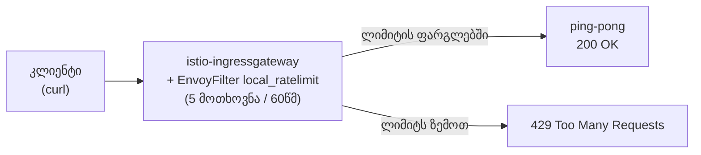

[Русская версия](README_RU.MD) · [Eng version](README.MD) · [Versión en español](README_ES.MD) · [Version française](README_FR.MD) · [Deutsche Version](README_DE.MD) · [繁體中文版](README_TW.MD) · [日本語版](README_JP.MD)

# ლაბორატორია 17 - Rate Limiting: მოთხოვნების ლოკალური შეზღუდვა EnvoyFilter-ის მეშვეობით

> [საცნობარო გადაწყვეტა](worker/files/solutions/1_GE.MD)

## მიმოხილვა

Rate limiting (მოთხოვნების სიხშირის შეზღუდვა) სერვისებს გადატვირთვისგან, ბოროტად გამოყენებისა და
DoS-ისგან იცავს. Istio-ში ორი მიდგომა არსებობს:

- **Local rate limit** - თითოეული Envoy საკუთარ token bucket-ს ინახავს. მარტივია, არ აქვს
  გარე დამოკიდებულებები და კონფიგურირდება `EnvoyFilter`-ის მეშვეობით.
- **Global rate limit** - Envoy მიმართავს გარე rate-limit-სერვისს (როგორც წესი,
  Redis-ით), ხოლო ლიმიტი საერთოა ყველა რეპლიკისთვის.

ამ ლაბორატორიაში ingress-gateway-ზე **ლოკალურ** rate limit-ს დააკონფიგურირებთ: წუთში არაუმეტეს 5
მოთხოვნისა, დანარჩენებზე კი დაბრუნდება `429 Too Many Requests`.

Istio უკვე დაყენებულია (ingress gateway NodePort-ზე `32080`), აპლიკაცია `ping-pong`
განთავსებულია namespace-ში `app` და gateway-ის მეშვეობით გამოქვეყნებულია მისამართზე `http://myapp.local:32080/`.



## ინფრასტრუქტურა

| კომპონენტი | ტიპი | რაოდენობა | როლი |
|---|---|---|---|
| control-plane | `t3.medium` | 1 | master + istiod + ingress gateway |
| worker | `t3.small` | 1 | აპლიკაციისთვის საჭირო სიმძლავრე |
| worker PC | `t3.small` | 1 | სამუშაო გარემო: `kubectl`, `curl`, `check_result` |

რეგიონი: `eu-central-1` (AZ `eu-central-1a` / `eu-central-1b`).

## გაშლა

```bash
TASK=17 make run_ica_task
```

## დავალება

1. შეამოწმეთ, რომ აპლიკაცია ხელმისაწვდომია (`200`).
2. ingress-gateway-ზე (`workloadSelector: istio=ingressgateway`, `context: GATEWAY`) გამოიყენეთ
   `EnvoyFilter` ფილტრით `envoy.filters.http.local_ratelimit` და
   token bucket-ით: 5 ტოკენი, ყოველ 60 წამში 5 ტოკენის შევსება.
3. დარწმუნდით, რომ ტოკენების ამოწურვის შემდეგ მოთხოვნები უარყოფილია კოდით `429`.

## ნაბიჯი 1. საბაზისო შემოწმება

```bash
curl -s -o /dev/null -w "%{http_code}\n" http://myapp.local:32080/
# -> 200
```

## ნაბიჯი 2. ლოკალური rate limit-ის გამოყენება

```bash
cat > ratelimit.yaml <<'EOF'
apiVersion: networking.istio.io/v1alpha3
kind: EnvoyFilter
metadata:
  name: ingress-local-rate-limit
  namespace: istio-system
spec:
  workloadSelector:
    labels:
      istio: ingressgateway
  configPatches:
    - applyTo: HTTP_FILTER
      match:
        context: GATEWAY
        listener:
          filterChain:
            filter:
              name: envoy.filters.network.http_connection_manager
      patch:
        operation: INSERT_BEFORE
        value:
          name: envoy.filters.http.local_ratelimit
          typed_config:
            "@type": type.googleapis.com/udpa.type.v1.TypedStruct
            type_url: type.googleapis.com/envoy.extensions.filters.http.local_ratelimit.v3.LocalRateLimit
            value:
              stat_prefix: http_local_rate_limiter
              token_bucket:
                max_tokens: 5
                tokens_per_fill: 5
                fill_interval: 60s
              filter_enabled:
                runtime_key: local_rate_limit_enabled
                default_value:
                  numerator: 100
                  denominator: HUNDRED
              filter_enforced:
                runtime_key: local_rate_limit_enforced
                default_value:
                  numerator: 100
                  denominator: HUNDRED
              response_headers_to_add:
                - append_action: OVERWRITE_IF_EXISTS_OR_ADD
                  header:
                    key: x-local-rate-limit
                    value: "true"
EOF

kubectl apply -f ratelimit.yaml
```

## ნაბიჯი 3. შემოწმება

```bash
for i in $(seq 10); do
  curl -s -o /dev/null -w "%{http_code}\n" http://myapp.local:32080/
done
# პირველი ~5 -> 200, დანარჩენი -> 429
```

## როგორ მუშაობს ეს

- **`token_bucket`** - `max_tokens: 5`, `tokens_per_fill: 5`, `fill_interval: 60s`:
  კალათაში 5 ტოკენია და ყოველ 60 წამში ის კვლავ 5-მდე ივსება. თითოეული მოთხოვნა ერთ ტოკენს ხარჯავს;
  როცა ტოკენები აღარ არის, ბრუნდება `429`.
- **`filter_enabled` / `filter_enforced`** - იმ მოთხოვნების წილი, რომლებზეც ფილტრი ჩართულია
  და რეალურად გამოიყენება (აქ ორივე 100%-ია).
- **context: GATEWAY** - ფილტრი ingress-gateway-ის listener-ში ინტეგრირდება, ამიტომ ლიმიტი
  mesh-ის საზღვარზე მთელ შემომავალ ტრაფიკზე ვრცელდება.

## Local და Global

- **Local** (ეს ლაბორატორია) - თითოეულ Envoy-ს საკუთარი token bucket აქვს. მარტივია, თუმცა gateway-ის რამდენიმე
  რეპლიკის შემთხვევაში ფაქტობრივი ლიმიტი მათ რაოდენობაზე მრავლდება.
- **Global** - Envoy გარე rate-limit-სერვისს (Redis-ით) იძახებს, ხოლო ლიმიტი საერთოა ყველა
  რეპლიკისთვის. იყენებს ფილტრს `envoy.filters.http.ratelimit` + ConfigMap-ს დესკრიპტორებით
  და გაშლილ ratelimit-სერვისს. საჭიროა, როცა მთელი კლასტერისთვის ზუსტი კვოტაა აუცილებელი.

## შედეგის შემოწმება

worker PC-ზე გაუშვით:

```bash
check_result
```

## შეჯამება

თქვენ ingress-gateway-ზე `EnvoyFilter`-ის მეშვეობით დააკონფიგურირეთ ლოკალური rate limit - გარე
დამოკიდებულებების გარეშე გადატვირთვისგან დაცვის საბაზისო მექანიზმი - და გაარკვიეთ, რით განსხვავდება ის
გლობალურისგან. `EnvoyFilter`-თან მუშაობა მნიშვნელოვანი senior-უნარია სტანდარტული Istio CRD-ების მიღმა
Envoy data plane-ის დეტალური კონფიგურაციისთვის.
