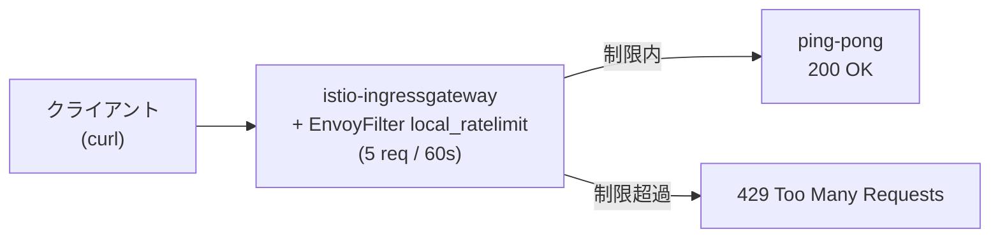

[Русская версия](README_RU.MD) · [Eng version](README.MD) · [Versión en español](README_ES.MD) · [Version française](README_FR.MD) · [Deutsche Version](README_DE.MD) · [ქართული ვერსია](README_GE.MD) · [繁體中文版](README_TW.MD)

# Lab 17 - Rate Limiting: EnvoyFilter によるローカルなリクエスト制限

> [リファレンス解答](worker/files/solutions/1_JP.MD)

## 概要

Rate limiting（リクエスト頻度の制限）は、サービスを過負荷、不正利用、
DoS から保護します。Istio には2つのアプローチがあります。

- **Local rate limit** - 各 Envoy が自身の token bucket を保持します。シンプルで、
  外部依存がなく、`EnvoyFilter` で設定します。
- **Global rate limit** - Envoy が外部の rate-limit サービス（通常は
  Redis を使用）に問い合わせ、制限はすべてのレプリカで共通です。

この Lab では、ingress-gateway に**ローカルな** rate limit を設定します。1分あたり最大5
リクエストとし、それ以外は `429 Too Many Requests` になります。

Istio はすでにインストールされています（ingress gateway は NodePort `32080`）。アプリケーション `ping-pong`
は namespace `app` にデプロイ済みで、gateway を通じて `http://myapp.local:32080/` で公開されています。



## インフラストラクチャ

| コンポーネント | タイプ | 数 | 役割 |
|---|---|---|---|
| control-plane | `t3.medium` | 1 | master + istiod + ingress gateway |
| worker | `t3.small` | 1 | アプリケーション用の容量 |
| worker PC | `t3.small` | 1 | 作業環境: `kubectl`、`curl`、`check_result` |

リージョン: `eu-central-1` (AZ `eu-central-1a` / `eu-central-1b`)。

## デプロイ

```bash
TASK=17 make run_ica_task
```

## 課題

1. アプリケーションにアクセスできることを確認する（`200`）。
2. ingress-gateway（`workloadSelector: istio=ingressgateway`、`context: GATEWAY`）に
   `envoy.filters.http.local_ratelimit` フィルターを持つ `EnvoyFilter` を適用し、
   token bucket を設定する: 5トークン、60秒ごとに5トークンを補充。
3. トークンを使い切った後、リクエストが `429` で拒否されることを確認する。

## ステップ 1. 基本確認

```bash
curl -s -o /dev/null -w "%{http_code}\n" http://myapp.local:32080/
# -> 200
```

## ステップ 2. ローカル rate limit を適用する

```bash
cat > ratelimit.yaml <<'EOF'
apiVersion: networking.istio.io/v1alpha3
kind: EnvoyFilter
metadata:
  name: ingress-local-rate-limit
  namespace: istio-system
spec:
  workloadSelector:
    labels:
      istio: ingressgateway
  configPatches:
    - applyTo: HTTP_FILTER
      match:
        context: GATEWAY
        listener:
          filterChain:
            filter:
              name: envoy.filters.network.http_connection_manager
      patch:
        operation: INSERT_BEFORE
        value:
          name: envoy.filters.http.local_ratelimit
          typed_config:
            "@type": type.googleapis.com/udpa.type.v1.TypedStruct
            type_url: type.googleapis.com/envoy.extensions.filters.http.local_ratelimit.v3.LocalRateLimit
            value:
              stat_prefix: http_local_rate_limiter
              token_bucket:
                max_tokens: 5
                tokens_per_fill: 5
                fill_interval: 60s
              filter_enabled:
                runtime_key: local_rate_limit_enabled
                default_value:
                  numerator: 100
                  denominator: HUNDRED
              filter_enforced:
                runtime_key: local_rate_limit_enforced
                default_value:
                  numerator: 100
                  denominator: HUNDRED
              response_headers_to_add:
                - append_action: OVERWRITE_IF_EXISTS_OR_ADD
                  header:
                    key: x-local-rate-limit
                    value: "true"
EOF

kubectl apply -f ratelimit.yaml
```

## ステップ 3. 確認

```bash
for i in $(seq 10); do
  curl -s -o /dev/null -w "%{http_code}\n" http://myapp.local:32080/
done
# 最初の ~5 件 -> 200、残り -> 429
```

## 仕組み

- **`token_bucket`** - `max_tokens: 5`、`tokens_per_fill: 5`、`fill_interval: 60s`:
  バケットには5トークンあり、60秒ごとに5まで補充されます。各リクエストはトークンを1つ消費し、
  トークンがなくなると `429` になります。
- **`filter_enabled` / `filter_enforced`** - フィルターが有効化され、
  実際に適用されるリクエストの割合です（ここではいずれも100%）。
- **context: GATEWAY** - フィルターは ingress-gateway の listener に組み込まれるため、制限は
  mesh の境界にあるすべての受信トラフィックに適用されます。

## Local と Global の比較

- **Local**（この Lab）- 各 Envoy に独自の token bucket があります。シンプルですが、
  gateway のレプリカが複数ある場合、実際の制限はその数に応じて増加します。
- **Global** - Envoy が外部の rate-limit サービス（Redis 使用）を呼び出し、制限はすべての
  レプリカで共通です。`envoy.filters.http.ratelimit` フィルター、ディスクリプターを含む ConfigMap、
  およびデプロイされた ratelimit サービスを使用します。クラスター全体で正確なクォータが必要な場合に適しています。

## 結果の確認

worker PC で次を実行します。

```bash
check_result
```

## まとめ

`EnvoyFilter` を使用して ingress-gateway にローカル rate limit を設定しました。これは外部依存なしで
過負荷から保護するための基本的な仕組みです。また、グローバル rate limit との違いも理解しました。`EnvoyFilter` を扱うことは、標準の Istio CRD の範囲を超えて
Envoy の data plane を細かく調整するための重要なシニアスキルです。
