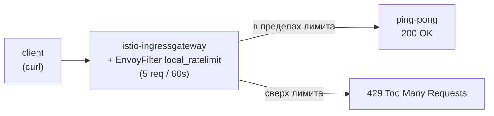

[Eng version](README.MD)

# Lab 17 — Rate Limiting: локальное ограничение запросов через EnvoyFilter

## Обзор

Rate limiting (ограничение частоты запросов) защищает сервисы от перегрузки, abuse и
DoS. В Istio есть два подхода:

- **Local rate limit** — каждый Envoy держит собственный token bucket. Просто, без
  внешних зависимостей, настраивается через `EnvoyFilter`.
- **Global rate limit** — Envoy обращается к внешнему rate-limit-сервису (обычно с
  Redis), лимит общий для всех реплик.

В этой лабе вы настроите **локальный** rate limit на ingress-gateway: не более 5
запросов в минуту, остальное — `429 Too Many Requests`.

Istio уже установлен (ingress gateway на NodePort `32080`), приложение `ping-pong`
развёрнуто в namespace `app` и опубликовано через gateway на `http://myapp.local:32080/`.



## Задание

1. Проверить, что приложение доступно (`200`).
2. Применить `EnvoyFilter` с фильтром `envoy.filters.http.local_ratelimit` на
   ingress-gateway (`workloadSelector: istio=ingressgateway`, `context: GATEWAY`) с
   token bucket: 5 токенов, refill 5 каждые 60 секунд.
3. Убедиться, что после исчерпания токенов запросы отбиваются с `429`.

## Шаг 1. Базовая проверка

```bash
curl -s -o /dev/null -w "%{http_code}\n" http://myapp.local:32080/
# -> 200
```

## Шаг 2. Применить локальный rate limit

```bash
cat > ratelimit.yaml <<'EOF'
apiVersion: networking.istio.io/v1alpha3
kind: EnvoyFilter
metadata:
  name: ingress-local-rate-limit
  namespace: istio-system
spec:
  workloadSelector:
    labels:
      istio: ingressgateway
  configPatches:
    - applyTo: HTTP_FILTER
      match:
        context: GATEWAY
        listener:
          filterChain:
            filter:
              name: envoy.filters.network.http_connection_manager
      patch:
        operation: INSERT_BEFORE
        value:
          name: envoy.filters.http.local_ratelimit
          typed_config:
            "@type": type.googleapis.com/udpa.type.v1.TypedStruct
            type_url: type.googleapis.com/envoy.extensions.filters.http.local_ratelimit.v3.LocalRateLimit
            value:
              stat_prefix: http_local_rate_limiter
              token_bucket:
                max_tokens: 5
                tokens_per_fill: 5
                fill_interval: 60s
              filter_enabled:
                runtime_key: local_rate_limit_enabled
                default_value:
                  numerator: 100
                  denominator: HUNDRED
              filter_enforced:
                runtime_key: local_rate_limit_enforced
                default_value:
                  numerator: 100
                  denominator: HUNDRED
              response_headers_to_add:
                - append_action: OVERWRITE_IF_EXISTS_OR_ADD
                  header:
                    key: x-local-rate-limit
                    value: "true"
EOF

kubectl apply -f ratelimit.yaml
```

## Шаг 3. Проверка

```bash
for i in $(seq 10); do
  curl -s -o /dev/null -w "%{http_code}\n" http://myapp.local:32080/
done
# первые ~5 -> 200, остальные -> 429
```

## Как это работает

- **`token_bucket`** — `max_tokens: 5`, `tokens_per_fill: 5`, `fill_interval: 60s`:
  в корзине 5 токенов, каждые 60с она пополняется до 5. Каждый запрос забирает токен;
  когда токенов нет — `429`.
- **`filter_enabled` / `filter_enforced`** — доля запросов, на которых фильтр включён
  и реально применяется (здесь по 100%).
- **context: GATEWAY** — фильтр встраивается в listener ingress-gateway, поэтому лимит
  действует на весь входящий трафик на границе mesh.

## Local против Global

- **Local** (эта лаба) — свой token bucket у каждого Envoy. Просто, но при нескольких
  репликах gateway фактический лимит умножается на их число.
- **Global** — Envoy вызывает внешний rate-limit-сервис (с Redis), лимит общий для всех
  реплик. Использует фильтр `envoy.filters.http.ratelimit` + ConfigMap с дескрипторами
  и развёрнутый ratelimit-сервис. Нужен, когда требуется точная квота на весь кластер.

## Проверка результата

Запустите на worker PC:

```bash
check_result
```

## Итог

Вы настроили локальный rate limit на ingress-gateway через `EnvoyFilter` — базовый
механизм защиты от перегрузки без внешних зависимостей, и разобрались, чем он отличается
от глобального. Работа с `EnvoyFilter` — важный senior-навык для тонкой настройки
data plane Envoy за пределами стандартных CRD Istio.

## Инфраструктура

| Компонент | Тип | Кол-во | Роль |
|---|---|---|---|
| control-plane | `t3.medium` | 1 | master + istiod + ingress gateway |
| worker | `t3.small` | 1 | ёмкость для приложения |
| worker PC | `t3.small` | 1 | рабочее место: `kubectl`, `curl`, `check_result` |

Регион: `eu-central-1` (AZ `eu-central-1a` / `eu-central-1b`).
