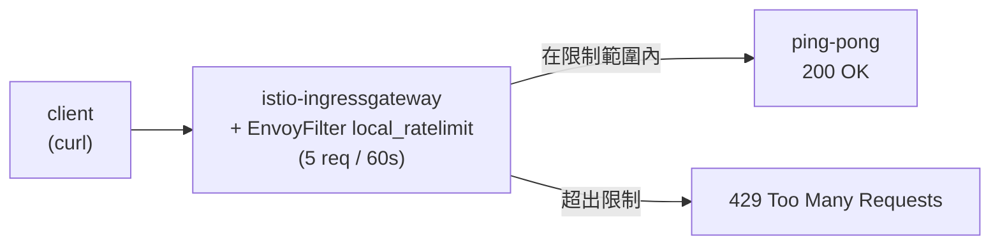

[Русская версия](README_RU.MD) · [Eng version](README.MD) · [Versión en español](README_ES.MD) · [Version française](README_FR.MD) · [Deutsche Version](README_DE.MD) · [ქართული ვერსია](README_GE.MD) · [日本語版](README_JP.MD)

# Lab 17 - Rate Limiting：透過 EnvoyFilter 進行本機請求限制

> [參考解答](worker/files/solutions/1_TW.MD)

## 概述

Rate limiting（請求頻率限制）可保護服務免於過載、濫用和
DoS。Istio 提供兩種方式：

- **Local rate limit** - 每個 Envoy 都維護自己的 token bucket。簡單、無需
  外部相依性，透過 `EnvoyFilter` 設定。
- **Global rate limit** - Envoy 呼叫外部 rate-limit 服務（通常搭配
  Redis），所有副本共用同一個限制。

在本 lab 中，您將在 ingress-gateway 上設定**本機** rate limit：每分鐘最多 5
個請求，其餘回應 `429 Too Many Requests`。

Istio 已安裝（NodePort `32080` 上的 ingress gateway），`ping-pong` 應用程式
已部署於 `app` namespace，並透過 gateway 發布至 `http://myapp.local:32080/`。



## 基礎架構

| 元件 | 類型 | 數量 | 角色 |
|---|---|---|---|
| control-plane | `t3.medium` | 1 | master + istiod + ingress gateway |
| worker | `t3.small` | 1 | 應用程式容量 |
| worker PC | `t3.small` | 1 | 工作站：`kubectl`、`curl`、`check_result` |

區域：`eu-central-1`（AZ `eu-central-1a` / `eu-central-1b`）。

## 部署

```bash
TASK=17 make run_ica_task
```

## 任務

1. 確認應用程式可存取（`200`）。
2. 在 ingress-gateway 上套用帶有 `envoy.filters.http.local_ratelimit` 篩選器的
   `EnvoyFilter`（`workloadSelector: istio=ingressgateway`、`context: GATEWAY`），設定
   token bucket：5 個 token，每 60 秒補充 5 個。
3. 確認 token 耗盡後，請求會以 `429` 被拒絕。

## 步驟 1. 基本檢查

```bash
curl -s -o /dev/null -w "%{http_code}\n" http://myapp.local:32080/
# -> 200
```

## 步驟 2. 套用本機 rate limit

```bash
cat > ratelimit.yaml <<'EOF'
apiVersion: networking.istio.io/v1alpha3
kind: EnvoyFilter
metadata:
  name: ingress-local-rate-limit
  namespace: istio-system
spec:
  workloadSelector:
    labels:
      istio: ingressgateway
  configPatches:
    - applyTo: HTTP_FILTER
      match:
        context: GATEWAY
        listener:
          filterChain:
            filter:
              name: envoy.filters.network.http_connection_manager
      patch:
        operation: INSERT_BEFORE
        value:
          name: envoy.filters.http.local_ratelimit
          typed_config:
            "@type": type.googleapis.com/udpa.type.v1.TypedStruct
            type_url: type.googleapis.com/envoy.extensions.filters.http.local_ratelimit.v3.LocalRateLimit
            value:
              stat_prefix: http_local_rate_limiter
              token_bucket:
                max_tokens: 5
                tokens_per_fill: 5
                fill_interval: 60s
              filter_enabled:
                runtime_key: local_rate_limit_enabled
                default_value:
                  numerator: 100
                  denominator: HUNDRED
              filter_enforced:
                runtime_key: local_rate_limit_enforced
                default_value:
                  numerator: 100
                  denominator: HUNDRED
              response_headers_to_add:
                - append_action: OVERWRITE_IF_EXISTS_OR_ADD
                  header:
                    key: x-local-rate-limit
                    value: "true"
EOF

kubectl apply -f ratelimit.yaml
```

## 步驟 3. 驗證

```bash
for i in $(seq 10); do
  curl -s -o /dev/null -w "%{http_code}\n" http://myapp.local:32080/
done
# 前 ~5 個 -> 200，其餘 -> 429
```

## 運作方式

- **`token_bucket`** - `max_tokens: 5`、`tokens_per_fill: 5`、`fill_interval: 60s`：
  bucket 中有 5 個 token，每 60 秒補滿至 5 個。每個請求會取走一個 token；
  token 用盡時回應 `429`。
- **`filter_enabled` / `filter_enforced`** - 啟用篩選器並實際套用的請求
  比例（此處皆為 100%）。
- **context: GATEWAY** - 篩選器會插入 ingress-gateway listener，因此限制
  會套用至 mesh 邊界上的所有傳入流量。

## Local 與 Global 的比較

- **Local**（本 lab）- 每個 Envoy 都有自己的 token bucket。簡單，但若有多個
  gateway 副本，實際限制會乘上副本數量。
- **Global** - Envoy 呼叫外部 rate-limit 服務（搭配 Redis），所有
  副本共用同一個限制。使用 `envoy.filters.http.ratelimit` 篩選器 + 帶有 descriptors 的 ConfigMap
  以及已部署的 ratelimit 服務。當需要整個叢集的精確配額時使用。

## 結果驗證

請在 worker PC 上執行：

```bash
check_result
```

## 總結

您已透過 `EnvoyFilter` 在 ingress-gateway 上設定本機 rate limit--這是一種無需外部相依性、
防止過載的基本機制，並了解它與全域方式的差異。使用 `EnvoyFilter` 是一項重要的
senior 技能，可在標準 Istio CRD 之外對 Envoy data plane 進行精細設定。