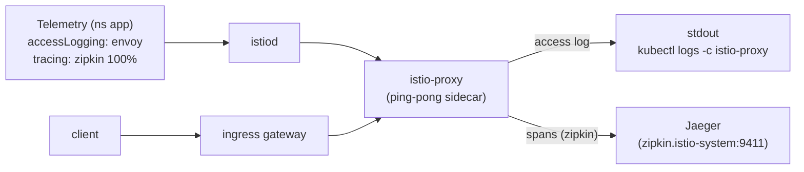

[RU version](README_RU.MD) · [Versión en español](README_ES.MD)

# Lab 18 - Telemetry API: access logs and distributed tracing

## Overview

The **Telemetry API** (`telemetry.istio.io`) is the modern, declarative way to manage
mesh telemetry - access logs, metrics, and traces. It replaces the older `meshConfig`
and `EnvoyFilter` approaches and supports a scope hierarchy:

- a `Telemetry` in the root namespace (`istio-system`) applies mesh-wide;
- a `Telemetry` in a workload namespace overrides it for that namespace;
- a `Telemetry` with a `selector` overrides it for specific workloads.

The `default` profile ships with access logging **disabled** and no `Telemetry`
resource. Istio is installed with the `zipkin` tracing provider (`enableTracing` +
`extensionProviders`), and the **Jaeger** backend is deployed in the cluster. Your task
is to enable access logs and tracing via the Telemetry API so logs and traces are
actually collected.

The `ping-pong` app is deployed in namespace `app` and exposed at
`http://myapp.local:32080/`.



## Where logs and traces go

| Signal | Provider | Destination |
|---|---|---|
| Access logs | `envoy` (built-in) | sidecar stdout → `kubectl logs -c istio-proxy` |
| Traces | `zipkin` extension provider | Jaeger (`zipkin.istio-system:9411`) → Jaeger UI |

## Task

1. Confirm that by default there are no access log lines in the sidecar.
2. Create a `Telemetry` resource in namespace `app` that:
   - enables access logging with the built-in `envoy` provider;
   - enables tracing through the `zipkin` provider with `randomSamplingPercentage: 100`.
3. Send traffic and confirm that:
   - access log lines now appear in the sidecar logs;
   - traces for the `ping-pong` service appear in Jaeger.

## Step 1. Confirm access logs are OFF

```bash
POD=$(kubectl get pod -n app -l app=ping-pong -o jsonpath='{.items[0].metadata.name}')
curl -s -o /dev/null http://myapp.local:32080/
kubectl logs -n app "$POD" -c istio-proxy --tail=50   # no access log lines
```

## Step 2. Configure logs + traces via Telemetry

```bash
cat > telemetry.yaml <<'EOF'
apiVersion: telemetry.istio.io/v1
kind: Telemetry
metadata:
  name: app-telemetry
  namespace: app
spec:
  accessLogging:
    - providers:
        - name: envoy
  tracing:
    - providers:
        - name: zipkin
      randomSamplingPercentage: 100.0
EOF

kubectl apply -f telemetry.yaml
```

## Step 3. Generate traffic

```bash
for i in $(seq 30); do curl -s -o /dev/null http://myapp.local:32080/; done
```

## Step 4. Verify collection

Access logs (in the sidecar stdout):

```bash
POD=$(kubectl get pod -n app -l app=ping-pong -o jsonpath='{.items[0].metadata.name}')
kubectl logs -n app "$POD" -c istio-proxy --tail=50 | grep 'GET / HTTP'
```

Traces (in Jaeger, queried from inside the cluster):

```bash
kubectl exec -n app deploy/curl-client -- \
  curl -s 'http://tracing.istio-system:80/jaeger/api/services' | tr ',' '\n' | grep ping-pong
```

You can also port-forward the Jaeger UI:

```bash
kubectl -n istio-system port-forward svc/tracing 16686:80
# open http://localhost:16686/jaeger and pick the ping-pong service
```

## How it works

- The **Telemetry API** declaratively configures logs, metrics, and traces, and
  supports a scope hierarchy: mesh-wide (root namespace) → namespace → workload
  (`selector`).
- **`accessLogging.providers.name: envoy`** writes access logs to the sidecar stdout.
- **`tracing.providers.name: zipkin`** points spans at the `zipkin` extension provider
  declared in `meshConfig.extensionProviders`, which forwards them to Jaeger. Without a
  provider reference the sampling policy would have nowhere to send spans.
- **`randomSamplingPercentage: 100`** traces every request (use a low value in
  production to control overhead).

> **Production note.** The `envoy` provider writes access logs to the **`istio-proxy`
> container stdout** - you can only read them locally via
> `kubectl logs -n app <pod> -c istio-proxy`. That is handy for debugging, but stdout is
> ephemeral: logs are lost when the pod restarts or is deleted, and you cannot search or
> alert on them centrally. In a real environment you add log collection on top - a
> per-node agent (**Fluent Bit / Fluentd / Vector**) tails container stdout and ships it
> to a central store (**Loki, Elasticsearch/OpenSearch, CloudWatch Logs**, etc.) where
> logs are retained, searched, and drive alerting. The same applies to traces: **Jaeger**
> here is the all-in-one, in-memory build (for learning), while production sends traces
> to a durable backend (Elasticsearch/Cassandra or a managed service).

## Check the result

Run on the worker PC:

```bash
check_result
```

## Summary

You learned the Telemetry API - the single declarative interface for logs, metrics, and
traces - and configured real collection: access logs in the sidecar stdout and
distributed traces in Jaeger through the `zipkin` provider. For a senior DevOps this is
a key tool for observability control without editing `meshConfig` or relying on fragile
`EnvoyFilter` patches.

## Infrastructure

| Component | Type | Count | Role |
|---|---|---|---|
| control-plane | `t3.medium` | 1 | master + istiod + ingress gateway + Jaeger |
| worker | `t3.small` | 1 | capacity for the app |
| worker PC | `t3.small` | 1 | workstation: `kubectl`, `curl`, `check_result` |

Region: `eu-central-1` (AZ `eu-central-1a` / `eu-central-1b`).
