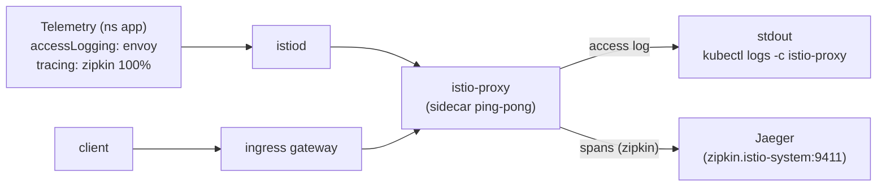

[RU version](README_RU.MD) · [Eng version](README.MD) · [Versión en español](README_ES.MD) · [Version française](README_FR.MD)

# Lab 18 - Telemetry API: Access Logs und verteiltes Tracing

## Überblick

Das **Telemetry API** (`telemetry.istio.io`) ist die moderne deklarative Art, die Telemetrie des
Mesh zu verwalten: Access Logs, Metriken und Traces. Es löst die alten Ansätze über `meshConfig`
und `EnvoyFilter` ab und unterstützt eine Hierarchie von Geltungsbereichen:

- `Telemetry` im Root-Namespace (`istio-system`) - für das gesamte Mesh;
- `Telemetry` im Namespace der Workload - überschreibt für diesen Namespace;
- `Telemetry` mit `selector` - überschreibt für konkrete Workloads.

Im Profil `default` sind Access Logs **deaktiviert**, und `Telemetry` gibt es noch nicht. Istio ist
mit dem Tracing-Provider `zipkin` installiert (`enableTracing` + `extensionProviders`), im Cluster
ist ein **Jaeger**-Backend ausgerollt. Ihre Aufgabe ist es, über das Telemetry API Access Logs und
Tracing zu aktivieren, damit Logs und Traces tatsächlich gesammelt werden.

Die Anwendung `ping-pong` ist im Namespace `app` ausgerollt und unter
`http://myapp.local:32080/` veröffentlicht.



## Wohin Logs und Traces gesammelt werden

| Signal | Provider | Ziel |
|---|---|---|
| Access-Logs | `envoy` (integriert) | stdout des Sidecars → `kubectl logs -c istio-proxy` |
| Traces | `zipkin` (extensionProvider) | Jaeger (`zipkin.istio-system:9411`) → Jaeger UI |

## Aufgabe

1. Sicherstellen, dass standardmäßig keine Access Logs im Sidecar vorhanden sind.
2. Eine `Telemetry`-Ressource im Namespace `app` erstellen, die:
   - Access Logging über den integrierten Provider `envoy` aktiviert;
   - Tracing über den Provider `zipkin` mit `randomSamplingPercentage: 100` aktiviert.
3. Traffic senden und sicherstellen, dass:
   - in den Sidecar-Logs Access-Log-Zeilen erscheinen;
   - in Jaeger Traces des Service `ping-pong` erscheinen.

## Schritt 1. Prüfen, dass keine Logs vorhanden sind

```bash
POD=$(kubectl get pod -n app -l app=ping-pong -o jsonpath='{.items[0].metadata.name}')
curl -s -o /dev/null http://myapp.local:32080/
kubectl logs -n app "$POD" -c istio-proxy --tail=50   # keine Access-Log-Zeilen
```

## Schritt 2. Logs + Traces über Telemetry konfigurieren

```bash
cat > telemetry.yaml <<'EOF'
apiVersion: telemetry.istio.io/v1
kind: Telemetry
metadata:
  name: app-telemetry
  namespace: app
spec:
  accessLogging:
    - providers:
        - name: envoy
  tracing:
    - providers:
        - name: zipkin
      randomSamplingPercentage: 100.0
EOF

kubectl apply -f telemetry.yaml
```

## Schritt 3. Traffic erzeugen

```bash
for i in $(seq 30); do curl -s -o /dev/null http://myapp.local:32080/; done
```

## Schritt 4. Sammlung prüfen

Access-Logs (in stdout des Sidecars):

```bash
POD=$(kubectl get pod -n app -l app=ping-pong -o jsonpath='{.items[0].metadata.name}')
kubectl logs -n app "$POD" -c istio-proxy --tail=50 | grep 'GET / HTTP'
```

Traces (in Jaeger, Anfrage aus dem Cluster heraus):

```bash
kubectl exec -n app deploy/curl-client -- \
  curl -s 'http://tracing.istio-system:80/jaeger/api/services' | tr ',' '\n' | grep ping-pong
```

Man kann die Jaeger-UI über Port-Forward ansehen:

```bash
kubectl -n istio-system port-forward svc/tracing 16686:80
# http://localhost:16686/jaeger öffnen und den Service ping-pong auswählen
```

## Wie das funktioniert

- **Telemetry API** verwaltet Logs/Metriken/Traces deklarativ; die Hierarchie der Geltungsbereiche
  erlaubt es, detaillierte Telemetrie für einen einzelnen Service zu aktivieren, ohne das restliche
  Mesh anzufassen.
- **`accessLogging.providers.name: envoy`** schreibt Access-Logs in stdout des Sidecars.
- **`tracing.providers.name: zipkin`** leitet Spans an den Provider `zipkin`, der in
  `meshConfig.extensionProviders` deklariert ist, und dieser leitet sie an Jaeger weiter. Ohne den
  Verweis auf den Provider hätte die Sampling-Policy keinen Ort, wohin sie Spans senden könnte.
- **`randomSamplingPercentage: 100`** verfolgt jede Anfrage (in der Produktion setzt man einen niedrigen
  Wert, um den Overhead zu kontrollieren).

> **Hinweis für die Produktion.** Der Provider `envoy` schreibt Access-Logs in **stdout des
> Containers `istio-proxy`** - ansehen kann man sie nur lokal über
> `kubectl logs -n app <pod> -c istio-proxy`. Das ist praktisch zum Debuggen, aber stdout ist
> flüchtig: bei Neustart/Löschung des Pods gehen die Logs verloren, und man kann darin nicht
> zentral suchen und Alerts aufbauen. In einer realen Infrastruktur rollt man darüber ein
> Log-Sammelsystem aus - ein Agent auf jeder Node (**Fluent Bit / Fluentd / Vector**) sammelt das
> stdout der Container und sendet es an einen zentralen Speicher (**Loki, Elasticsearch/OpenSearch,
> CloudWatch Logs** usw.), wo Logs gespeichert, durchsucht und im Alerting genutzt werden. Dasselbe
> gilt für Traces: **Jaeger** ist hier eine All-in-one-Variante mit Arbeitsspeicher als Speicher
> (für den Lernbetrieb), in der Produktion schreibt man Traces in ein persistentes Backend
> (Elasticsearch/Cassandra oder eine Managed-Lösung).

## Ergebnisprüfung

Führen Sie auf dem worker PC aus:

```bash
check_result
```

## Fazit

Sie haben das Telemetry API gemeistert - eine einheitliche deklarative Schnittstelle für Logs,
Metriken und Traces - und eine echte Sammlung konfiguriert: Access-Logs in stdout des Sidecars und
verteilte Traces in Jaeger über den Provider `zipkin`. Für Senior DevOps ist das ein Schlüsselwerkzeug
zur Steuerung der Observability ohne Bearbeitung von meshConfig und fragile `EnvoyFilter`.

## Infrastruktur

| Komponente | Typ | Anzahl | Rolle |
|---|---|---|---|
| control-plane | `t3.medium` | 1 | master + istiod + Ingress Gateway + Jaeger |
| worker | `t3.small` | 1 | Kapazität für die Anwendung |
| worker PC | `t3.small` | 1 | Arbeitsplatz: `kubectl`, `curl`, `check_result` |

Region: `eu-central-1` (AZ `eu-central-1a` / `eu-central-1b`).
