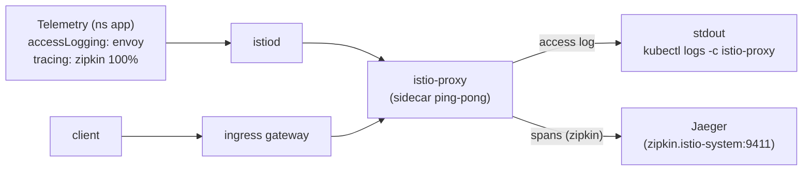

[RU version](README_RU.MD) · [Eng version](README.MD) · [Version française](README_FR.MD) · [Deutsche Version](README_DE.MD)

# Lab 18 - Telemetry API: access logs y trazado distribuido

## Descripción general

La **Telemetry API** (`telemetry.istio.io`) es la forma declarativa moderna de gestionar la
telemetría del mesh: logs de acceso, métricas y trazas. Sustituye a los enfoques antiguos
basados en `meshConfig` y `EnvoyFilter` y admite una jerarquía de ámbitos de aplicación:

- `Telemetry` en el namespace raíz (`istio-system`) - para todo el mesh;
- `Telemetry` en el namespace del workload - lo sobrescribe para ese namespace;
- `Telemetry` con `selector` - lo sobrescribe para workloads concretos.

En el perfil `default` los access logs están **desactivados**, y todavía no hay `Telemetry`. Istio
está instalado con el proveedor de trazado `zipkin` (`enableTracing` + `extensionProviders`), y en
el clúster está desplegado un backend **Jaeger**. Tu tarea es activar mediante la Telemetry API los
access logs y el trazado, para que los logs y las trazas se recojan realmente.

La aplicación `ping-pong` está desplegada en el namespace `app` y publicada en
`http://myapp.local:32080/`.



## Adónde se recogen los logs y las trazas

| Señal | Proveedor | Destino |
|---|---|---|
| Access logs | `envoy` (integrado) | stdout del sidecar → `kubectl logs -c istio-proxy` |
| Trazas | `zipkin` (extensionProvider) | Jaeger (`zipkin.istio-system:9411`) → Jaeger UI |

## Infraestructura

| Componente | Tipo | Cantidad | Rol |
|---|---|---|---|
| control-plane | `t3.medium` | 1 | master + istiod + ingress gateway + Jaeger |
| worker | `t3.small` | 1 | capacidad para la aplicación |
| worker PC | `t3.small` | 1 | puesto de trabajo: `kubectl`, `curl`, `check_result` |

Región: `eu-central-1` (AZ `eu-central-1a` / `eu-central-1b`).

## Despliegue

```bash
TASK=18 make run_ica_task
```

## Tarea

1. Comprobar que, por defecto, no hay access logs en el sidecar.
2. Crear un recurso `Telemetry` en el namespace `app` que:
   - active el access logging a través del proveedor integrado `envoy`;
   - active el trazado a través del proveedor `zipkin` con `randomSamplingPercentage: 100`.
3. Enviar tráfico y comprobar que:
   - en los logs del sidecar aparecen líneas de access log;
   - en Jaeger aparecen trazas del servicio `ping-pong`.

## Paso 1. Comprobar que no hay logs

```bash
POD=$(kubectl get pod -n app -l app=ping-pong -o jsonpath='{.items[0].metadata.name}')
curl -s -o /dev/null http://myapp.local:32080/
kubectl logs -n app "$POD" -c istio-proxy --tail=50   # no hay líneas de access log
```

## Paso 2. Configurar logs + trazas mediante Telemetry

```bash
cat > telemetry.yaml <<'EOF'
apiVersion: telemetry.istio.io/v1
kind: Telemetry
metadata:
  name: app-telemetry
  namespace: app
spec:
  accessLogging:
    - providers:
        - name: envoy
  tracing:
    - providers:
        - name: zipkin
      randomSamplingPercentage: 100.0
EOF

kubectl apply -f telemetry.yaml
```

## Paso 3. Generar tráfico

```bash
for i in $(seq 30); do curl -s -o /dev/null http://myapp.local:32080/; done
```

## Paso 4. Verificar la recolección

Access logs (en el stdout del sidecar):

```bash
POD=$(kubectl get pod -n app -l app=ping-pong -o jsonpath='{.items[0].metadata.name}')
kubectl logs -n app "$POD" -c istio-proxy --tail=50 | grep 'GET / HTTP'
```

Trazas (en Jaeger, petición desde dentro del clúster):

```bash
kubectl exec -n app deploy/curl-client -- \
  curl -s 'http://tracing.istio-system:80/jaeger/api/services' | tr ',' '\n' | grep ping-pong
```

Puedes ver el UI de Jaeger mediante port-forward:

```bash
kubectl -n istio-system port-forward svc/tracing 16686:80
# abrir http://localhost:16686/jaeger y seleccionar el servicio ping-pong
```

## Cómo funciona

- La **Telemetry API** gestiona de forma declarativa los logs/métricas/trazas; la jerarquía de
  ámbitos permite activar telemetría detallada para un único servicio sin tocar el resto del mesh.
- **`accessLogging.providers.name: envoy`** escribe los access logs en el stdout del sidecar.
- **`tracing.providers.name: zipkin`** dirige los spans al proveedor `zipkin`, declarado
  en `meshConfig.extensionProviders`, que a su vez los reenvía a Jaeger. Sin la referencia al proveedor
  la política de muestreo no tendría adónde enviar los spans.
- **`randomSamplingPercentage: 100`** traza cada petición (en producción se pone un valor bajo,
  para controlar la sobrecarga).

> **Nota para producción.** El proveedor `envoy` escribe los access logs en el **stdout
> del contenedor `istio-proxy`** - solo se pueden ver localmente mediante
> `kubectl logs -n app <pod> -c istio-proxy`. Es cómodo para depurar, pero el stdout es efímero:
> al reiniciar/eliminar el pod los logs se pierden, y con ellos no se puede buscar ni construir alertas
> de forma centralizada. En una infraestructura real, por encima de esto se despliega una recolección de
> logs - un agente en cada nodo (**Fluent Bit / Fluentd / Vector**) recoge el stdout de los contenedores
> y lo envía a un almacenamiento centralizado (**Loki, Elasticsearch/OpenSearch,
> CloudWatch Logs**, etc.), donde los logs se almacenan, se buscan y participan en el alertado. Lo mismo
> ocurre con las trazas: **Jaeger** aquí es un all-in-one con memoria como almacenamiento (para
> aprendizaje), mientras que en producción las trazas se escriben en un backend persistente
> (Elasticsearch/Cassandra o una solución gestionada).

## Verificación del resultado

Ejecuta en el worker PC:

```bash
check_result
```

## Conclusión

Dominaste la Telemetry API - una interfaz declarativa única para logs, métricas y trazas - y
configuraste una recolección real: access logs en el stdout del sidecar y trazas distribuidas en Jaeger
a través del proveedor `zipkin`. Para un senior DevOps es una herramienta clave de gestión de la
observabilidad sin editar meshConfig ni frágiles `EnvoyFilter`.
