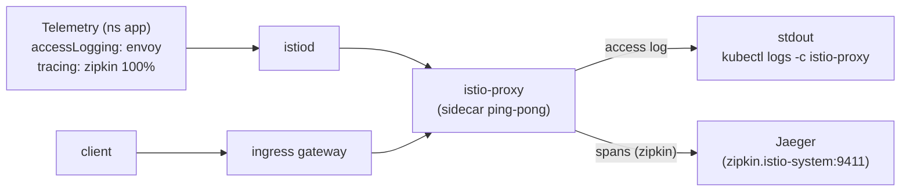

[RU version](README_RU.MD) · [Eng version](README.MD) · [Versión en español](README_ES.MD) · [Deutsche Version](README_DE.MD)

# Lab 18 - Telemetry API : access logs et tracing distribué

## Vue d'ensemble

Le **Telemetry API** (`telemetry.istio.io`) est la façon déclarative moderne de gérer la
télémétrie du maillage : logs d'accès, métriques et traces. Il remplace les anciennes
approches via `meshConfig` et `EnvoyFilter` et prend en charge une hiérarchie de portées :

- `Telemetry` dans le namespace racine (`istio-system`) - sur tout le maillage ;
- `Telemetry` dans le namespace du workload - remplace pour ce namespace ;
- `Telemetry` avec un `selector` - remplace pour des workloads précis.

Dans le profil `default`, les access logs sont **désactivés**, et il n'y a pas encore de
`Telemetry`. Istio est installé avec le fournisseur de tracing `zipkin` (`enableTracing` +
`extensionProviders`), et un backend **Jaeger** est déployé dans le cluster. Votre tâche
consiste à activer, via le Telemetry API, les access logs et le tracing afin que les logs
et les traces soient réellement collectés.

L'application `ping-pong` est déployée dans le namespace `app` et publiée sur
`http://myapp.local:32080/`.



## Où sont collectés les logs et les traces

| Signal | Fournisseur | Destination |
|---|---|---|
| Access logs | `envoy` (intégré) | stdout du sidecar → `kubectl logs -c istio-proxy` |
| Traces | `zipkin` (extensionProvider) | Jaeger (`zipkin.istio-system:9411`) → Jaeger UI |

## Infrastructure

| Composant | Type | Nombre | Rôle |
|---|---|---|---|
| control-plane | `t3.medium` | 1 | master + istiod + ingress gateway + Jaeger |
| worker | `t3.small` | 1 | capacité pour l'application |
| worker PC | `t3.small` | 1 | poste de travail : `kubectl`, `curl`, `check_result` |

Région : `eu-central-1` (AZ `eu-central-1a` / `eu-central-1b`).

## Déploiement

```bash
TASK=18 make run_ica_task
```

## Tâche

1. Vérifier que par défaut, il n'y a pas d'access logs dans le sidecar.
2. Créer une ressource `Telemetry` dans le namespace `app` qui :
   - active l'access logging via le fournisseur intégré `envoy` ;
   - active le tracing via le fournisseur `zipkin` avec `randomSamplingPercentage: 100`.
3. Envoyer du trafic et vérifier que :
   - des lignes d'access log apparaissent dans les logs du sidecar ;
   - des traces du service `ping-pong` apparaissent dans Jaeger.

## Étape 1. Vérifier l'absence de logs

```bash
POD=$(kubectl get pod -n app -l app=ping-pong -o jsonpath='{.items[0].metadata.name}')
curl -s -o /dev/null http://myapp.local:32080/
kubectl logs -n app "$POD" -c istio-proxy --tail=50   # aucune ligne d'access log
```

## Étape 2. Configurer les logs + les traces via Telemetry

```bash
cat > telemetry.yaml <<'EOF'
apiVersion: telemetry.istio.io/v1
kind: Telemetry
metadata:
  name: app-telemetry
  namespace: app
spec:
  accessLogging:
    - providers:
        - name: envoy
  tracing:
    - providers:
        - name: zipkin
      randomSamplingPercentage: 100.0
EOF

kubectl apply -f telemetry.yaml
```

## Étape 3. Générer du trafic

```bash
for i in $(seq 30); do curl -s -o /dev/null http://myapp.local:32080/; done
```

## Étape 4. Vérifier la collecte

Access logs (dans le stdout du sidecar) :

```bash
POD=$(kubectl get pod -n app -l app=ping-pong -o jsonpath='{.items[0].metadata.name}')
kubectl logs -n app "$POD" -c istio-proxy --tail=50 | grep 'GET / HTTP'
```

Traces (dans Jaeger, requête depuis l'intérieur du cluster) :

```bash
kubectl exec -n app deploy/curl-client -- \
  curl -s 'http://tracing.istio-system:80/jaeger/api/services' | tr ',' '\n' | grep ping-pong
```

Vous pouvez consulter l'UI de Jaeger via un port-forward :

```bash
kubectl -n istio-system port-forward svc/tracing 16686:80
# ouvrir http://localhost:16686/jaeger et sélectionner le service ping-pong
```

## Comment ça fonctionne

- **Telemetry API** gère de façon déclarative les logs/métriques/traces ; la hiérarchie de
  portées permet d'activer une télémétrie détaillée pour un seul service sans toucher au
  reste du maillage.
- **`accessLogging.providers.name: envoy`** écrit les access logs dans le stdout du sidecar.
- **`tracing.providers.name: zipkin`** dirige les spans vers le fournisseur `zipkin`,
  déclaré dans `meshConfig.extensionProviders`, qui les transmet ensuite à Jaeger. Sans
  référence au fournisseur, la politique d'échantillonnage n'aurait nulle part où envoyer
  les spans.
- **`randomSamplingPercentage: 100`** trace chaque requête (en production on met une valeur
  basse pour maîtriser le surcoût).

> **Remarque pour la production.** Le fournisseur `envoy` écrit les access logs dans le
> **stdout du conteneur `istio-proxy`** - on ne peut les consulter que localement via
> `kubectl logs -n app <pod> -c istio-proxy`. C'est pratique pour le débogage, mais stdout
> est éphémère : au redémarrage/suppression du pod, les logs sont perdus, et on ne peut pas
> les rechercher ni construire des alertes de façon centralisée. Dans une infrastructure
> réelle, on déploie par-dessus une collecte de logs - un agent sur chaque nœud
> (**Fluent Bit / Fluentd / Vector**) collecte le stdout des conteneurs et l'envoie vers un
> stockage centralisé (**Loki, Elasticsearch/OpenSearch, CloudWatch Logs**, etc.), où les
> logs sont conservés, recherchés et utilisés pour l'alerting. Il en va de même pour les
> traces : **Jaeger** est ici en mode all-in-one avec la mémoire comme stockage (pour
> l'apprentissage), alors qu'en production les traces sont écrites dans un backend persistant
> (Elasticsearch/Cassandra ou une solution managée).

## Vérification du résultat

Lancez sur le worker PC :

```bash
check_result
```

## Conclusion

Vous avez pris en main le Telemetry API - une interface déclarative unifiée pour les logs,
les métriques et les traces - et configuré une collecte réelle : access logs dans le stdout
du sidecar et traces distribuées dans Jaeger via le fournisseur `zipkin`. Pour un senior
DevOps, c'est un outil clé de gestion de l'observabilité sans modifier meshConfig ni recourir
à de fragiles `EnvoyFilter`.
