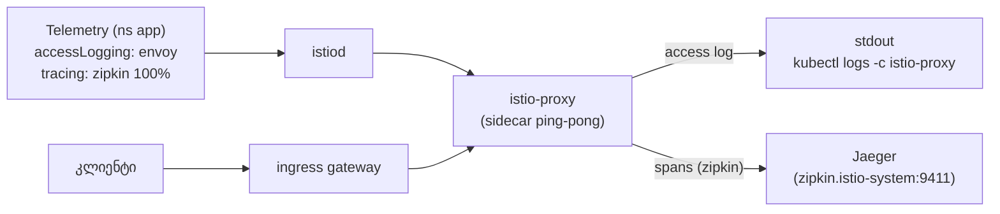

[Русская версия](README_RU.MD) · [Eng version](README.MD) · [Versión en español](README_ES.MD) · [Version française](README_FR.MD) · [Deutsche Version](README_DE.MD) · [繁體中文版](README_TW.MD) · [日本語版](README_JP.MD)

# Lab 18 - Telemetry API: წვდომის ლოგები და განაწილებული ტრეისინგი

> [საცნობარო გადაწყვეტა](worker/files/solutions/1_GE.MD)

## მიმოხილვა

**Telemetry API** (`telemetry.istio.io`) - mesh-ის ტელემეტრიის: წვდომის ლოგების,
მეტრიკებისა და ტრეისების მართვის თანამედროვე დეკლარაციული მეთოდია. ის ანაცვლებს
`meshConfig`-ისა და `EnvoyFilter`-ის გამოყენებაზე დაფუძნებულ ძველ მიდგომებს და მოქმედების არეების იერარქიას უჭერს მხარს:

- `Telemetry` ძირეულ namespace-ში (`istio-system`) - მთელი mesh-ისთვის;
- `Telemetry` სამუშაო დატვირთვის namespace-ში - ამ namespace-ისთვის გადააწერს პარამეტრებს;
- `Telemetry` `selector`-ით - კონკრეტული სამუშაო დატვირთვებისთვის გადააწერს პარამეტრებს.

`default` პროფილში access-ლოგები **გამორთულია**, ხოლო `Telemetry` ჯერ არ არსებობს. Istio
დაინსტალირებულია ტრეისინგის პროვაიდერით `zipkin` (`enableTracing` + `extensionProviders`),
კლასტერში კი გაშლილია backend **Jaeger**. თქვენი ამოცანაა, Telemetry API-ის საშუალებით
ჩართოთ access-ლოგები და ტრეისინგი, რათა ლოგები და ტრეისები რეალურად შეგროვდეს.

აპლიკაცია `ping-pong` გაშლილია namespace `app`-ში და გამოქვეყნებულია მისამართზე
`http://myapp.local:32080/`.



## სად გროვდება ლოგები და ტრეისები

| სიგნალი | პროვაიდერი | დანიშნულება |
|---|---|---|
| Access-ლოგები | `envoy` (ჩაშენებული) | stdout sidecar → `kubectl logs -c istio-proxy` |
| ტრეისები | `zipkin` (extensionProvider) | Jaeger (`zipkin.istio-system:9411`) → Jaeger UI |

## ინფრასტრუქტურა

| კომპონენტი | ტიპი | რაოდენობა | როლი |
|---|---|---|---|
| control-plane | `t3.medium` | 1 | master + istiod + ingress gateway + Jaeger |
| worker | `t3.small` | 1 | აპლიკაციისთვის განკუთვნილი რესურსები |
| worker PC | `t3.small` | 1 | სამუშაო ადგილი: `kubectl`, `curl`, `check_result` |

რეგიონი: `eu-central-1` (AZ `eu-central-1a` / `eu-central-1b`).

## გაშლა

```bash
TASK=18 make run_ica_task
```

## დავალება

1. დარწმუნდით, რომ ნაგულისხმევად sidecar-ში access-ლოგები არ არის.
2. შექმენით რესურსი `Telemetry` namespace `app`-ში, რომელიც:
   - ჩართავს access logging-ს ჩაშენებული პროვაიდერის `envoy` საშუალებით;
   - ჩართავს ტრეისინგს პროვაიდერის `zipkin` საშუალებით, `randomSamplingPercentage: 100` პარამეტრით.
3. გააგზავნეთ ტრაფიკი და დარწმუნდით, რომ:
   - sidecar-ის ლოგებში access log-ის სტრიქონები გამოჩნდა;
   - Jaeger-ში სერვის `ping-pong`-ის ტრეისები გამოჩნდა.

## ნაბიჯი 1. შეამოწმეთ, რომ ლოგები არ არის

```bash
POD=$(kubectl get pod -n app -l app=ping-pong -o jsonpath='{.items[0].metadata.name}')
curl -s -o /dev/null http://myapp.local:32080/
kubectl logs -n app "$POD" -c istio-proxy --tail=50   # access log-ის სტრიქონები არ არის
```

## ნაბიჯი 2. გამართეთ ლოგები + ტრეისები Telemetry-ის საშუალებით

```bash
cat > telemetry.yaml <<'EOF'
apiVersion: telemetry.istio.io/v1
kind: Telemetry
metadata:
  name: app-telemetry
  namespace: app
spec:
  accessLogging:
    - providers:
        - name: envoy
  tracing:
    - providers:
        - name: zipkin
      randomSamplingPercentage: 100.0
EOF

kubectl apply -f telemetry.yaml
```

## ნაბიჯი 3. დააგენერირეთ ტრაფიკი

```bash
for i in $(seq 30); do curl -s -o /dev/null http://myapp.local:32080/; done
```

## ნაბიჯი 4. შეამოწმეთ შეგროვება

Access-ლოგები (sidecar-ის stdout-ში):

```bash
POD=$(kubectl get pod -n app -l app=ping-pong -o jsonpath='{.items[0].metadata.name}')
kubectl logs -n app "$POD" -c istio-proxy --tail=50 | grep 'GET / HTTP'
```

ტრეისები (Jaeger-ში, მოთხოვნა კლასტერის შიგნიდან):

```bash
kubectl exec -n app deploy/curl-client -- \
  curl -s 'http://tracing.istio-system:80/jaeger/api/services' | tr ',' '\n' | grep ping-pong
```

Jaeger UI-ის ნახვა port-forward-ის საშუალებით შეგიძლიათ:

```bash
kubectl -n istio-system port-forward svc/tracing 16686:80
# გახსენით http://localhost:16686/jaeger და აირჩიეთ სერვისი ping-pong
```

## როგორ მუშაობს ეს

- **Telemetry API** დეკლარაციულად მართავს ლოგებს/მეტრიკებს/ტრეისებს; მოქმედების არეების
  იერარქია საშუალებას გაძლევთ, დეტალური ტელემეტრია ერთი სერვისისთვის ჩართოთ ისე, რომ დანარჩენ mesh-ს არ შეეხოთ.
- **`accessLogging.providers.name: envoy`** access-ლოგებს sidecar-ის stdout-ში წერს.
- **`tracing.providers.name: zipkin`** span-ებს მიმართავს პროვაიდერ `zipkin`-ში, რომელიც
  `meshConfig.extensionProviders`-შია გამოცხადებული, ის კი მათ Jaeger-ში აგზავნის. პროვაიდერზე
  მითითების გარეშე სემპლირების პოლიტიკას span-ების გასაგზავნი ადგილი არ ექნებოდა.
- **`randomSamplingPercentage: 100`** თითოეულ მოთხოვნას ატრეისებს (production-ში დაბალ
  მნიშვნელობას იყენებენ, რათა ზედნადები ხარჯები აკონტროლონ).

> **შენიშვნა production-ისთვის.** პროვაიდერი `envoy` access-ლოგებს **კონტეინერ
> `istio-proxy`-ის stdout-ში** წერს - მათი ნახვა მხოლოდ ლოკალურად, ბრძანებით
> `kubectl logs -n app <pod> -c istio-proxy` არის შესაძლებელი. ეს გამართვისთვის მოსახერხებელია, მაგრამ stdout ეფემერულია:
> pod-ის გადატვირთვის/წაშლისას ლოგები იკარგება და მათი საშუალებით ცენტრალიზებულად ძიება
> და alert-ების აგება შეუძლებელია. რეალურ ინფრასტრუქტურაში ამას ზემოდან ლოგების შეგროვების სისტემა ემატება -
> აგენტი თითოეულ node-ზე (**Fluent Bit / Fluentd / Vector**) კონტეინერების stdout-ს აგროვებს და
> ცენტრალიზებულ საცავში (**Loki, Elasticsearch/OpenSearch,
> CloudWatch Logs** და ა.შ.) აგზავნის, სადაც ლოგები ინახება, იძებნება და alerting-ში გამოიყენება. იგივე
> ეხება ტრეისებსაც: **Jaeger** აქ all-in-one კონფიგურაციაშია, მეხსიერებით საცავის სახით (სასწავლო
> მიზნებისთვის), production-ში კი ტრეისებს მუდმივ backend-ში (Elasticsearch/Cassandra ან
> managed-გადაწყვეტილება) წერენ.

## შედეგის შემოწმება

გაუშვით worker PC-ზე:

```bash
check_result
```

## შეჯამება

თქვენ აითვისეთ Telemetry API - ერთიანი დეკლარაციული ინტერფეისი ლოგების, მეტრიკებისა და ტრეისებისთვის -
და გამართეთ რეალური შეგროვება: access-ლოგები sidecar-ის stdout-ში და განაწილებული ტრეისები Jaeger-ში
პროვაიდერ `zipkin`-ის საშუალებით. senior DevOps-ისთვის ეს დაკვირვებადობის მართვის საკვანძო ინსტრუმენტია,
რომელიც meshConfig-ის ჩასწორებასა და არასაიმედო `EnvoyFilter`-ებს არ საჭიროებს.
