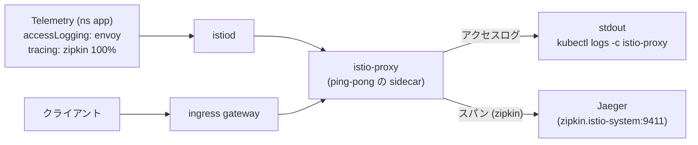

[Русская версия](README_RU.MD) · [Eng version](README.MD) · [Versión en español](README_ES.MD) · [Version française](README_FR.MD) · [Deutsche Version](README_DE.MD) · [ქართული ვერსია](README_GE.MD) · [繁體中文版](README_TW.MD)

# Lab 18 - Telemetry API: アクセスログと分散トレーシング

> [リファレンス解答](worker/files/solutions/1_JP.MD)

## 概要

**Telemetry API** (`telemetry.istio.io`) は、mesh のテレメトリー（アクセスログ、メトリクス、トレース）を管理するための最新の宣言的な方法です。従来の `meshConfig` および `EnvoyFilter` によるアプローチに代わるもので、以下のスコープ階層をサポートします。

- ルート namespace（`istio-system`）の `Telemetry` - mesh 全体に適用。
- ワークロードの namespace にある `Telemetry` - その namespace 向けの設定をオーバーライド。
- `selector` を持つ `Telemetry` - 特定のワークロード向けの設定をオーバーライド。

`default` プロファイルではアクセスログは**無効**であり、`Telemetry` はまだありません。Istio はトレーシングプロバイダー `zipkin`（`enableTracing` + `extensionProviders`）とともにインストールされており、クラスターにはバックエンドの **Jaeger** がデプロイされています。課題は Telemetry API を使用してアクセスログとトレーシングを有効化し、ログとトレースが実際に収集されるようにすることです。

アプリケーション `ping-pong` は namespace `app` にデプロイされ、`http://myapp.local:32080/` で公開されています。



## ログとトレースの収集先

| シグナル | プロバイダー | 宛先 |
|---|---|---|
| アクセスログ | `envoy`（組み込み） | sidecar の stdout → `kubectl logs -c istio-proxy` |
| トレース | `zipkin`（extensionProvider） | Jaeger（`zipkin.istio-system:9411`）→ Jaeger UI |

## インフラストラクチャ

| コンポーネント | タイプ | 数 | 役割 |
|---|---|---|---|
| control-plane | `t3.medium` | 1 | master + istiod + ingress gateway + Jaeger |
| worker | `t3.small` | 1 | アプリケーション用の容量 |
| worker PC | `t3.small` | 1 | 作業環境: `kubectl`、`curl`、`check_result` |

リージョン: `eu-central-1`（AZ `eu-central-1a` / `eu-central-1b`）。

## デプロイ

```bash
TASK=18 make run_ica_task
```

## 課題

1. デフォルトでは sidecar にアクセスログが存在しないことを確認する。
2. namespace `app` に、以下を満たす `Telemetry` リソースを作成する。
   - 組み込みプロバイダー `envoy` によりアクセスログを有効化する。
   - `randomSamplingPercentage: 100` を指定してプロバイダー `zipkin` によるトレーシングを有効化する。
3. トラフィックを送信し、以下を確認する。
   - sidecar のログにアクセスログの行が表示される。
   - Jaeger にサービス `ping-pong` のトレースが表示される。

## ステップ 1. ログがないことを確認する

```bash
POD=$(kubectl get pod -n app -l app=ping-pong -o jsonpath='{.items[0].metadata.name}')
curl -s -o /dev/null http://myapp.local:32080/
kubectl logs -n app "$POD" -c istio-proxy --tail=50   # access log の行がない
```

## ステップ 2. Telemetry でログとトレースを設定する

```bash
cat > telemetry.yaml <<'EOF'
apiVersion: telemetry.istio.io/v1
kind: Telemetry
metadata:
  name: app-telemetry
  namespace: app
spec:
  accessLogging:
    - providers:
        - name: envoy
  tracing:
    - providers:
        - name: zipkin
      randomSamplingPercentage: 100.0
EOF

kubectl apply -f telemetry.yaml
```

## ステップ 3. トラフィックを生成する

```bash
for i in $(seq 30); do curl -s -o /dev/null http://myapp.local:32080/; done
```

## ステップ 4. 収集を確認する

アクセスログ（sidecar の stdout）:

```bash
POD=$(kubectl get pod -n app -l app=ping-pong -o jsonpath='{.items[0].metadata.name}')
kubectl logs -n app "$POD" -c istio-proxy --tail=50 | grep 'GET / HTTP'
```

トレース（Jaeger 内、クラスター内からのリクエスト）:

```bash
kubectl exec -n app deploy/curl-client -- \
  curl -s 'http://tracing.istio-system:80/jaeger/api/services' | tr ',' '\n' | grep ping-pong
```

port-forward を使用して Jaeger UI を確認できます。

```bash
kubectl -n istio-system port-forward svc/tracing 16686:80
# http://localhost:16686/jaeger を開き、ping-pong サービスを選択する
```

## 仕組み

- **Telemetry API** はログ、メトリクス、トレースを宣言的に管理します。スコープ階層により、mesh の残りに変更を加えずに、1 つのサービスに対して詳細なテレメトリーを有効化できます。
- **`accessLogging.providers.name: envoy`** はアクセスログを sidecar の stdout に出力します。
- **`tracing.providers.name: zipkin`** はスパンを `meshConfig.extensionProviders` で定義されたプロバイダー `zipkin` に送信し、プロバイダーがそれらを Jaeger に転送します。プロバイダーへの参照がなければ、サンプリングポリシーはスパンの送信先を持ちません。
- **`randomSamplingPercentage: 100`** はすべてのリクエストをトレースします（本番環境では、オーバーヘッドを抑えるため低い値を設定します）。

> **本番環境に関する注意。** プロバイダー `envoy` はアクセスログを **`istio-proxy` コンテナの stdout** に出力します。これらは `kubectl logs -n app <pod> -c istio-proxy` を使用してローカルでのみ確認できます。デバッグには便利ですが、stdout はエフェメラルです。Pod の再起動または削除時にログは失われ、ログを横断的に検索したり一元的にアラートを構築したりできません。実際のインフラでは、この上にログ収集をデプロイします。各ノードのエージェント（**Fluent Bit / Fluentd / Vector**）がコンテナの stdout を収集し、集中ストレージ（**Loki、Elasticsearch/OpenSearch、CloudWatch Logs** など）に送信します。そこでログは保存、検索され、アラートに利用されます。トレースも同様です。ここでの **Jaeger** はストレージにメモリを使用する all-in-one（学習用）ですが、本番ではトレースを永続的なバックエンド（Elasticsearch/Cassandra またはマネージドソリューション）に書き込みます。

## 結果の確認

worker PC で実行します。

```bash
check_result
```

## まとめ

Telemetry API（ログ、メトリクス、トレースのための統一された宣言的インターフェース）を習得し、実際の収集を設定しました。アクセスログは sidecar の stdout に、分散トレースはプロバイダー `zipkin` を介して Jaeger に送られます。シニア DevOps にとって、これは meshConfig の変更や壊れやすい `EnvoyFilter` なしに可観測性を管理するための重要なツールです。
