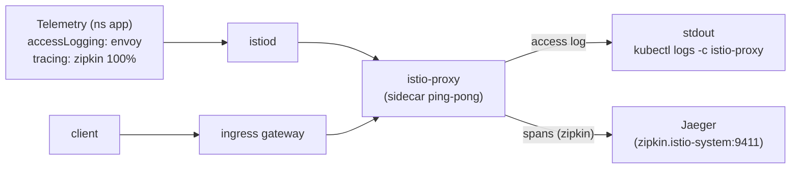

[Eng version](README.MD)

# Lab 18 - Telemetry API: access logs и распределённый трейсинг

## Обзор

**Telemetry API** (`telemetry.istio.io`) - современный декларативный способ управлять
телеметрией mesh: логами доступа, метриками и трейсами. Он приходит на смену старым
подходам через `meshConfig` и `EnvoyFilter` и поддерживает иерархию областей действия:

- `Telemetry` в корневом namespace (`istio-system`) - на весь mesh;
- `Telemetry` в namespace ворклоада - переопределяет для этого namespace;
- `Telemetry` с `selector` - переопределяет для конкретных ворклоадов.

В профиле `default` access-логи **выключены**, а `Telemetry` ещё нет. Istio установлен
с трейсинг-провайдером `zipkin` (`enableTracing` + `extensionProviders`), в кластере
развёрнут backend **Jaeger**. Ваша задача - через Telemetry API включить access-логи и
трейсинг, чтобы логи и трейсы реально собирались.

Приложение `ping-pong` развёрнуто в namespace `app` и опубликовано на
`http://myapp.local:32080/`.



## Куда собираются логи и трейсы

| Сигнал | Провайдер | Назначение |
|---|---|---|
| Access-логи | `envoy` (встроенный) | stdout sidecar → `kubectl logs -c istio-proxy` |
| Трейсы | `zipkin` (extensionProvider) | Jaeger (`zipkin.istio-system:9411`) → Jaeger UI |

## Задание

1. Убедиться, что по умолчанию access-логи в sidecar отсутствуют.
2. Создать ресурс `Telemetry` в namespace `app`, который:
   - включает access logging через встроенный провайдер `envoy`;
   - включает трейсинг через провайдер `zipkin` c `randomSamplingPercentage: 100`.
3. Отправить трафик и убедиться, что:
   - в логах sidecar появились строки access log;
   - в Jaeger появились трейсы сервиса `ping-pong`.

## Шаг 1. Проверить, что логов нет

```bash
POD=$(kubectl get pod -n app -l app=ping-pong -o jsonpath='{.items[0].metadata.name}')
curl -s -o /dev/null http://myapp.local:32080/
kubectl logs -n app "$POD" -c istio-proxy --tail=50   # строк access log нет
```

## Шаг 2. Настроить логи + трейсы через Telemetry

```bash
cat > telemetry.yaml <<'EOF'
apiVersion: telemetry.istio.io/v1
kind: Telemetry
metadata:
  name: app-telemetry
  namespace: app
spec:
  accessLogging:
    - providers:
        - name: envoy
  tracing:
    - providers:
        - name: zipkin
      randomSamplingPercentage: 100.0
EOF

kubectl apply -f telemetry.yaml
```

## Шаг 3. Сгенерировать трафик

```bash
for i in $(seq 30); do curl -s -o /dev/null http://myapp.local:32080/; done
```

## Шаг 4. Проверить сбор

Access-логи (в stdout sidecar):

```bash
POD=$(kubectl get pod -n app -l app=ping-pong -o jsonpath='{.items[0].metadata.name}')
kubectl logs -n app "$POD" -c istio-proxy --tail=50 | grep 'GET / HTTP'
```

Трейсы (в Jaeger, запрос изнутри кластера):

```bash
kubectl exec -n app deploy/curl-client -- \
  curl -s 'http://tracing.istio-system:80/jaeger/api/services' | tr ',' '\n' | grep ping-pong
```

Можно посмотреть UI Jaeger через port-forward:

```bash
kubectl -n istio-system port-forward svc/tracing 16686:80
# открыть http://localhost:16686/jaeger и выбрать сервис ping-pong
```

## Как это работает

- **Telemetry API** декларативно управляет логами/метриками/трейсами; иерархия областей
  позволяет включить подробную телеметрию для одного сервиса, не трогая остальной mesh.
- **`accessLogging.providers.name: envoy`** пишет access-логи в stdout sidecar.
- **`tracing.providers.name: zipkin`** направляет спаны в провайдер `zipkin`, объявленный
  в `meshConfig.extensionProviders`, а тот пересылает их в Jaeger. Без ссылки на провайдер
  политике сэмплирования некуда было бы отправлять спаны.
- **`randomSamplingPercentage: 100`** трейсит каждый запрос (в проде ставят низкое
  значение, чтобы контролировать накладные расходы).

> **Замечание для продакшена.** Провайдер `envoy` пишет access-логи в **stdout
> контейнера `istio-proxy`** - смотреть их можно только локально через
> `kubectl logs -n app <pod> -c istio-proxy`. Это удобно для отладки, но stdout эфемерен:
> при рестарте/удалении пода логи теряются, и по ним нельзя искать и строить алерты
> централизованно. В реальной инфраструктуре поверх этого разворачивают сбор логов -
> агент на каждой ноде (**Fluent Bit / Fluentd / Vector**) собирает stdout контейнеров и
> отправляет в централизованное хранилище (**Loki, Elasticsearch/OpenSearch,
> CloudWatch Logs** и т.п.), где логи хранятся, ищутся и участвуют в алертинге. То же
> касается трейсов: **Jaeger** здесь - all-in-one с памятью в качестве хранилища (для
> учёбы), а в проде трейсы пишут в постоянный backend (Elasticsearch/Cassandra или
> managed-решение).

## Проверка результата

Запустите на worker PC:

```bash
check_result
```

## Итог

Вы освоили Telemetry API - единый декларативный интерфейс для логов, метрик и трейсов -
и настроили реальный сбор: access-логи в stdout sidecar и распределённые трейсы в Jaeger
через провайдер `zipkin`. Для senior DevOps это ключевой инструмент управления
наблюдаемостью без правки meshConfig и хрупких `EnvoyFilter`.

## Инфраструктура

| Компонент | Тип | Кол-во | Роль |
|---|---|---|---|
| control-plane | `t3.medium` | 1 | master + istiod + ingress gateway + Jaeger |
| worker | `t3.small` | 1 | ёмкость для приложения |
| worker PC | `t3.small` | 1 | рабочее место: `kubectl`, `curl`, `check_result` |

Регион: `eu-central-1` (AZ `eu-central-1a` / `eu-central-1b`).
