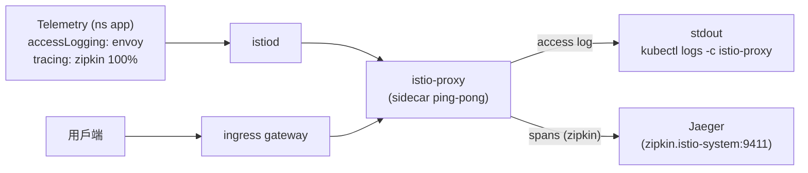

[Русская версия](README_RU.MD) · [Eng version](README.MD) · [Versión en español](README_ES.MD) · [Version française](README_FR.MD) · [Deutsche Version](README_DE.MD) · [ქართული ვერსია](README_GE.MD) · [日本語版](README_JP.MD)

# Lab 18 - Telemetry API：存取日誌與分散式追蹤

> [參考解答](worker/files/solutions/1_TW.MD)

## 概覽

**Telemetry API** (`telemetry.istio.io`) 是一種現代的宣告式方式，可管理
mesh 遙測資料：存取日誌、指標與追蹤。它取代了透過 `meshConfig` 與 `EnvoyFilter` 的舊式
做法，並支援作用範圍階層：

- 根 namespace（`istio-system`）中的 `Telemetry`：套用至整個 mesh；
- 工作負載 namespace 中的 `Telemetry`：覆寫此 namespace 的設定；
- 使用 `selector` 的 `Telemetry`：覆寫特定工作負載的設定。

在 `default` 設定檔中，存取日誌**已停用**，且尚未有 `Telemetry`。Istio 已安裝
追蹤提供者 `zipkin`（`enableTracing` + `extensionProviders`），叢集中已部署 **Jaeger**
後端。您的任務是透過 Telemetry API 啟用存取日誌與追蹤，使日誌與追蹤確實被收集。

應用程式 `ping-pong` 已部署於 namespace `app`，並發布在
`http://myapp.local:32080/`。



## 日誌與追蹤收集至何處

| 訊號 | 提供者 | 目的地 |
|---|---|---|
| 存取日誌 | `envoy`（內建） | sidecar stdout → `kubectl logs -c istio-proxy` |
| 追蹤 | `zipkin`（extensionProvider） | Jaeger（`zipkin.istio-system:9411`）→ Jaeger UI |

## 基礎設施

| 元件 | 類型 | 數量 | 角色 |
|---|---|---|---|
| control-plane | `t3.medium` | 1 | master + istiod + ingress gateway + Jaeger |
| worker | `t3.small` | 1 | 應用程式容量 |
| worker PC | `t3.small` | 1 | 工作站：`kubectl`、`curl`、`check_result` |

區域：`eu-central-1`（AZ `eu-central-1a` / `eu-central-1b`）。

## 部署

```bash
TASK=18 make run_ica_task
```

## 任務

1. 確認 sidecar 預設未產生存取日誌。
2. 在 namespace `app` 中建立 `Telemetry` 資源，該資源：
   - 透過內建提供者 `envoy` 啟用存取日誌；
   - 透過提供者 `zipkin` 啟用追蹤，並設定 `randomSamplingPercentage: 100`。
3. 傳送流量並確認：
   - sidecar 日誌中出現存取日誌行；
   - Jaeger 中出現服務 `ping-pong` 的追蹤。

## 步驟 1：確認沒有日誌

```bash
POD=$(kubectl get pod -n app -l app=ping-pong -o jsonpath='{.items[0].metadata.name}')
curl -s -o /dev/null http://myapp.local:32080/
kubectl logs -n app "$POD" -c istio-proxy --tail=50   # 沒有 access log 行
```

## 步驟 2：透過 Telemetry 設定日誌與追蹤

```bash
cat > telemetry.yaml <<'EOF'
apiVersion: telemetry.istio.io/v1
kind: Telemetry
metadata:
  name: app-telemetry
  namespace: app
spec:
  accessLogging:
    - providers:
        - name: envoy
  tracing:
    - providers:
        - name: zipkin
      randomSamplingPercentage: 100.0
EOF

kubectl apply -f telemetry.yaml
```

## 步驟 3：產生流量

```bash
for i in $(seq 30); do curl -s -o /dev/null http://myapp.local:32080/; done
```

## 步驟 4：驗證收集結果

存取日誌（sidecar stdout）：

```bash
POD=$(kubectl get pod -n app -l app=ping-pong -o jsonpath='{.items[0].metadata.name}')
kubectl logs -n app "$POD" -c istio-proxy --tail=50 | grep 'GET / HTTP'
```

追蹤（Jaeger 中，從叢集內部發出請求）：

```bash
kubectl exec -n app deploy/curl-client -- \
  curl -s 'http://tracing.istio-system:80/jaeger/api/services' | tr ',' '\n' | grep ping-pong
```

您可以透過 port-forward 查看 Jaeger UI：

```bash
kubectl -n istio-system port-forward svc/tracing 16686:80
# 開啟 http://localhost:16686/jaeger 並選擇 ping-pong 服務
```

## 運作方式

- **Telemetry API** 以宣告式方式管理日誌／指標／追蹤；作用範圍階層可讓您為單一服務啟用
  詳細遙測資料，而不影響 mesh 的其餘部分。
- **`accessLogging.providers.name: envoy`** 將存取日誌寫入 sidecar stdout。
- **`tracing.providers.name: zipkin`** 將 span 導向在
  `meshConfig.extensionProviders` 中宣告的 `zipkin` 提供者，該提供者再將它們轉送至 Jaeger。若未參照提供者，
  取樣策略便沒有可傳送 span 的目的地。
- **`randomSamplingPercentage: 100`** 會追蹤每個請求（在生產環境中會設定較低的
  值，以控制額外負擔）。

> **生產環境注意事項。** 提供者 `envoy` 將存取日誌寫入 **`istio-proxy`
> 容器的 stdout**，只能透過
> `kubectl logs -n app <pod> -c istio-proxy` 在本機查看。這對除錯很方便，但 stdout 是暫時性的：
> pod 重新啟動／刪除時日誌會遺失，且無法對其進行集中搜尋與建立告警。
> 在實際基礎設施中，會在其上部署日誌收集系統：每個節點上的代理程式（**Fluent Bit / Fluentd / Vector**）
> 收集容器 stdout 並傳送至集中式儲存（**Loki、Elasticsearch/OpenSearch、
> CloudWatch Logs** 等），使日誌得以保存、搜尋並用於告警。追蹤亦同：此處的 **Jaeger** 是以記憶體作為儲存的 all-in-one（供學習使用），
> 而在生產環境中，追蹤會寫入持久化後端（Elasticsearch/Cassandra 或受管理的解決方案）。

## 驗證結果

在 worker PC 上執行：

```bash
check_result
```

## 總結

您已掌握 Telemetry API：這是日誌、指標與追蹤的統一宣告式介面，並已設定實際收集：將存取日誌寫入 sidecar stdout，並透過提供者 `zipkin` 將分散式追蹤傳送至 Jaeger。對 senior DevOps 而言，這是無須修改 meshConfig 與脆弱的 `EnvoyFilter` 即可管理可觀測性的關鍵工具。
