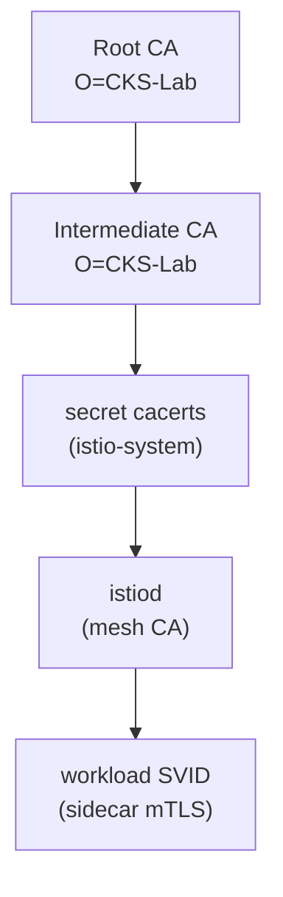

[RU version](README_RU.MD) · [Versión en español](README_ES.MD) · [Version française](README_FR.MD) · [Deutsche Version](README_DE.MD)

# Lab 19 - Custom CA: plug your own root + intermediate CA into istiod

## Overview

istiod is the mesh certificate authority (CA): it signs the SPIFFE identity certificates
(`SVID`) that sidecars use for mTLS. By default istiod generates a **self-signed** CA on
first start. Production rarely does that - organizations plug in their own PKI so the
whole mesh chains to a root they control (and so multiple clusters can share a common
root of trust).

In this lab you plug in **your own** CA: generate a root and an intermediate
certificate, load them into istio-system as the `cacerts` secret, install Istio, and
confirm that workload certificates are issued by your CA.

The cluster is up but Istio is **not** installed (installing it with a custom CA is the
task). `istioctl 1.29.1` and `openssl` are pre-installed on the worker PC.



## Infrastructure

| Component | Type | Count | Role |
|---|---|---|---|
| control-plane | `t3.medium` | 1 | master + istiod (mesh CA) |
| worker | `t3.small` | 1 | capacity for the app |
| worker PC | `t3.small` | 1 | workstation: `kubectl`, `istioctl`, `openssl`, `check_result` |

Region: `eu-central-1` (AZ `eu-central-1a` / `eu-central-1b`).

## Provisioning

```bash
TASK=19 make run_ica_task
```

## Task

1. Generate a root CA and an intermediate CA (openssl).
2. Create a `cacerts` secret in namespace `istio-system` with keys `ca-cert.pem`,
   `ca-key.pem`, `root-cert.pem`, `cert-chain.pem`.
3. Install Istio (`istioctl install`) - istiod picks up `cacerts` and signs workload
   certificates with the intermediate CA.
4. Deploy the app and confirm the sidecar's root of trust is your custom CA.

## Step 1. Generate a root and an intermediate CA

```bash
mkdir -p ~/ca && cd ~/ca

# Root CA
openssl genrsa -out root-key.pem 4096
openssl req -x509 -new -nodes -key root-key.pem -sha256 -days 3650 \
  -subj "/O=CKS-Lab/CN=CKS-Lab Root CA" -out root-cert.pem

# Intermediate CA, signed by the root
openssl genrsa -out ca-key.pem 4096
openssl req -new -key ca-key.pem -subj "/O=CKS-Lab/CN=CKS-Lab Intermediate CA" -out ca.csr

cat > ext.cnf <<'EOF'
basicConstraints=critical,CA:TRUE,pathlen:0
keyUsage=critical,digitalSignature,keyCertSign,cRLSign
subjectAltName=DNS:istiod.istio-system.svc
EOF

openssl x509 -req -in ca.csr -CA root-cert.pem -CAkey root-key.pem -CAcreateserial \
  -days 1825 -sha256 -extfile ext.cnf -out ca-cert.pem

# Istio expects the chain = intermediate + root
cat ca-cert.pem root-cert.pem > cert-chain.pem
```

## Step 2. Create the `cacerts` secret

```bash
kubectl create namespace istio-system
kubectl create secret generic cacerts -n istio-system \
  --from-file=ca-cert.pem \
  --from-file=ca-key.pem \
  --from-file=root-cert.pem \
  --from-file=cert-chain.pem
```

## Step 3. Install Istio

```bash
istioctl install --set profile=default -y
```

istiod detects the `cacerts` secret on startup and uses the intermediate CA to issue
workload certificates instead of generating a self-signed CA.

## Step 4. Deploy the app

```bash
kubectl apply -f https://raw.githubusercontent.com/ViktorUJ/cks/refs/heads/master/tasks/ica/labs/19/k8s-1/scripts/1.yaml
kubectl rollout status deploy/ping-pong -n app
```

## Step 5. Verify the trust chain

```bash
POD=$(kubectl get pod -n app -l app=ping-pong -o jsonpath='{.items[0].metadata.name}')

# The root of trust the sidecar validates against - should be our custom root
istioctl proxy-config secret "$POD" -n app -o json \
  | jq -r '.dynamicActiveSecrets[] | select(.name=="ROOTCA") | .secret.validationContext.trustedCa.inlineBytes' \
  | base64 -d | openssl x509 -noout -subject -issuer
# subject/issuer -> O=CKS-Lab, CN=CKS-Lab Root CA

# The workload certificate itself, signed by our intermediate
istioctl proxy-config secret "$POD" -n app -o json \
  | jq -r '.dynamicActiveSecrets[] | select(.name=="default") | .secret.tlsCertificate.certificateChain.inlineBytes' \
  | base64 -d | openssl x509 -noout -issuer
# issuer -> O=CKS-Lab, CN=CKS-Lab Intermediate CA
```

## How it works

- istiod is the mesh CA: it signs the SPIFFE identity certs (`SVID`) that power mTLS.
- The **`cacerts`** secret (`ca-cert.pem`, `ca-key.pem`, `root-cert.pem`,
  `cert-chain.pem`) lets you supply your own intermediate CA. istiod then issues workload
  certs from *your* PKI, so the whole mesh chains to a root you control - essential for
  integrating with an enterprise PKI or sharing a multi-cluster trust root.
- istiod still **rotates** workload certificates automatically (short-lived SVIDs); you
  only supply the signing CA.

## Production evolution: dynamic issuance with cert-manager + istio-csr

A static `cacerts` secret means the intermediate key lives in the cluster and you rotate
it manually. In production, teams often use **cert-manager + istio-csr**: istiod
delegates signing to `istio-csr`, which requests certificates from a cert-manager
`Issuer` (backed by Vault, an ACME CA, or a corporate PKI). That keeps the signing key
out of istiod and enables automated CA rotation.

## Check the result

Run on the worker PC:

```bash
check_result
```

## Summary

You plugged your own root and intermediate CA into istiod via the `cacerts` secret and
confirmed workload certificates are issued from your PKI. Managing the mesh CA is a key
senior/security skill - without it you cannot integrate Istio with a corporate PKI or
build a shared trust root across clusters.
