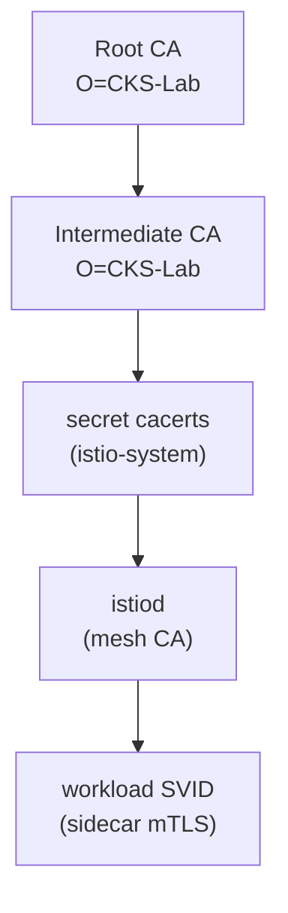

[RU version](README_RU.MD) · [Eng version](README.MD) · [Versión en español](README_ES.MD) · [Version française](README_FR.MD)

# Lab 19 - Custom CA: Einbindung einer eigenen Root- und Intermediate-CA in istiod

## Überblick

istiod fungiert als Zertifizierungsstelle (CA) des Mesh: es signiert Identity-Zertifikate
(SPIFFE `SVID`), die die Sidecars für mTLS verwenden. Standardmäßig generiert istiod beim ersten
Start eine **selbstsignierte** CA. In der Produktion macht man das normalerweise nicht - Unternehmen
binden ihre eigene PKI ein, damit das gesamte Mesh der Root vertraut, die sie selbst verwalten (und
damit mehrere Cluster einen gemeinsamen Vertrauensanker haben).

In diesem Lab binden Sie Ihre **eigene** CA ein: Sie generieren Root- und Intermediate-Zertifikate,
laden sie als Secret `cacerts` in istio-system, installieren Istio und stellen sicher, dass die
Zertifikate der Workloads von Ihrer CA ausgestellt werden.

Der Cluster ist bereits eingerichtet, aber Istio ist **nicht installiert** (die Installation mit
eigener CA ist die Aufgabe). Auf dem worker PC sind `istioctl 1.29.1` und `openssl` vorinstalliert.



## Aufgabe

1. Eine Root-CA und eine Intermediate-CA generieren (openssl).
2. Ein Secret `cacerts` im Namespace `istio-system` mit den Schlüsseln `ca-cert.pem`,
   `ca-key.pem`, `root-cert.pem`, `cert-chain.pem` erstellen.
3. Istio installieren (`istioctl install`) - istiod übernimmt `cacerts` und signiert die
   Zertifikate der Workloads mit der Intermediate-CA.
4. Die Anwendung ausrollen und sicherstellen, dass der Vertrauensanker des Sidecars Ihre
   Custom-CA ist.

## Schritt 1. Root- und Intermediate-CA generieren

```bash
mkdir -p ~/ca && cd ~/ca

# Root-CA
openssl genrsa -out root-key.pem 4096
openssl req -x509 -new -nodes -key root-key.pem -sha256 -days 3650 \
  -subj "/O=CKS-Lab/CN=CKS-Lab Root CA" -out root-cert.pem

# Intermediate-CA, signiert von der Root-CA
openssl genrsa -out ca-key.pem 4096
openssl req -new -key ca-key.pem -subj "/O=CKS-Lab/CN=CKS-Lab Intermediate CA" -out ca.csr

cat > ext.cnf <<'EOF'
basicConstraints=critical,CA:TRUE,pathlen:0
keyUsage=critical,digitalSignature,keyCertSign,cRLSign
subjectAltName=DNS:istiod.istio-system.svc
EOF

openssl x509 -req -in ca.csr -CA root-cert.pem -CAkey root-key.pem -CAcreateserial \
  -days 1825 -sha256 -extfile ext.cnf -out ca-cert.pem

# Istio erwartet die Kette = Intermediate + Root
cat ca-cert.pem root-cert.pem > cert-chain.pem
```

## Schritt 2. Secret `cacerts` erstellen

```bash
kubectl create namespace istio-system
kubectl create secret generic cacerts -n istio-system \
  --from-file=ca-cert.pem \
  --from-file=ca-key.pem \
  --from-file=root-cert.pem \
  --from-file=cert-chain.pem
```

## Schritt 3. Istio installieren

```bash
istioctl install --set profile=default -y
```

istiod erkennt beim Start das Secret `cacerts` und verwendet die Intermediate-CA für die
Ausstellung der Workload-Zertifikate anstelle der selbstsignierten.

## Schritt 4. Anwendung ausrollen

```bash
kubectl apply -f https://raw.githubusercontent.com/ViktorUJ/cks/refs/heads/master/tasks/ica/labs/19/k8s-1/scripts/1.yaml
kubectl rollout status deploy/ping-pong -n app
```

## Schritt 5. Vertrauenskette prüfen

```bash
POD=$(kubectl get pod -n app -l app=ping-pong -o jsonpath='{.items[0].metadata.name}')

# Vertrauensanker, der den Sidecar validiert - muss unsere Custom-Root sein
istioctl proxy-config secret "$POD" -n app -o json \
  | jq -r '.dynamicActiveSecrets[] | select(.name=="ROOTCA") | .secret.validationContext.trustedCa.inlineBytes' \
  | base64 -d | openssl x509 -noout -subject -issuer
# subject/issuer -> O=CKS-Lab, CN=CKS-Lab Root CA

# Das Workload-Zertifikat selbst, signiert von unserer Intermediate-CA
istioctl proxy-config secret "$POD" -n app -o json \
  | jq -r '.dynamicActiveSecrets[] | select(.name=="default") | .secret.tlsCertificate.certificateChain.inlineBytes' \
  | base64 -d | openssl x509 -noout -issuer
# issuer -> O=CKS-Lab, CN=CKS-Lab Intermediate CA
```

## Wie das funktioniert

- istiod ist die CA des Mesh: es stellt Identity-Zertifikate (`SVID`) aus, auf denen mTLS aufbaut.
- Das Secret **`cacerts`** (`ca-cert.pem`, `ca-key.pem`, `root-cert.pem`, `cert-chain.pem`)
  erlaubt es, eine eigene Intermediate-CA einzusetzen. istiod stellt die Workload-Zertifikate aus
  *Ihrer* PKI aus, und das gesamte Mesh vertraut der Root, die Sie verwalten - das ist nötig für die
  Integration mit einer Unternehmens-PKI oder für einen gemeinsamen Vertrauensanker zwischen Clustern.
- istiod **rotiert** die Workload-Zertifikate weiterhin **automatisch** (kurzlebige
  SVID); Sie stellen nur die signierende CA bereit.

## Produktions-Evolution: dynamische Ausstellung über cert-manager + istio-csr

Ein statisches Secret `cacerts` bedeutet, dass der Schlüssel der Intermediate-CA im Cluster liegt und
manuell rotiert wird. In der Produktion nutzt man häufig **cert-manager + istio-csr**: istiod
delegiert das Signieren an die Komponente `istio-csr`, und diese fordert Zertifikate von einem
`Issuer` des cert-manager an (auf Basis von Vault, ACME oder einer Unternehmens-PKI). So wird der
signierende Schlüssel nicht in istiod gespeichert, und die automatische CA-Rotation ist aktiviert.

## Ergebnisprüfung

Führen Sie auf dem worker PC aus:

```bash
check_result
```

## Fazit

Sie haben eine eigene Root- und Intermediate-CA über das Secret `cacerts` in istiod eingebunden und
sichergestellt, dass die Zertifikate der Workloads aus Ihrer PKI ausgestellt werden. Die Verwaltung
der Mesh-CA ist eine wichtige Senior-/Security-Fähigkeit: ohne sie lässt sich Istio nicht mit einer
Unternehmens-PKI integrieren und kein gemeinsamer Vertrauensanker für mehrere Cluster aufbauen.

## Infrastruktur

| Komponente | Typ | Anzahl | Rolle |
|---|---|---|---|
| control-plane | `t3.medium` | 1 | master + istiod (mesh CA) |
| worker | `t3.small` | 1 | Kapazität für die Anwendung |
| worker PC | `t3.small` | 1 | Arbeitsplatz: `kubectl`, `istioctl`, `openssl`, `check_result` |

Region: `eu-central-1` (AZ `eu-central-1a` / `eu-central-1b`).
