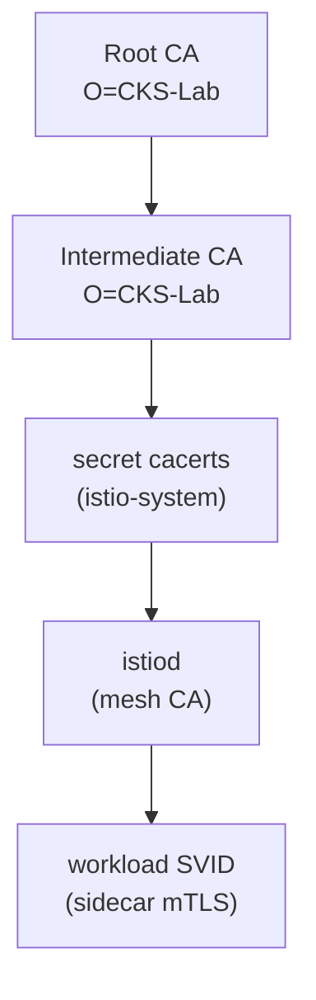

[RU version](README_RU.MD) · [Eng version](README.MD) · [Version française](README_FR.MD) · [Deutsche Version](README_DE.MD)

# Lab 19 - CA personalizada: integración de tu propia CA raíz e intermedia en istiod

## Descripción general

istiod actúa como autoridad certificadora (CA) del mesh: firma los certificados de identidad
(SPIFFE `SVID`) que los sidecars usan para mTLS. Por defecto, istiod genera en su primer
arranque una CA **autofirmada**. En producción esto no suele hacerse - las empresas conectan su
propio PKI para que todo el mesh confíe en una raíz que ellas gestionan (y para que
varios clústeres compartan una raíz de confianza común).

En este lab conectarás **tu propia** CA: generarás los certificados raíz e intermedio,
los cargarás en istio-system como el secret `cacerts`, instalarás Istio y comprobarás que
los certificados de las cargas de trabajo se emiten con tu CA.

El clúster ya está levantado, pero Istio **no está instalado** (instalarlo con tu propia CA es la tarea).
En el worker PC vienen preinstalados `istioctl 1.29.1` y `openssl`.



## Tarea

1. Generar la CA raíz y la CA intermedia (openssl).
2. Crear el secret `cacerts` en el namespace `istio-system` con las claves `ca-cert.pem`,
   `ca-key.pem`, `root-cert.pem`, `cert-chain.pem`.
3. Instalar Istio (`istioctl install`) - istiod detectará `cacerts` y firmará los
   certificados de los workloads con la CA intermedia.
4. Desplegar la aplicación y comprobar que la raíz de confianza del sidecar es tu CA personalizada.

## Paso 1. Generar la CA raíz y la intermedia

```bash
mkdir -p ~/ca && cd ~/ca

# CA raíz
openssl genrsa -out root-key.pem 4096
openssl req -x509 -new -nodes -key root-key.pem -sha256 -days 3650 \
  -subj "/O=CKS-Lab/CN=CKS-Lab Root CA" -out root-cert.pem

# CA intermedia, firmada por la raíz
openssl genrsa -out ca-key.pem 4096
openssl req -new -key ca-key.pem -subj "/O=CKS-Lab/CN=CKS-Lab Intermediate CA" -out ca.csr

cat > ext.cnf <<'EOF'
basicConstraints=critical,CA:TRUE,pathlen:0
keyUsage=critical,digitalSignature,keyCertSign,cRLSign
subjectAltName=DNS:istiod.istio-system.svc
EOF

openssl x509 -req -in ca.csr -CA root-cert.pem -CAkey root-key.pem -CAcreateserial \
  -days 1825 -sha256 -extfile ext.cnf -out ca-cert.pem

# Istio espera la cadena = intermedio + raíz
cat ca-cert.pem root-cert.pem > cert-chain.pem
```

## Paso 2. Crear el secret `cacerts`

```bash
kubectl create namespace istio-system
kubectl create secret generic cacerts -n istio-system \
  --from-file=ca-cert.pem \
  --from-file=ca-key.pem \
  --from-file=root-cert.pem \
  --from-file=cert-chain.pem
```

## Paso 3. Instalar Istio

```bash
istioctl install --set profile=default -y
```

istiod, al arrancar, detectará el secret `cacerts` y usará la CA intermedia para
emitir los certificados de los workloads en lugar de la autofirmada.

## Paso 4. Desplegar la aplicación

```bash
kubectl apply -f https://raw.githubusercontent.com/ViktorUJ/cks/refs/heads/master/tasks/ica/labs/19/k8s-1/scripts/1.yaml
kubectl rollout status deploy/ping-pong -n app
```

## Paso 5. Comprobar la cadena de confianza

```bash
POD=$(kubectl get pod -n app -l app=ping-pong -o jsonpath='{.items[0].metadata.name}')

# La raíz de confianza que valida el sidecar - debe ser nuestra raíz personalizada
istioctl proxy-config secret "$POD" -n app -o json \
  | jq -r '.dynamicActiveSecrets[] | select(.name=="ROOTCA") | .secret.validationContext.trustedCa.inlineBytes' \
  | base64 -d | openssl x509 -noout -subject -issuer
# subject/issuer -> O=CKS-Lab, CN=CKS-Lab Root CA

# El propio certificado del workload, firmado por nuestra CA intermedia
istioctl proxy-config secret "$POD" -n app -o json \
  | jq -r '.dynamicActiveSecrets[] | select(.name=="default") | .secret.tlsCertificate.certificateChain.inlineBytes' \
  | base64 -d | openssl x509 -noout -issuer
# issuer -> O=CKS-Lab, CN=CKS-Lab Intermediate CA
```

## Cómo funciona

- istiod es la CA del mesh: emite los certificados de identidad (`SVID`) sobre los que se construye mTLS.
- El secret **`cacerts`** (`ca-cert.pem`, `ca-key.pem`, `root-cert.pem`, `cert-chain.pem`)
  permite sustituir con tu propia CA intermedia. istiod emite los certificados de los workloads a partir
  de *tu* PKI, y todo el mesh confía en la raíz que tú gestionas - esto es necesario para la
  integración con un PKI corporativo o para una raíz de confianza común entre clústeres.
- istiod sigue **rotando automáticamente** los certificados de los workloads (SVID de vida corta);
  tú solo proporcionas la CA firmante.

## Evolución en producción: emisión dinámica con cert-manager + istio-csr

Un secret `cacerts` estático significa que la clave de la CA intermedia reside en el clúster y
se rota manualmente. En producción se suele usar **cert-manager + istio-csr**: istiod
delega la firma en el componente `istio-csr`, que a su vez solicita certificados a un `Issuer`
de cert-manager (basado en Vault, ACME o un PKI corporativo). Así la clave firmante no
se guarda en istiod, y se activa la rotación automática de la CA.

## Verificación del resultado

Ejecuta en el worker PC:

```bash
check_result
```

## Conclusión

Conectaste tu propia CA raíz e intermedia en istiod mediante el secret `cacerts` y
comprobaste que los certificados de las cargas de trabajo se emiten a partir de tu PKI. Gestionar
la CA del mesh es una habilidad senior/de seguridad importante: sin ella no se puede integrar Istio con
un PKI corporativo ni construir una raíz de confianza común para varios clústeres.

## Infraestructura

| Componente | Tipo | Cantidad | Rol |
|---|---|---|---|
| control-plane | `t3.medium` | 1 | master + istiod (mesh CA) |
| worker | `t3.small` | 1 | capacidad para la aplicación |
| worker PC | `t3.small` | 1 | puesto de trabajo: `kubectl`, `istioctl`, `openssl`, `check_result` |

Región: `eu-central-1` (AZ `eu-central-1a` / `eu-central-1b`).
