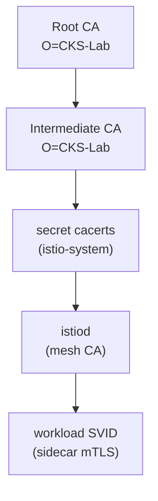

[RU version](README_RU.MD) · [Eng version](README.MD) · [Versión en español](README_ES.MD) · [Deutsche Version](README_DE.MD)

# Lab 19 - CA personnalisée : intégration de votre CA racine et intermédiaire dans istiod

## Vue d'ensemble

istiod fait office d'autorité de certification (CA) du maillage : il signe les certificats
d'identité (SPIFFE `SVID`) que les sidecars utilisent pour le mTLS. Par défaut, istiod génère
au premier démarrage une CA **auto-signée**. En production, on ne procède généralement pas
ainsi - les entreprises intègrent leur propre PKI afin que tout le maillage fasse confiance à
une racine qu'elles maîtrisent (et pour que plusieurs clusters partagent une racine de
confiance commune).

Dans ce lab, vous intégrerez **votre propre** CA : vous générerez des certificats racine et
intermédiaire, vous les chargerez dans istio-system en tant que secret `cacerts`, vous
installerez Istio et vérifierez que les certificats des charges de travail sont émis par
votre CA.

Le cluster est déjà en place, mais Istio **n'est pas installé** (l'installation avec votre
propre CA est justement la tâche). Sur le worker PC, `istioctl 1.29.1` et `openssl` sont
préinstallés.



## Infrastructure

| Composant | Type | Nombre | Rôle |
|---|---|---|---|
| control-plane | `t3.medium` | 1 | master + istiod (mesh CA) |
| worker | `t3.small` | 1 | capacité pour l'application |
| worker PC | `t3.small` | 1 | poste de travail : `kubectl`, `istioctl`, `openssl`, `check_result` |

Région : `eu-central-1` (AZ `eu-central-1a` / `eu-central-1b`).

## Déploiement

```bash
TASK=19 make run_ica_task
```

## Tâche

1. Générer une CA racine et une CA intermédiaire (openssl).
2. Créer un secret `cacerts` dans le namespace `istio-system` avec les clés `ca-cert.pem`,
   `ca-key.pem`, `root-cert.pem`, `cert-chain.pem`.
3. Installer Istio (`istioctl install`) - istiod récupère `cacerts` et signera les
   certificats des workloads avec la CA intermédiaire.
4. Déployer l'application et vérifier que la racine de confiance du sidecar est votre CA
   personnalisée.

## Étape 1. Générer la CA racine et la CA intermédiaire

```bash
mkdir -p ~/ca && cd ~/ca

# CA racine
openssl genrsa -out root-key.pem 4096
openssl req -x509 -new -nodes -key root-key.pem -sha256 -days 3650 \
  -subj "/O=CKS-Lab/CN=CKS-Lab Root CA" -out root-cert.pem

# CA intermédiaire, signée par la racine
openssl genrsa -out ca-key.pem 4096
openssl req -new -key ca-key.pem -subj "/O=CKS-Lab/CN=CKS-Lab Intermediate CA" -out ca.csr

cat > ext.cnf <<'EOF'
basicConstraints=critical,CA:TRUE,pathlen:0
keyUsage=critical,digitalSignature,keyCertSign,cRLSign
subjectAltName=DNS:istiod.istio-system.svc
EOF

openssl x509 -req -in ca.csr -CA root-cert.pem -CAkey root-key.pem -CAcreateserial \
  -days 1825 -sha256 -extfile ext.cnf -out ca-cert.pem

# Istio attend une chaîne = intermédiaire + racine
cat ca-cert.pem root-cert.pem > cert-chain.pem
```

## Étape 2. Créer le secret `cacerts`

```bash
kubectl create namespace istio-system
kubectl create secret generic cacerts -n istio-system \
  --from-file=ca-cert.pem \
  --from-file=ca-key.pem \
  --from-file=root-cert.pem \
  --from-file=cert-chain.pem
```

## Étape 3. Installer Istio

```bash
istioctl install --set profile=default -y
```

Au démarrage, istiod détecte le secret `cacerts` et utilise la CA intermédiaire pour émettre
les certificats des workloads au lieu d'une CA auto-signée.

## Étape 4. Déployer l'application

```bash
kubectl apply -f https://raw.githubusercontent.com/ViktorUJ/cks/refs/heads/master/tasks/ica/labs/19/k8s-1/scripts/1.yaml
kubectl rollout status deploy/ping-pong -n app
```

## Étape 5. Vérifier la chaîne de confiance

```bash
POD=$(kubectl get pod -n app -l app=ping-pong -o jsonpath='{.items[0].metadata.name}')

# La racine de confiance qui valide le sidecar - doit être notre racine personnalisée
istioctl proxy-config secret "$POD" -n app -o json \
  | jq -r '.dynamicActiveSecrets[] | select(.name=="ROOTCA") | .secret.validationContext.trustedCa.inlineBytes' \
  | base64 -d | openssl x509 -noout -subject -issuer
# subject/issuer -> O=CKS-Lab, CN=CKS-Lab Root CA

# Le certificat du workload lui-même, signé par notre CA intermédiaire
istioctl proxy-config secret "$POD" -n app -o json \
  | jq -r '.dynamicActiveSecrets[] | select(.name=="default") | .secret.tlsCertificate.certificateChain.inlineBytes' \
  | base64 -d | openssl x509 -noout -issuer
# issuer -> O=CKS-Lab, CN=CKS-Lab Intermediate CA
```

## Comment ça fonctionne

- istiod est la CA du maillage : il émet les certificats d'identité (`SVID`) sur lesquels
  repose le mTLS.
- Le secret **`cacerts`** (`ca-cert.pem`, `ca-key.pem`, `root-cert.pem`, `cert-chain.pem`)
  permet d'intégrer votre propre CA intermédiaire. istiod émet les certificats des workloads
  depuis *votre* PKI, et tout le maillage fait confiance à une racine que vous maîtrisez - ce
  qui est nécessaire pour l'intégration à un PKI d'entreprise ou pour une racine de confiance
  commune entre clusters.
- istiod continue de **faire tourner automatiquement** les certificats des workloads (SVID à
  courte durée de vie) ; vous ne fournissez que la CA de signature.

## Évolution production : émission dynamique via cert-manager + istio-csr

Un secret `cacerts` statique signifie que la clé de la CA intermédiaire réside dans le cluster
et qu'elle est renouvelée manuellement. En production, on utilise souvent **cert-manager +
istio-csr** : istiod délègue la signature au composant `istio-csr`, qui demande des certificats
à un `Issuer` cert-manager (basé sur Vault, ACME ou un PKI d'entreprise). Ainsi, la clé de
signature n'est pas stockée dans istiod, et la rotation automatique de la CA est activée.

## Vérification du résultat

Lancez sur le worker PC :

```bash
check_result
```

## Conclusion

Vous avez intégré votre propre CA racine et intermédiaire dans istiod via le secret `cacerts`
et vérifié que les certificats des charges de travail sont émis depuis votre PKI. La gestion
de la CA du maillage est une compétence senior/sécurité importante : sans elle, impossible
d'intégrer Istio à un PKI d'entreprise et de construire une racine de confiance commune pour
plusieurs clusters.
