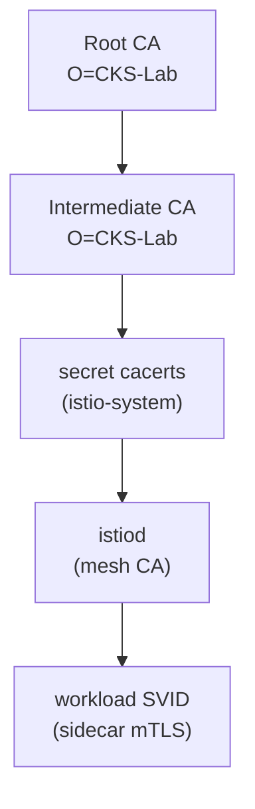

[Русская версия](README_RU.MD) · [Eng version](README.MD) · [Versión en español](README_ES.MD) · [Version française](README_FR.MD) · [Deutsche Version](README_DE.MD) · [繁體中文版](README_TW.MD) · [日本語版](README_JP.MD)

# Lab 19 - მორგებული CA: საკუთარი root და intermediate CA-ს istiod-ში დაკავშირება

> [საცნობარო გადაწყვეტა](worker/files/solutions/1_GE.MD)

## მიმოხილვა

istiod mesh-ის სერტიფიკაციის ცენტრის (CA) როლს ასრულებს: ის ხელს აწერს identity-სერტიფიკატებს
(SPIFFE `SVID`), რომლებსაც sidecar-ები mTLS-ისთვის იყენებენ. ნაგულისხმევად, პირველი
გაშვებისას istiod **თვითხელმოწერილ** CA-ს ქმნის. production გარემოში ასე, ჩვეულებრივ, არ
იქცევიან - კომპანიები საკუთარ PKI-ს აერთებენ, რათა მთელი mesh ენდობოდეს მათ მიერ მართულ root-ს
(და რამდენიმე კლასტერს ნდობის საერთო root ჰქონდეს).

ამ ლაბორატორიაში **საკუთარ** CA-ს დააკავშირებთ: შექმნით root და intermediate სერტიფიკატებს,
ჩატვირთავთ მათ istio-system-ში `cacerts` secret-ის სახით, დააინსტალირებთ Istio-ს და დარწმუნდებით,
რომ workload-ების სერტიფიკატებს თქვენი CA გასცემს.

კლასტერი უკვე გაშვებულია, მაგრამ Istio **არ არის დაინსტალირებული** (საკუთარი CA-თი ინსტალაცია
ამოცანის ნაწილია). worker PC-ზე წინასწარ არის დაინსტალირებული `istioctl 1.29.1` და `openssl`.



## ინფრასტრუქტურა

| კომპონენტი | ტიპი | რაოდენობა | როლი |
|---|---|---|---|
| control-plane | `t3.medium` | 1 | master + istiod (mesh CA) |
| worker | `t3.small` | 1 | აპლიკაციისთვის განკუთვნილი რესურსები |
| worker PC | `t3.small` | 1 | სამუშაო გარემო: `kubectl`, `istioctl`, `openssl`, `check_result` |

რეგიონი: `eu-central-1` (AZ `eu-central-1a` / `eu-central-1b`).

## გაშლა

```bash
TASK=19 make run_ica_task
```

## დავალება

1. შექმენით root CA და intermediate CA (openssl).
2. namespace `istio-system`-ში შექმენით secret `cacerts` გასაღებებით `ca-cert.pem`,
   `ca-key.pem`, `root-cert.pem`, `cert-chain.pem`.
3. დააინსტალირეთ Istio (`istioctl install`) - istiod გამოიყენებს `cacerts`-ს და workload-ების
   სერტიფიკატებს intermediate CA-თი მოაწერს ხელს.
4. გაშალეთ აპლიკაცია და დარწმუნდით, რომ sidecar-ის ნდობის root თქვენი მორგებული CA-ა.

## ნაბიჯი 1. root და intermediate CA-ს შექმნა

```bash
mkdir -p ~/ca && cd ~/ca

# ძირეული CA
openssl genrsa -out root-key.pem 4096
openssl req -x509 -new -nodes -key root-key.pem -sha256 -days 3650 \
  -subj "/O=CKS-Lab/CN=CKS-Lab Root CA" -out root-cert.pem

# შუალედური CA, ხელმოწერილი ძირეულით
openssl genrsa -out ca-key.pem 4096
openssl req -new -key ca-key.pem -subj "/O=CKS-Lab/CN=CKS-Lab Intermediate CA" -out ca.csr

cat > ext.cnf <<'EOF'
basicConstraints=critical,CA:TRUE,pathlen:0
keyUsage=critical,digitalSignature,keyCertSign,cRLSign
subjectAltName=DNS:istiod.istio-system.svc
EOF

openssl x509 -req -in ca.csr -CA root-cert.pem -CAkey root-key.pem -CAcreateserial \
  -days 1825 -sha256 -extfile ext.cnf -out ca-cert.pem

# Istio ელოდება ჯაჭვს = შუალედური + ძირეული
cat ca-cert.pem root-cert.pem > cert-chain.pem
```

## ნაბიჯი 2. `cacerts` secret-ის შექმნა

```bash
kubectl create namespace istio-system
kubectl create secret generic cacerts -n istio-system \
  --from-file=ca-cert.pem \
  --from-file=ca-key.pem \
  --from-file=root-cert.pem \
  --from-file=cert-chain.pem
```

## ნაბიჯი 3. Istio-ს ინსტალაცია

```bash
istioctl install --set profile=default -y
```

გაშვებისას istiod აღმოაჩენს secret `cacerts`-ს და თვითხელმოწერილი CA-ს ნაცვლად workload-ების
სერტიფიკატების გასაცემად intermediate CA-ს გამოიყენებს.

## ნაბიჯი 4. აპლიკაციის გაშლა

```bash
kubectl apply -f https://raw.githubusercontent.com/ViktorUJ/cks/refs/heads/master/tasks/ica/labs/19/k8s-1/scripts/1.yaml
kubectl rollout status deploy/ping-pong -n app
```

## ნაბიჯი 5. ნდობის ჯაჭვის შემოწმება

```bash
POD=$(kubectl get pod -n app -l app=ping-pong -o jsonpath='{.items[0].metadata.name}')

# ნდობის ძირი, რომელიც sidecar-ს ავალიდურებს - უნდა იყოს ჩვენი მორგებული ძირი
istioctl proxy-config secret "$POD" -n app -o json \
  | jq -r '.dynamicActiveSecrets[] | select(.name=="ROOTCA") | .secret.validationContext.trustedCa.inlineBytes' \
  | base64 -d | openssl x509 -noout -subject -issuer
# subject/issuer -> O=CKS-Lab, CN=CKS-Lab Root CA

# თავად workload-ის სერტიფიკატი, ხელმოწერილი ჩვენი შუალედური CA-ით
istioctl proxy-config secret "$POD" -n app -o json \
  | jq -r '.dynamicActiveSecrets[] | select(.name=="default") | .secret.tlsCertificate.certificateChain.inlineBytes' \
  | base64 -d | openssl x509 -noout -issuer
# issuer -> O=CKS-Lab, CN=CKS-Lab Intermediate CA
```

## მუშაობის პრინციპი

- istiod არის mesh-ის CA: ის გასცემს identity-სერტიფიკატებს (`SVID`), რომლებზეც mTLS არის აგებული.
- secret **`cacerts`** (`ca-cert.pem`, `ca-key.pem`, `root-cert.pem`, `cert-chain.pem`)
  საკუთარი intermediate CA-ს გამოყენების საშუალებას გაძლევთ. istiod workload-ების სერტიფიკატებს
  *თქვენი* PKI-დან გასცემს, ხოლო მთელი mesh ენდობა თქვენ მიერ მართულ root-ს - ეს საჭიროა
  კორპორაციულ PKI-სთან ინტეგრაციისთვის ან კლასტერებს შორის ნდობის საერთო root-ის შესაქმნელად.
- istiod კვლავ **ავტომატურად ახდენს** workload-ების სერტიფიკატების როტაციას (ხანმოკლე
  SVID-ები); თქვენ მხოლოდ ხელმომწერ CA-ს აწვდით.

## production-ევოლუცია: დინამიკური გაცემა cert-manager + istio-csr-ის მეშვეობით

სტატიკური secret `cacerts` ნიშნავს, რომ intermediate CA-ს გასაღები კლასტერში ინახება და მისი
როტაცია ხელით ხდება. production გარემოში ხშირად იყენებენ **cert-manager + istio-csr**-ს: istiod
ხელმოწერას `istio-csr` კომპონენტს გადასცემს, ის კი სერტიფიკატებს cert-manager-ის `Issuer`-ისგან
ითხოვს (Vault-ის, ACME-ს ან კორპორაციული PKI-ს ბაზაზე). ამგვარად, ხელმომწერი გასაღები istiod-ში
არ ინახება და CA-ს ავტომატური როტაცია ირთვება.

## შედეგის შემოწმება

worker PC-ზე გაუშვით:

```bash
check_result
```

## შეჯამება

თქვენ საკუთარი root და intermediate CA istiod-ს secret `cacerts`-ის მეშვეობით დაუკავშირეთ და
დარწმუნდით, რომ workload-ების სერტიფიკატები თქვენი PKI-დან გაიცემა. mesh-CA-ს მართვა მნიშვნელოვანი
senior/security უნარია: მის გარეშე შეუძლებელია Istio-ს კორპორაციულ PKI-სთან ინტეგრაცია და რამდენიმე
კლასტერისთვის ნდობის საერთო root-ის შექმნა.
