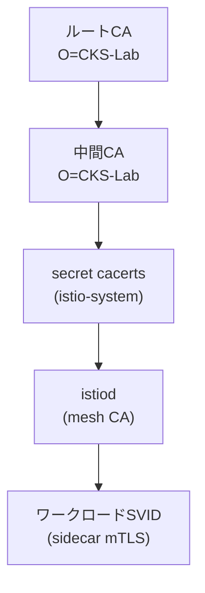

[Русская версия](README_RU.MD) · [Eng version](README.MD) · [Versión en español](README_ES.MD) · [Version française](README_FR.MD) · [Deutsche Version](README_DE.MD) · [ქართული ვერსია](README_GE.MD) · [繁體中文版](README_TW.MD)

# Lab 19 - カスタムCA: 独自のルートCAと中間CAをistiodに接続する

> [リファレンス解答](worker/files/solutions/1_JP.MD)

## 概要

istiodはmeshの認証局（CA）として機能し、sidecarがmTLSで使用するidentity証明書
(SPIFFE `SVID`) に署名します。デフォルトでは、istiodは初回起動時に**自己署名**CAを
生成します。本番環境で通常この方法は使いません。企業では独自のPKIを接続し、mesh全体が
自ら管理するルートを信頼できるようにします（また、複数のクラスターで共通の信頼ルートを
持てるようにします）。

このラボでは、**独自の**CAを接続します。ルート証明書と中間証明書を生成し、それらを
`cacerts`シークレットとしてistio-systemにアップロードし、Istioをインストールして、
ワークロードの証明書が自分のCAによって発行されることを確認します。

クラスターはすでに起動済みですが、Istioは**インストールされていません**（独自CAによる
インストールが課題です）。worker PCには`istioctl 1.29.1`と`openssl`がプリインストール
されています。



## インフラストラクチャ

| コンポーネント | タイプ | 数 | 役割 |
|---|---|---|---|
| control-plane | `t3.medium` | 1 | master + istiod (mesh CA) |
| worker | `t3.small` | 1 | アプリケーション用の容量 |
| worker PC | `t3.small` | 1 | 作業環境: `kubectl`, `istioctl`, `openssl`, `check_result` |

リージョン: `eu-central-1` (AZ `eu-central-1a` / `eu-central-1b`)。

## デプロイ

```bash
TASK=19 make run_ica_task
```

## 課題

1. ルートCAと中間CAを生成する（openssl）。
2. namespace `istio-system`に、キー`ca-cert.pem`、`ca-key.pem`、`root-cert.pem`、
   `cert-chain.pem`を持つ`cacerts`シークレットを作成する。
3. Istioをインストールする（`istioctl install`）。istiodは`cacerts`を取得し、中間CAで
   ワークロード証明書に署名します。
4. アプリケーションをデプロイし、sidecarの信頼ルートがカスタムCAであることを確認する。

## ステップ1. ルートCAと中間CAを生成する

```bash
mkdir -p ~/ca && cd ~/ca

# ルート CA
openssl genrsa -out root-key.pem 4096
openssl req -x509 -new -nodes -key root-key.pem -sha256 -days 3650 \
  -subj "/O=CKS-Lab/CN=CKS-Lab Root CA" -out root-cert.pem

# ルートによって署名された中間 CA
openssl genrsa -out ca-key.pem 4096
openssl req -new -key ca-key.pem -subj "/O=CKS-Lab/CN=CKS-Lab Intermediate CA" -out ca.csr

cat > ext.cnf <<'EOF'
basicConstraints=critical,CA:TRUE,pathlen:0
keyUsage=critical,digitalSignature,keyCertSign,cRLSign
subjectAltName=DNS:istiod.istio-system.svc
EOF

openssl x509 -req -in ca.csr -CA root-cert.pem -CAkey root-key.pem -CAcreateserial \
  -days 1825 -sha256 -extfile ext.cnf -out ca-cert.pem

# Istio が期待するチェーン = 中間 + ルート
cat ca-cert.pem root-cert.pem > cert-chain.pem
```

## ステップ2. `cacerts`シークレットを作成する

```bash
kubectl create namespace istio-system
kubectl create secret generic cacerts -n istio-system \
  --from-file=ca-cert.pem \
  --from-file=ca-key.pem \
  --from-file=root-cert.pem \
  --from-file=cert-chain.pem
```

## ステップ3. Istioをインストールする

```bash
istioctl install --set profile=default -y
```

istiodは起動時に`cacerts`シークレットを検出し、自己署名CAではなく中間CAを使用して
ワークロード証明書を発行します。

## ステップ4. アプリケーションをデプロイする

```bash
kubectl apply -f https://raw.githubusercontent.com/ViktorUJ/cks/refs/heads/master/tasks/ica/labs/19/k8s-1/scripts/1.yaml
kubectl rollout status deploy/ping-pong -n app
```

## ステップ5. 信頼チェーンを確認する

```bash
POD=$(kubectl get pod -n app -l app=ping-pong -o jsonpath='{.items[0].metadata.name}')

# sidecar を検証する信頼の起点 - 我々のカスタムルートでなければならない
istioctl proxy-config secret "$POD" -n app -o json \
  | jq -r '.dynamicActiveSecrets[] | select(.name=="ROOTCA") | .secret.validationContext.trustedCa.inlineBytes' \
  | base64 -d | openssl x509 -noout -subject -issuer
# subject/issuer -> O=CKS-Lab, CN=CKS-Lab Root CA

# ワークロード自体の証明書、我々の中間 CA によって署名される
istioctl proxy-config secret "$POD" -n app -o json \
  | jq -r '.dynamicActiveSecrets[] | select(.name=="default") | .secret.tlsCertificate.certificateChain.inlineBytes' \
  | base64 -d | openssl x509 -noout -issuer
# issuer -> O=CKS-Lab, CN=CKS-Lab Intermediate CA
```

## 仕組み

- istiodはmeshのCAです。mTLSの基盤となるidentity証明書（`SVID`）を発行します。
- シークレット**`cacerts`**（`ca-cert.pem`、`ca-key.pem`、`root-cert.pem`、`cert-chain.pem`）
  により、独自の中間CAを設定できます。istiodは*あなたの*PKIからワークロード証明書を
  発行し、mesh全体があなたの管理するルートを信頼します。これは企業PKIとの統合や、
  クラスター間の共通信頼ルートに必要です。
- istiodは引き続きワークロード証明書（短期間有効なSVID）を**自動的にローテーション**
  します。提供するのは署名用CAのみです。

## 本番環境への発展: cert-manager + istio-csrによる動的な発行

静的な`cacerts`シークレットは、中間CAのキーがクラスター内に存在し、手動でローテーション
されることを意味します。本番環境では、**cert-manager + istio-csr**がよく使われます。
istiodは署名を`istio-csr`コンポーネントに委譲し、同コンポーネントはcert-managerの
`Issuer`（Vault、ACME、または企業PKIに基づく）に証明書を要求します。これにより、
署名キーはistiodに保存されず、CAの自動ローテーションが有効になります。

## 結果の確認

worker PCで次を実行します。

```bash
check_result
```

## まとめ

`cacerts`シークレットを通じて、独自のルートCAと中間CAをistiodに接続し、ワークロードの
証明書があなたのPKIから発行されることを確認しました。mesh CAの管理は重要な
senior/securityスキルです。これがなければ、Istioを企業PKIと統合したり、複数クラスターの
共通信頼ルートを構築したりできません。
