# Lab 19 — Кастомный CA: подключение своего корневого и промежуточного CA в istiod

## Обзор

istiod выступает удостоверяющим центром (CA) mesh: он подписывает identity-сертификаты
(SPIFFE `SVID`), которыми sidecar'ы пользуются для mTLS. По умолчанию istiod при первом
запуске генерирует **самоподписанный** CA. В продакшене так обычно не делают — компании
подключают собственный PKI, чтобы весь mesh доверял корню, которым они управляют (и чтобы
несколько кластеров имели общий корень доверия).

В этой лабе вы подключите **свой** CA: сгенерируете корневой и промежуточный сертификаты,
загрузите их в istio-system как секрет `cacerts`, установите Istio и убедитесь, что
сертификаты рабочих нагрузок выпускаются вашим CA.

Кластер уже поднят, но Istio **не установлен** (установка со своим CA — это задача).
На worker PC предустановлены `istioctl 1.29.1` и `openssl`.

```mermaid
flowchart TB
    R["Root CA<br>O=CKS-Lab"] --> I["Intermediate CA<br>O=CKS-Lab"]
    I --> SEC["secret cacerts<br>(istio-system)"]
    SEC --> D["istiod<br>(mesh CA)"]
    D --> W["workload SVID<br>(sidecar mTLS)"]
```



## Задание

1. Сгенерировать корневой CA и промежуточный CA (openssl).
2. Создать секрет `cacerts` в namespace `istio-system` с ключами `ca-cert.pem`,
   `ca-key.pem`, `root-cert.pem`, `cert-chain.pem`.
3. Установить Istio (`istioctl install`) — istiod подхватит `cacerts` и будет подписывать
   сертификаты ворклоадов промежуточным CA.
4. Развернуть приложение и убедиться, что корень доверия sidecar'а — ваш кастомный CA.

## Шаг 1. Сгенерировать корневой и промежуточный CA

```bash
mkdir -p ~/ca && cd ~/ca

# Корневой CA
openssl genrsa -out root-key.pem 4096
openssl req -x509 -new -nodes -key root-key.pem -sha256 -days 3650 \
  -subj "/O=CKS-Lab/CN=CKS-Lab Root CA" -out root-cert.pem

# Промежуточный CA, подписанный корневым
openssl genrsa -out ca-key.pem 4096
openssl req -new -key ca-key.pem -subj "/O=CKS-Lab/CN=CKS-Lab Intermediate CA" -out ca.csr

cat > ext.cnf <<'EOF'
basicConstraints=critical,CA:TRUE,pathlen:0
keyUsage=critical,digitalSignature,keyCertSign,cRLSign
subjectAltName=DNS:istiod.istio-system.svc
EOF

openssl x509 -req -in ca.csr -CA root-cert.pem -CAkey root-key.pem -CAcreateserial \
  -days 1825 -sha256 -extfile ext.cnf -out ca-cert.pem

# Istio ожидает цепочку = промежуточный + корневой
cat ca-cert.pem root-cert.pem > cert-chain.pem
```

## Шаг 2. Создать секрет `cacerts`

```bash
kubectl create namespace istio-system
kubectl create secret generic cacerts -n istio-system \
  --from-file=ca-cert.pem \
  --from-file=ca-key.pem \
  --from-file=root-cert.pem \
  --from-file=cert-chain.pem
```

## Шаг 3. Установить Istio

```bash
istioctl install --set profile=default -y
```

istiod при старте обнаружит секрет `cacerts` и будет использовать промежуточный CA для
выпуска сертификатов ворклоадов вместо самоподписанного.

## Шаг 4. Развернуть приложение

```bash
kubectl apply -f https://raw.githubusercontent.com/ViktorUJ/cks/refs/heads/master/tasks/ica/labs/19/k8s-1/scripts/1.yaml
kubectl rollout status deploy/ping-pong -n app
```

## Шаг 5. Проверить цепочку доверия

```bash
POD=$(kubectl get pod -n app -l app=ping-pong -o jsonpath='{.items[0].metadata.name}')

# Корень доверия, который валидирует sidecar — должен быть нашим кастомным корнем
istioctl proxy-config secret "$POD" -n app -o json \
  | jq -r '.dynamicActiveSecrets[] | select(.name=="ROOTCA") | .secret.validationContext.trustedCa.inlineBytes' \
  | base64 -d | openssl x509 -noout -subject -issuer
# subject/issuer -> O=CKS-Lab, CN=CKS-Lab Root CA

# Сам сертификат ворклоада, подписанный нашим промежуточным CA
istioctl proxy-config secret "$POD" -n app -o json \
  | jq -r '.dynamicActiveSecrets[] | select(.name=="default") | .secret.tlsCertificate.certificateChain.inlineBytes' \
  | base64 -d | openssl x509 -noout -issuer
# issuer -> O=CKS-Lab, CN=CKS-Lab Intermediate CA
```

## Как это работает

- istiod — CA mesh: он выпускает identity-сертификаты (`SVID`), на которых строится mTLS.
- Секрет **`cacerts`** (`ca-cert.pem`, `ca-key.pem`, `root-cert.pem`, `cert-chain.pem`)
  позволяет подставить свой промежуточный CA. istiod выпускает сертификаты ворклоадов из
  *вашего* PKI, и весь mesh доверяет корню, которым вы управляете, — это нужно для
  интеграции с корпоративным PKI или для общего корня доверия между кластерами.
- istiod по-прежнему **автоматически ротирует** сертификаты ворклоадов (короткоживущие
  SVID); вы предоставляете только подписывающий CA.

## Продакшен-эволюция: динамический выпуск через cert-manager + istio-csr

Статический секрет `cacerts` означает, что ключ промежуточного CA лежит в кластере и
ротируется вручную. В продакшене часто используют **cert-manager + istio-csr**: istiod
делегирует подпись компоненту `istio-csr`, а тот запрашивает сертификаты у `Issuer`
cert-manager (на базе Vault, ACME или корпоративного PKI). Так подписывающий ключ не
хранится в istiod, и включается автоматическая ротация CA.

## Проверка результата

Запустите на worker PC:

```bash
check_result
```

## Итог

Вы подключили собственный корневой и промежуточный CA в istiod через секрет `cacerts` и
убедились, что сертификаты рабочих нагрузок выпускаются из вашего PKI. Управление
mesh-CA — важный senior/security-навык: без него нельзя интегрировать Istio с
корпоративным PKI и построить общий корень доверия для нескольких кластеров.

## Инфраструктура

| Компонент | Тип | Кол-во | Роль |
|---|---|---|---|
| control-plane | `t3.medium` | 1 | master + istiod (mesh CA) |
| worker | `t3.small` | 1 | ёмкость для приложения |
| worker PC | `t3.small` | 1 | рабочее место: `kubectl`, `istioctl`, `openssl`, `check_result` |

Регион: `eu-central-1` (AZ `eu-central-1a` / `eu-central-1b`).
