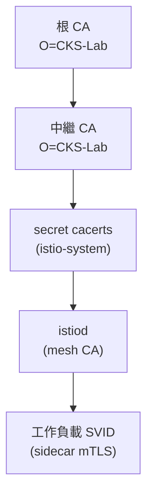

[Русская версия](README_RU.MD) · [Eng version](README.MD) · [Versión en español](README_ES.MD) · [Version française](README_FR.MD) · [Deutsche Version](README_DE.MD) · [ქართული ვერსია](README_GE.MD) · [日本語版](README_JP.MD)

# 實驗 19 - 自訂 CA：將自有根 CA 與中繼 CA 連接至 istiod

> [參考解答](worker/files/solutions/1_TW.MD)

## 概述

istiod 作為 mesh 的憑證授權中心（CA）：它簽發供 sidecar 用於 mTLS 的身分憑證
（SPIFFE `SVID`）。預設情況下，istiod 會在首次啟動時產生**自我簽署的** CA。這通常
不會用於正式環境--企業會連接自己的 PKI，使整個 mesh 信任由其管理的根憑證（並讓
多個叢集共用同一個信任根）。

在本實驗中，您將連接**自己的** CA：產生根憑證與中繼憑證，將它們以 `cacerts` secret
上傳至 istio-system，安裝 Istio，並確認工作負載憑證由您的 CA 簽發。

叢集已啟動，但 Istio **尚未安裝**（使用自有 CA 安裝即為本實驗的任務）。
worker PC 已預先安裝 `istioctl 1.29.1` 與 `openssl`。



## 基礎設施

| 元件 | 類型 | 數量 | 角色 |
|---|---|---|---|
| control-plane | `t3.medium` | 1 | master + istiod (mesh CA) |
| worker | `t3.small` | 1 | 應用程式容量 |
| worker PC | `t3.small` | 1 | 工作站：`kubectl`、`istioctl`、`openssl`、`check_result` |

區域：`eu-central-1`（AZ `eu-central-1a` / `eu-central-1b`）。

## 部署

```bash
TASK=19 make run_ica_task
```

## 任務

1. 產生根 CA 與中繼 CA（openssl）。
2. 在 namespace `istio-system` 中建立 secret `cacerts`，包含鍵 `ca-cert.pem`、
   `ca-key.pem`、`root-cert.pem`、`cert-chain.pem`。
3. 安裝 Istio（`istioctl install`）--istiod 會載入 `cacerts`，並使用中繼 CA 簽發
   工作負載憑證。
4. 部署應用程式，並確認 sidecar 的信任根是您的自訂 CA。

## 步驟 1. 產生根 CA 與中繼 CA

```bash
mkdir -p ~/ca && cd ~/ca

# 根 CA
openssl genrsa -out root-key.pem 4096
openssl req -x509 -new -nodes -key root-key.pem -sha256 -days 3650 \
  -subj "/O=CKS-Lab/CN=CKS-Lab Root CA" -out root-cert.pem

# 由根憑證簽署的中繼 CA
openssl genrsa -out ca-key.pem 4096
openssl req -new -key ca-key.pem -subj "/O=CKS-Lab/CN=CKS-Lab Intermediate CA" -out ca.csr

cat > ext.cnf <<'EOF'
basicConstraints=critical,CA:TRUE,pathlen:0
keyUsage=critical,digitalSignature,keyCertSign,cRLSign
subjectAltName=DNS:istiod.istio-system.svc
EOF

openssl x509 -req -in ca.csr -CA root-cert.pem -CAkey root-key.pem -CAcreateserial \
  -days 1825 -sha256 -extfile ext.cnf -out ca-cert.pem

# Istio 需要的憑證鏈 = 中繼 + 根
cat ca-cert.pem root-cert.pem > cert-chain.pem
```

## 步驟 2. 建立 secret `cacerts`

```bash
kubectl create namespace istio-system
kubectl create secret generic cacerts -n istio-system \
  --from-file=ca-cert.pem \
  --from-file=ca-key.pem \
  --from-file=root-cert.pem \
  --from-file=cert-chain.pem
```

## 步驟 3. 安裝 Istio

```bash
istioctl install --set profile=default -y
```

istiod 在啟動時會偵測到 secret `cacerts`，並使用中繼 CA 簽發工作負載憑證，
而非使用自我簽署的 CA。

## 步驟 4. 部署應用程式

```bash
kubectl apply -f https://raw.githubusercontent.com/ViktorUJ/cks/refs/heads/master/tasks/ica/labs/19/k8s-1/scripts/1.yaml
kubectl rollout status deploy/ping-pong -n app
```

## 步驟 5. 檢查信任鏈

```bash
POD=$(kubectl get pod -n app -l app=ping-pong -o jsonpath='{.items[0].metadata.name}')

# 信任根，用於驗證 sidecar - 必須是我們的自訂根憑證
istioctl proxy-config secret "$POD" -n app -o json \
  | jq -r '.dynamicActiveSecrets[] | select(.name=="ROOTCA") | .secret.validationContext.trustedCa.inlineBytes' \
  | base64 -d | openssl x509 -noout -subject -issuer
# subject/issuer -> O=CKS-Lab, CN=CKS-Lab Root CA

# 工作負載本身的憑證，由我們的中繼 CA 簽署
istioctl proxy-config secret "$POD" -n app -o json \
  | jq -r '.dynamicActiveSecrets[] | select(.name=="default") | .secret.tlsCertificate.certificateChain.inlineBytes' \
  | base64 -d | openssl x509 -noout -issuer
# issuer -> O=CKS-Lab, CN=CKS-Lab Intermediate CA
```

## 運作方式

- istiod 是 mesh CA：它簽發身分憑證（`SVID`），mTLS 建立於這些憑證之上。
- Secret **`cacerts`**（`ca-cert.pem`、`ca-key.pem`、`root-cert.pem`、`cert-chain.pem`）
  可讓您代入自有的中繼 CA。istiod 會從*您的* PKI 簽發工作負載憑證，整個 mesh 都會
  信任由您管理的根憑證--這對整合企業 PKI 或建立多叢集間共用的信任根是必要的。
- istiod 仍會**自動輪替**工作負載憑證（短生命週期的 SVID）；您僅需提供簽署用 CA。

## 正式環境演進：透過 cert-manager + istio-csr 動態簽發

靜態 secret `cacerts` 意味著中繼 CA 金鑰存放在叢集中，且需手動輪替。在正式環境中，
經常使用 **cert-manager + istio-csr**：istiod 將簽署委派給 `istio-csr` 元件，後者再向
cert-manager `Issuer` 請求憑證（以 Vault、ACME 或企業 PKI 為基礎）。如此一來，
簽署金鑰不會儲存在 istiod 中，且可啟用 CA 自動輪替。

## 驗證結果

在 worker PC 上執行：

```bash
check_result
```

## 總結

您已透過 secret `cacerts` 將自有根 CA 與中繼 CA 連接至 istiod，並確認工作負載憑證
由您的 PKI 簽發。管理 mesh CA 是一項重要的資深工程師／安全技能：沒有它，便無法將
Istio 與企業 PKI 整合，也無法為多個叢集建立共用的信任根。