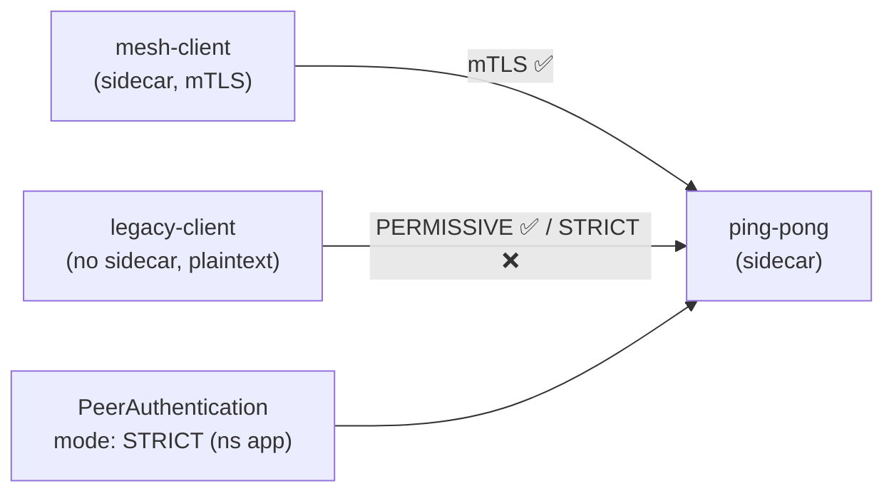

[RU version](README_RU.MD)

# Lab 20 - mTLS migration: PERMISSIVE → STRICT with zero downtime

## Overview

Flipping a live service to strict mTLS in one step is risky: if you enable `STRICT`
immediately, every client not yet in the mesh (sending plaintext) breaks at once. Istio
solves this with **PERMISSIVE** mode: the server-side sidecar accepts both mTLS and
plaintext at the same time. That lets you onboard workloads to the mesh gradually and
then safely switch to `STRICT`.

Three workloads are deployed:
- `ping-pong` in namespace `app` (sidecar injected - the service);
- `mesh-client` in namespace `app` (sidecar injected - speaks mTLS);
- `legacy-client` in namespace `legacy` (**no** sidecar - plaintext only).

With no `PeerAuthentication`, the default is **PERMISSIVE**: both clients reach the app.



## Task

1. Observe the PERMISSIVE baseline (both clients get `200`).
2. Apply a `PeerAuthentication` with `mode: STRICT` in namespace `app`.
3. Confirm that afterwards:
   - the mesh client (mTLS) still gets `200`;
   - the legacy client (plaintext) gets a connection reset (not `200`).

## Step 1. PERMISSIVE baseline

```bash
# mesh client -> app : works (mTLS)
kubectl exec -n app deploy/mesh-client -c curl -- \
  curl -s -o /dev/null -w "%{http_code}\n" http://ping-pong.app.svc.cluster.local:8080/
# -> 200

# legacy plaintext -> app : ALSO works under PERMISSIVE
kubectl exec -n legacy deploy/legacy-client -c curl -- \
  curl -s -o /dev/null -w "%{http_code}\n" http://ping-pong.app.svc.cluster.local:8080/
# -> 200
```

## Step 2. (recommended) Pin PERMISSIVE explicitly

A safe migration first pins PERMISSIVE, confirms via metrics that no plaintext traffic
remains, then flips to STRICT:

```bash
kubectl apply -f - <<'EOF'
apiVersion: security.istio.io/v1
kind: PeerAuthentication
metadata:
  name: default
  namespace: app
spec:
  mtls:
    mode: PERMISSIVE
EOF
```

## Step 3. Switch the namespace to STRICT

```bash
kubectl apply -f - <<'EOF'
apiVersion: security.istio.io/v1
kind: PeerAuthentication
metadata:
  name: default
  namespace: app
spec:
  mtls:
    mode: STRICT
EOF
```

## Step 4. Verify

```bash
# mesh client -> app : still works (mTLS)
kubectl exec -n app deploy/mesh-client -c curl -- \
  curl -s -o /dev/null -w "%{http_code}\n" http://ping-pong.app.svc.cluster.local:8080/
# -> 200

# legacy plaintext -> app : now rejected (connection reset)
kubectl exec -n legacy deploy/legacy-client -c curl -- \
  curl -s -o /dev/null -w "%{http_code}\n" --max-time 10 http://ping-pong.app.svc.cluster.local:8080/
# -> 000 (curl exit 56: reset by peer)
```

## How it works

- **PeerAuthentication** controls how the *server-side* sidecar accepts inbound
  connections:
  - `PERMISSIVE` (mesh default) - accepts both mTLS and plaintext. This is what makes a
    zero-downtime migration possible: onboard workloads gradually while legacy plaintext
    clients keep working.
  - `STRICT` - mTLS only; plaintext connections are reset.
- Scope hierarchy: a `PeerAuthentication` in `istio-system` (root) applies mesh-wide; one
  in a namespace overrides it there; one with a `selector` overrides it per workload.
- **Safe migration recipe**: keep PERMISSIVE, watch
  `istio_requests_total{connection_security_policy="none"}` until it drops to zero (no
  plaintext left), then flip to STRICT.

## Related

Lab 04 covers the STRICT end-state combined with `AuthorizationPolicy` (who may call
whom). This lab focuses on the transition itself and the role of PERMISSIVE.

## Check the result

Run on the worker PC:

```bash
check_result
```

## Summary

You migrated a namespace to strict mTLS without breaking in-mesh traffic and saw STRICT
reject plaintext. Understanding the PERMISSIVE → STRICT pair is a fundamental
senior/security skill for rolling out zero-trust in a live environment.

## Infrastructure

| Component | Type | Count | Role |
|---|---|---|---|
| control-plane | `t3.medium` | 1 | master + istiod |
| worker | `t3.small` | 1 | capacity for the app and clients |
| worker PC | `t3.small` | 1 | workstation: `kubectl`, `check_result` |

Region: `eu-central-1` (AZ `eu-central-1a` / `eu-central-1b`).
