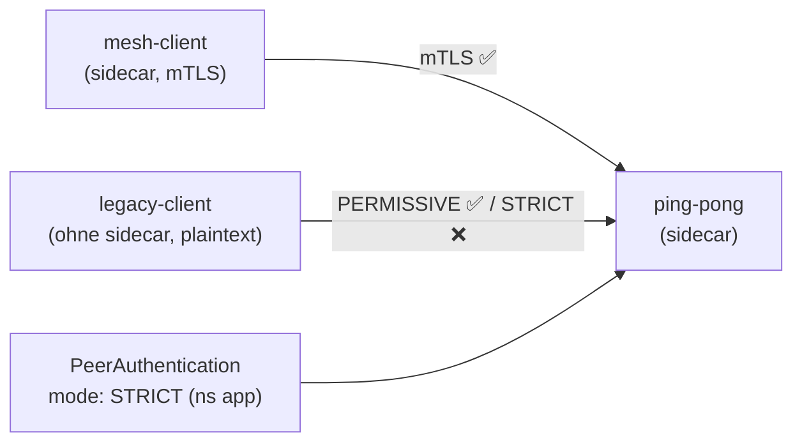

[RU version](README_RU.MD) · [Eng version](README.MD) · [Versión en español](README_ES.MD) · [Version française](README_FR.MD)

# Lab 20 - mTLS-Migration: PERMISSIVE → STRICT ohne Downtime

## Überblick

Einen laufenden Service „auf einen Schlag" auf striktes mTLS umzustellen, ist gefährlich: wenn man
sofort `STRICT` aktiviert, fallen alle Clients, die noch nicht im Mesh sind (die Plaintext senden),
augenblicklich aus. Istio löst das mit dem Modus **PERMISSIVE**: der serverseitige Sidecar nimmt
gleichzeitig mTLS und Plaintext an. Das erlaubt es, alle Workloads schrittweise ins Mesh zu bringen
und danach sicher auf `STRICT` umzuschalten.

Im Lab sind drei Workloads ausgerollt:
- `ping-pong` im Namespace `app` (mit Sidecar - der Service selbst);
- `mesh-client` im Namespace `app` (mit Sidecar - kommuniziert über mTLS);
- `legacy-client` im Namespace `legacy` (**ohne** Sidecar - nur Plaintext).

Ohne `PeerAuthentication` gilt der voreingestellte **PERMISSIVE**: beide Clients erreichen den Service.



## Aufgabe

1. Das Basisverhalten von PERMISSIVE ansehen (beide Clients erhalten `200`).
2. `PeerAuthentication` mit `mode: STRICT` im Namespace `app` anwenden.
3. Sicherstellen, dass danach:
   - der Mesh-Client (mTLS) weiterhin `200` erhält;
   - der Legacy-Client (Plaintext) einen Connection Reset erhält (nicht `200`).

## Schritt 1. Basisverhalten von PERMISSIVE

```bash
# mesh-client -> Service : funktioniert (mTLS)
kubectl exec -n app deploy/mesh-client -c curl -- \
  curl -s -o /dev/null -w "%{http_code}\n" http://ping-pong.app.svc.cluster.local:8080/
# -> 200

# legacy plaintext -> Service : bei PERMISSIVE funktioniert es EBENFALLS
kubectl exec -n legacy deploy/legacy-client -c curl -- \
  curl -s -o /dev/null -w "%{http_code}\n" http://ping-pong.app.svc.cluster.local:8080/
# -> 200
```

## Schritt 2. (empfohlen) PERMISSIVE explizit festlegen

Sichere Migration: zuerst setzen wir explizit PERMISSIVE, überzeugen uns anhand der Metriken, dass es
keinen Plaintext-Traffic mehr gibt, und schalten erst dann auf STRICT um:

```bash
kubectl apply -f - <<'EOF'
apiVersion: security.istio.io/v1
kind: PeerAuthentication
metadata:
  name: default
  namespace: app
spec:
  mtls:
    mode: PERMISSIVE
EOF
```

## Schritt 3. Namespace auf STRICT umschalten

```bash
kubectl apply -f - <<'EOF'
apiVersion: security.istio.io/v1
kind: PeerAuthentication
metadata:
  name: default
  namespace: app
spec:
  mtls:
    mode: STRICT
EOF
```

## Schritt 4. Prüfung

```bash
# mesh-client -> Service : funktioniert weiterhin (mTLS)
kubectl exec -n app deploy/mesh-client -c curl -- \
  curl -s -o /dev/null -w "%{http_code}\n" http://ping-pong.app.svc.cluster.local:8080/
# -> 200

# legacy plaintext -> Service : jetzt abgewiesen (reset)
kubectl exec -n legacy deploy/legacy-client -c curl -- \
  curl -s -o /dev/null -w "%{http_code}\n" --max-time 10 http://ping-pong.app.svc.cluster.local:8080/
# -> 000 (curl exit 56: connection reset by peer)
```

## Wie das funktioniert

- **PeerAuthentication** steuert, wie der *serverseitige* Sidecar eingehende
  Verbindungen annimmt:
  - `PERMISSIVE` (Mesh-Standard) - nimmt sowohl mTLS als auch Plaintext an. Genau das macht die
    Migration ohne Downtime möglich: wir bringen Workloads schrittweise ins Mesh, während Legacy-
    Plaintext-Clients weiterarbeiten.
  - `STRICT` - nur mTLS; Plaintext-Verbindungen werden zurückgesetzt.
- Hierarchie der Geltungsbereiche: `PeerAuthentication` in `istio-system` (root) - für das gesamte
  Mesh; im Namespace - überschreibt dort; mit `selector` - für eine konkrete Workload.
- **Rezept für eine sichere Migration**: wir halten PERMISSIVE, beobachten die Metrik
  `istio_requests_total{connection_security_policy="none"}`, bis sie auf null fällt
  (kein Plaintext mehr übrig), und aktivieren erst dann STRICT.

## Bezug zu anderen Labs

Lab 04 zeigt den Endzustand STRICT + `AuthorizationPolicy` (wer mit wem kommunizieren darf).
Dieses Lab handelt vom Übergang selbst und der Rolle von PERMISSIVE.

## Ergebnisprüfung

Führen Sie auf dem worker PC aus:

```bash
check_result
```

## Fazit

Sie haben die Migration eines Namespace auf striktes mTLS ohne Abbruch des Traffics der Mesh-Clients
durchgeführt und gesehen, wie STRICT Plaintext abschneidet. Das Verständnis des Paares
PERMISSIVE → STRICT ist eine grundlegende Senior-/Security-Fähigkeit für die Einführung von Zero
Trust in einer laufenden Umgebung.

## Infrastruktur

| Komponente | Typ | Anzahl | Rolle |
|---|---|---|---|
| control-plane | `t3.medium` | 1 | master + istiod |
| worker | `t3.small` | 1 | Kapazität für Anwendung und Clients |
| worker PC | `t3.small` | 1 | Arbeitsplatz: `kubectl`, `check_result` |

Region: `eu-central-1` (AZ `eu-central-1a` / `eu-central-1b`).
