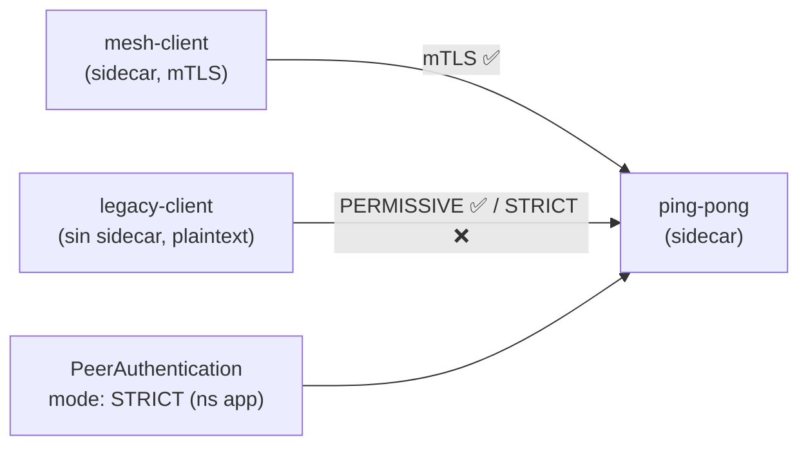

[RU version](README_RU.MD) · [Eng version](README.MD)

# Lab 20 - Migración de mTLS: PERMISSIVE → STRICT sin downtime

## Descripción general

Pasar un servicio en producción a mTLS estricto «de golpe» es peligroso: si activas de inmediato
`STRICT`, todos los clientes que aún no están en el mesh (envían plaintext) se caerán al instante.
Istio lo resuelve con el modo **PERMISSIVE**: el sidecar del lado servidor acepta a la vez mTLS y
plaintext. Esto permite ir incorporando poco a poco todas las cargas al mesh y luego cambiar de
forma segura a `STRICT`.

En el lab hay desplegadas tres cargas:
- `ping-pong` en el namespace `app` (con sidecar - el propio servicio);
- `mesh-client` en el namespace `app` (con sidecar - va por mTLS);
- `legacy-client` en el namespace `legacy` (**sin** sidecar - solo plaintext).

Sin `PeerAuthentication` rige el **PERMISSIVE** por defecto: ambos clientes alcanzan el servicio.



## Tarea

1. Ver el comportamiento base de PERMISSIVE (ambos clientes reciben `200`).
2. Aplicar `PeerAuthentication` con `mode: STRICT` en el namespace `app`.
3. Comprobar que después de esto:
   - el cliente del mesh (mTLS) sigue recibiendo `200`;
   - el cliente legacy (plaintext) recibe un reset de conexión (no `200`).

## Paso 1. Comportamiento base de PERMISSIVE

```bash
# cliente del mesh -> servicio : funciona (mTLS)
kubectl exec -n app deploy/mesh-client -c curl -- \
  curl -s -o /dev/null -w "%{http_code}\n" http://ping-pong.app.svc.cluster.local:8080/
# -> 200

# legacy plaintext -> servicio : con PERMISSIVE TAMBIÉN funciona
kubectl exec -n legacy deploy/legacy-client -c curl -- \
  curl -s -o /dev/null -w "%{http_code}\n" http://ping-pong.app.svc.cluster.local:8080/
# -> 200
```

## Paso 2. (recomendado) Fijar explícitamente PERMISSIVE

Migración segura: primero establecemos explícitamente PERMISSIVE, con las métricas confirmamos que
ya no queda tráfico plaintext, y solo entonces cambiamos a STRICT:

```bash
kubectl apply -f - <<'EOF'
apiVersion: security.istio.io/v1
kind: PeerAuthentication
metadata:
  name: default
  namespace: app
spec:
  mtls:
    mode: PERMISSIVE
EOF
```

## Paso 3. Cambiar el namespace a STRICT

```bash
kubectl apply -f - <<'EOF'
apiVersion: security.istio.io/v1
kind: PeerAuthentication
metadata:
  name: default
  namespace: app
spec:
  mtls:
    mode: STRICT
EOF
```

## Paso 4. Verificación

```bash
# cliente del mesh -> servicio : sigue funcionando (mTLS)
kubectl exec -n app deploy/mesh-client -c curl -- \
  curl -s -o /dev/null -w "%{http_code}\n" http://ping-pong.app.svc.cluster.local:8080/
# -> 200

# legacy plaintext -> servicio : ahora rechazado (reset)
kubectl exec -n legacy deploy/legacy-client -c curl -- \
  curl -s -o /dev/null -w "%{http_code}\n" --max-time 10 http://ping-pong.app.svc.cluster.local:8080/
# -> 000 (curl exit 56: connection reset by peer)
```

## Cómo funciona

- **PeerAuthentication** controla cómo el sidecar *del servidor* acepta las conexiones
  entrantes:
  - `PERMISSIVE` (por defecto en el mesh) - acepta tanto mTLS como plaintext. Esto es precisamente lo
    que hace posible la migración sin downtime: incorporamos las cargas al mesh de forma gradual, y los
    clientes legacy en plaintext siguen funcionando.
  - `STRICT` - solo mTLS; las conexiones plaintext se descartan.
- Jerarquía de ámbitos: `PeerAuthentication` en `istio-system` (root) - para todo el mesh; en un
  namespace - lo sobrescribe ahí; con `selector` - para un workload concreto.
- **Receta de migración segura**: mantenemos PERMISSIVE, observamos la métrica
  `istio_requests_total{connection_security_policy="none"}` hasta que caiga a cero
  (no queda plaintext), y solo entonces activamos STRICT.

## Relación con otros labs

El lab 04 muestra el estado final STRICT + `AuthorizationPolicy` (quién puede acceder a quién).
Este lab trata sobre la transición en sí y el papel de PERMISSIVE.

## Verificación del resultado

Ejecuta en el worker PC:

```bash
check_result
```

## Conclusión

Realizaste la migración de un namespace a mTLS estricto sin cortar el tráfico de los clientes del mesh y
viste cómo STRICT corta el plaintext. Entender el par PERMISSIVE → STRICT es una habilidad básica
senior/de seguridad para implantar zero-trust en un entorno en producción.

## Infraestructura

| Componente | Tipo | Cantidad | Rol |
|---|---|---|---|
| control-plane | `t3.medium` | 1 | master + istiod |
| worker | `t3.small` | 1 | capacidad para la aplicación y los clientes |
| worker PC | `t3.small` | 1 | puesto de trabajo: `kubectl`, `check_result` |

Región: `eu-central-1` (AZ `eu-central-1a` / `eu-central-1b`).
