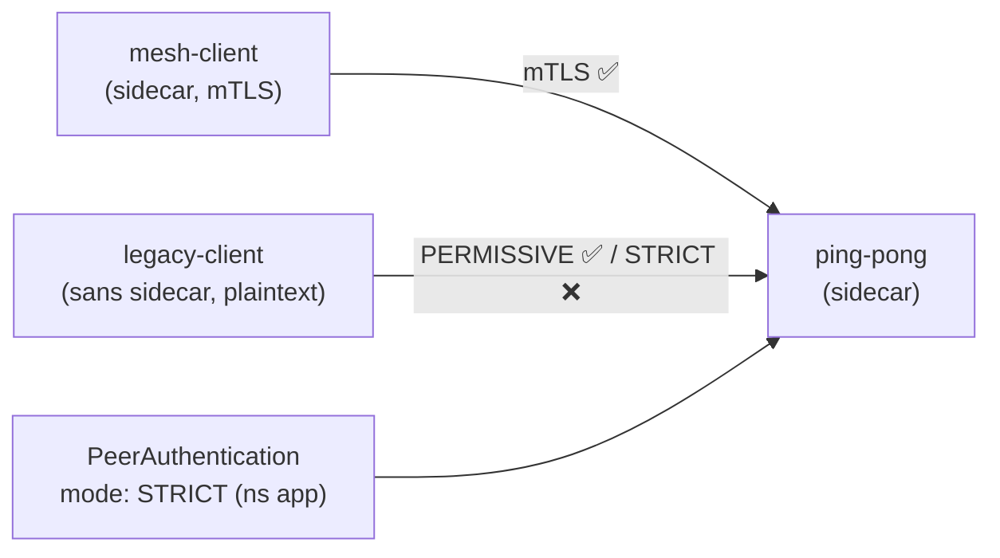

[RU version](README_RU.MD) · [Eng version](README.MD) · [Versión en español](README_ES.MD) · [Deutsche Version](README_DE.MD)

# Lab 20 - Migration mTLS : PERMISSIVE → STRICT sans interruption

## Vue d'ensemble

Faire basculer un service en production vers un mTLS strict « d'un coup » est risqué : si on
active immédiatement `STRICT`, tous les clients qui ne sont pas encore dans le maillage
(envoient du plaintext) tombent instantanément. Istio résout cela avec le mode
**PERMISSIVE** : le sidecar côté serveur accepte à la fois le mTLS et le plaintext. Cela
permet d'intégrer progressivement toutes les charges au maillage, puis de basculer en toute
sécurité vers `STRICT`.

Dans ce lab, trois charges de travail sont déployées :
- `ping-pong` dans le namespace `app` (avec sidecar - le service lui-même) ;
- `mesh-client` dans le namespace `app` (avec sidecar - communique en mTLS) ;
- `legacy-client` dans le namespace `legacy` (**sans** sidecar - plaintext uniquement).

Sans `PeerAuthentication`, le mode par défaut **PERMISSIVE** s'applique : les deux clients
atteignent le service.



## Tâche

1. Observer le comportement de base en PERMISSIVE (les deux clients obtiennent `200`).
2. Appliquer une `PeerAuthentication` avec `mode: STRICT` dans le namespace `app`.
3. Vérifier qu'ensuite :
   - le client mesh (mTLS) obtient toujours `200` ;
   - le client legacy (plaintext) reçoit un reset de connexion (pas de `200`).

## Étape 1. Comportement de base en PERMISSIVE

```bash
# client mesh -> service : fonctionne (mTLS)
kubectl exec -n app deploy/mesh-client -c curl -- \
  curl -s -o /dev/null -w "%{http_code}\n" http://ping-pong.app.svc.cluster.local:8080/
# -> 200

# legacy plaintext -> service : en PERMISSIVE, fonctionne AUSSI
kubectl exec -n legacy deploy/legacy-client -c curl -- \
  curl -s -o /dev/null -w "%{http_code}\n" http://ping-pong.app.svc.cluster.local:8080/
# -> 200
```

## Étape 2. (recommandé) Fixer explicitement PERMISSIVE

Migration sûre : d'abord on fixe explicitement PERMISSIVE, on vérifie via les métriques
qu'il n'y a plus de trafic plaintext, et seulement ensuite on bascule en STRICT :

```bash
kubectl apply -f - <<'EOF'
apiVersion: security.istio.io/v1
kind: PeerAuthentication
metadata:
  name: default
  namespace: app
spec:
  mtls:
    mode: PERMISSIVE
EOF
```

## Étape 3. Basculer le namespace en STRICT

```bash
kubectl apply -f - <<'EOF'
apiVersion: security.istio.io/v1
kind: PeerAuthentication
metadata:
  name: default
  namespace: app
spec:
  mtls:
    mode: STRICT
EOF
```

## Étape 4. Vérification

```bash
# client mesh -> service : fonctionne toujours (mTLS)
kubectl exec -n app deploy/mesh-client -c curl -- \
  curl -s -o /dev/null -w "%{http_code}\n" http://ping-pong.app.svc.cluster.local:8080/
# -> 200

# legacy plaintext -> service : désormais rejeté (reset)
kubectl exec -n legacy deploy/legacy-client -c curl -- \
  curl -s -o /dev/null -w "%{http_code}\n" --max-time 10 http://ping-pong.app.svc.cluster.local:8080/
# -> 000 (curl exit 56: connection reset by peer)
```

## Comment ça fonctionne

- **PeerAuthentication** gère la façon dont le sidecar *serveur* accepte les connexions
  entrantes :
  - `PERMISSIVE` (défaut du maillage) - accepte à la fois le mTLS et le plaintext. C'est
    précisément ce qui rend possible la migration sans interruption : on intègre les charges
    au maillage progressivement, tandis que les clients legacy en plaintext continuent de
    fonctionner.
  - `STRICT` - mTLS uniquement ; les connexions plaintext sont réinitialisées.
- Hiérarchie des portées : `PeerAuthentication` dans `istio-system` (root) - sur tout le
  maillage ; dans un namespace - remplace là ; avec un `selector` - sur un workload précis.
- **Recette de migration sûre** : on maintient PERMISSIVE, on surveille la métrique
  `istio_requests_total{connection_security_policy="none"}` jusqu'à ce qu'elle tombe à zéro
  (plus aucun plaintext), et seulement alors on active STRICT.

## Lien avec les autres labs

Le Lab 04 montre l'état final STRICT + `AuthorizationPolicy` (qui peut communiquer avec qui).
Ce lab porte sur la transition elle-même et le rôle de PERMISSIVE.

## Vérification du résultat

Lancez sur le worker PC :

```bash
check_result
```

## Conclusion

Vous avez effectué la migration d'un namespace vers un mTLS strict sans interruption du trafic
des clients mesh et vu comment STRICT rejette le plaintext. Comprendre le couple
PERMISSIVE → STRICT est une compétence senior/sécurité de base pour déployer le zero-trust
dans un environnement en production.

## Infrastructure

| Composant | Type | Nombre | Rôle |
|---|---|---|---|
| control-plane | `t3.medium` | 1 | master + istiod |
| worker | `t3.small` | 1 | capacité pour l'application et les clients |
| worker PC | `t3.small` | 1 | poste de travail : `kubectl`, `check_result` |

Région : `eu-central-1` (AZ `eu-central-1a` / `eu-central-1b`).
