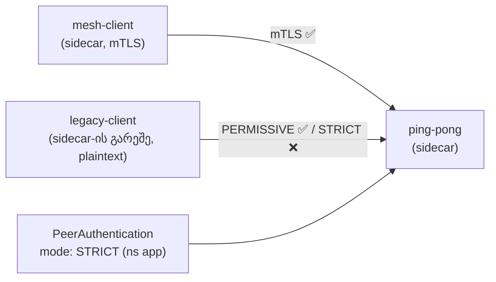

[Русская версия](README_RU.MD) · [Eng version](README.MD) · [Versión en español](README_ES.MD) · [Version française](README_FR.MD) · [Deutsche Version](README_DE.MD) · [繁體中文版](README_TW.MD) · [日本語版](README_JP.MD)

# ლაბორატორია 20 - mTLS-ის მიგრაცია: PERMISSIVE → STRICT შეფერხების გარეშე

> [საცნობარო გადაწყვეტა](worker/files/solutions/1_GE.MD)

## მიმოხილვა

მოქმედი სერვისის მკაცრ mTLS-ზე პირდაპირ გადაყვანა სახიფათოა: თუ დაუყოვნებლივ ჩართავთ
`STRICT`-ს, ყველა კლიენტი, რომელიც ჯერ კიდევ არ არის mesh-ში (აგზავნის plaintext-ს),
მყისიერად გაითიშება. Istio ამ პრობლემას **PERMISSIVE** რეჟიმით აგვარებს: server-side
sidecar ერთდროულად იღებს როგორც mTLS-ს, ისე plaintext-ს. ეს საშუალებას გაძლევთ,
თანდათან შეიყვანოთ ყველა workload mesh-ში, შემდეგ კი უსაფრთხოდ გადახვიდეთ `STRICT`-ზე.

ლაბორატორიაში გაშლილია სამი workload:
- `ping-pong` namespace-ში `app` (sidecar-ით - თავად სერვისი);
- `mesh-client` namespace-ში `app` (sidecar-ით - იყენებს mTLS-ს);
- `legacy-client` namespace-ში `legacy` (**sidecar-ის გარეშე** - მხოლოდ plaintext).

`PeerAuthentication`-ის გარეშე მოქმედებს ნაგულისხმევი **PERMISSIVE**: ორივე კლიენტს
სერვისთან წვდომა აქვს.



## ინფრასტრუქტურა

| კომპონენტი | ტიპი | რაოდენობა | როლი |
|---|---|---|---|
| control-plane | `t3.medium` | 1 | master + istiod |
| worker | `t3.small` | 1 | აპლიკაციისა და კლიენტებისთვის საჭირო სიმძლავრე |
| worker PC | `t3.small` | 1 | სამუშაო გარემო: `kubectl`, `check_result` |

რეგიონი: `eu-central-1` (AZ `eu-central-1a` / `eu-central-1b`).

## გაშლა

```bash
TASK=20 make run_ica_task
```

## დავალება

1. შეამოწმეთ PERMISSIVE-ის საბაზისო ქცევა (ორივე კლიენტი იღებს `200`-ს).
2. namespace-ში `app` გამოიყენეთ `PeerAuthentication` პარამეტრით `mode: STRICT`.
3. დარწმუნდით, რომ ამის შემდეგ:
   - mesh-კლიენტი (mTLS) კვლავ იღებს `200`-ს;
   - legacy-კლიენტი (plaintext) იღებს კავშირის reset-ს (არა `200`-ს).

## ნაბიჯი 1. PERMISSIVE-ის საბაზისო ქცევა

```bash
# mesh-კლიენტი -> სერვისი : მუშაობს (mTLS)
kubectl exec -n app deploy/mesh-client -c curl -- \
  curl -s -o /dev/null -w "%{http_code}\n" http://ping-pong.app.svc.cluster.local:8080/
# -> 200

# legacy plaintext -> სერვისი : PERMISSIVE-ის დროს ასევე მუშაობს
kubectl exec -n legacy deploy/legacy-client -c curl -- \
  curl -s -o /dev/null -w "%{http_code}\n" http://ping-pong.app.svc.cluster.local:8080/
# -> 200
```

## ნაბიჯი 2. (რეკომენდებულია) PERMISSIVE-ის ცხადად დაფიქსირება

უსაფრთხო მიგრაცია: თავდაპირველად ცხადად ვაყენებთ PERMISSIVE-ს, მეტრიკების საშუალებით
ვრწმუნდებით, რომ plaintext-ტრაფიკი აღარ არის, და მხოლოდ ამის შემდეგ გადავდივართ STRICT-ზე:

```bash
kubectl apply -f - <<'EOF'
apiVersion: security.istio.io/v1
kind: PeerAuthentication
metadata:
  name: default
  namespace: app
spec:
  mtls:
    mode: PERMISSIVE
EOF
```

## ნაბიჯი 3. namespace-ის STRICT-ზე გადაყვანა

```bash
kubectl apply -f - <<'EOF'
apiVersion: security.istio.io/v1
kind: PeerAuthentication
metadata:
  name: default
  namespace: app
spec:
  mtls:
    mode: STRICT
EOF
```

## ნაბიჯი 4. შემოწმება

```bash
# mesh-კლიენტი -> სერვისი : კვლავ მუშაობს (mTLS)
kubectl exec -n app deploy/mesh-client -c curl -- \
  curl -s -o /dev/null -w "%{http_code}\n" http://ping-pong.app.svc.cluster.local:8080/
# -> 200

# legacy plaintext -> სერვისი : ახლა უარყოფილია (reset)
kubectl exec -n legacy deploy/legacy-client -c curl -- \
  curl -s -o /dev/null -w "%{http_code}\n" --max-time 10 http://ping-pong.app.svc.cluster.local:8080/
# -> 000 (curl exit 56: connection reset by peer)
```

## როგორ მუშაობს ეს

- **PeerAuthentication** განსაზღვრავს, როგორ იღებს *სერვერის* sidecar შემომავალ
  კავშირებს:
  - `PERMISSIVE` (mesh-ის ნაგულისხმევი რეჟიმი) - იღებს როგორც mTLS-ს, ისე plaintext-ს.
    სწორედ ეს ხდის შესაძლებელს მიგრაციას შეფერხების გარეშე: workload-ები mesh-ში
    თანდათან შეგვყავს, legacy plaintext-კლიენტები კი მუშაობას განაგრძობენ.
  - `STRICT` - მხოლოდ mTLS; plaintext-კავშირები წყდება.
- მოქმედების არეალების იერარქია: `PeerAuthentication` `istio-system`-ში (root) - მთელ
  mesh-ზე; namespace-ში - იქ არსებულ პარამეტრებს ანაცვლებს; `selector`-ით - კონკრეტულ
  workload-ზე.
- **უსაფრთხო მიგრაციის რეცეპტი**: ვინარჩუნებთ PERMISSIVE-ს და ვაკვირდებით მეტრიკას
  `istio_requests_total{connection_security_policy="none"}`, სანამ ის ნულამდე არ
  შემცირდება (plaintext აღარ დარჩა), და მხოლოდ ამის შემდეგ ვრთავთ STRICT-ს.

## კავშირი სხვა ლაბორატორიებთან

ლაბორატორია 04 აჩვენებს საბოლოო მდგომარეობას STRICT + `AuthorizationPolicy` (ვის ვისთან
შეუძლია დაკავშირება). ეს ლაბორატორია უშუალოდ გადასვლასა და PERMISSIVE-ის როლს ეხება.

## შედეგის შემოწმება

worker PC-ზე გაუშვით:

```bash
check_result
```

## შეჯამება

თქვენ namespace მკაცრ mTLS-ზე გადაიყვანეთ mesh-კლიენტების ტრაფიკის შეწყვეტის გარეშე და
ნახეთ, როგორ ბლოკავს STRICT plaintext-ს. PERMISSIVE → STRICT წყვილის გაგება ცოცხალ
გარემოში zero-trust-ის დანერგვისთვის აუცილებელი საბაზისო senior/security-უნარია.
