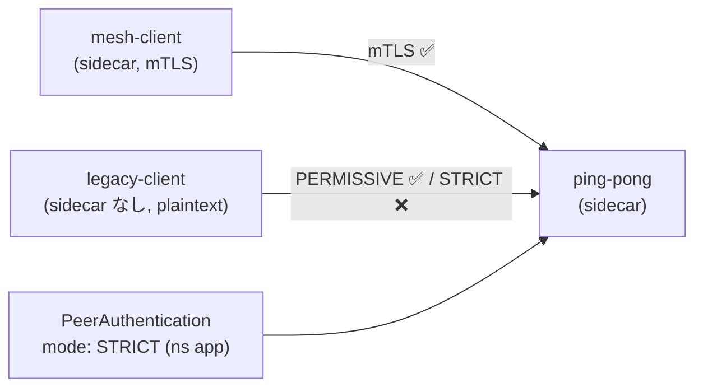

[Русская версия](README_RU.MD) · [Eng version](README.MD) · [Versión en español](README_ES.MD) · [Version française](README_FR.MD) · [Deutsche Version](README_DE.MD) · [ქართული ვერსია](README_GE.MD) · [繁體中文版](README_TW.MD)

# Lab 20 - mTLS の移行: ダウンタイムなしで PERMISSIVE → STRICT

> [リファレンス解答](worker/files/solutions/1_JP.MD)

## 概要

稼働中のサービスを「一気に」厳格な mTLS へ移行するのは危険です。すぐに `STRICT` を有効にすると、
まだ mesh 内にいない（plaintext を送信する）すべてのクライアントが即座に利用不能になります。Istio は
**PERMISSIVE** モードでこれを解決します。サーバー側 sidecar は mTLS と plaintext の両方を
同時に受け入れます。これにより、すべての workload を段階的に mesh へ参加させ、その後安全に
`STRICT` へ切り替えられます。

このラボでは 3 つの workload がデプロイされています。
- namespace `app` の `ping-pong`（sidecar あり - サービス本体）。
- namespace `app` の `mesh-client`（sidecar あり - mTLS で通信）。
- namespace `legacy` の `legacy-client`（sidecar **なし** - plaintext のみ）。

`PeerAuthentication` がない場合、デフォルトの **PERMISSIVE** が適用され、両方のクライアントがサービスに到達します。



## インフラストラクチャ

| コンポーネント | タイプ | 台数 | 役割 |
|---|---|---|---|
| control-plane | `t3.medium` | 1 | master + istiod |
| worker | `t3.small` | 1 | アプリケーションとクライアントの容量 |
| worker PC | `t3.small` | 1 | 作業環境: `kubectl`, `check_result` |

リージョン: `eu-central-1`（AZ `eu-central-1a` / `eu-central-1b`）。

## デプロイ

```bash
TASK=20 make run_ica_task
```

## 課題

1. PERMISSIVE の基本動作を確認する（両方のクライアントが `200` を受け取る）。
2. namespace `app` に `mode: STRICT` の `PeerAuthentication` を適用する。
3. その後、次を確認する。
   - mesh クライアント（mTLS）は引き続き `200` を受け取る。
   - legacy クライアント（plaintext）は接続 reset を受ける（`200` ではない）。

## ステップ 1. PERMISSIVE の基本動作

```bash
# mesh クライアント -> サービス : 動作する (mTLS)
kubectl exec -n app deploy/mesh-client -c curl -- \
  curl -s -o /dev/null -w "%{http_code}\n" http://ping-pong.app.svc.cluster.local:8080/
# -> 200

# legacy plaintext -> サービス : PERMISSIVE では これも動作する
kubectl exec -n legacy deploy/legacy-client -c curl -- \
  curl -s -o /dev/null -w "%{http_code}\n" http://ping-pong.app.svc.cluster.local:8080/
# -> 200
```

## ステップ 2. （推奨）PERMISSIVE を明示的に固定する

安全な移行では、まず明示的に PERMISSIVE を設定し、メトリクスで
plaintext トラフィックがなくなったことを確認してから、STRICT に切り替えます。

```bash
kubectl apply -f - <<'EOF'
apiVersion: security.istio.io/v1
kind: PeerAuthentication
metadata:
  name: default
  namespace: app
spec:
  mtls:
    mode: PERMISSIVE
EOF
```

## ステップ 3. namespace を STRICT に切り替える

```bash
kubectl apply -f - <<'EOF'
apiVersion: security.istio.io/v1
kind: PeerAuthentication
metadata:
  name: default
  namespace: app
spec:
  mtls:
    mode: STRICT
EOF
```

## ステップ 4. 検証

```bash
# mesh クライアント -> サービス : 引き続き動作する (mTLS)
kubectl exec -n app deploy/mesh-client -c curl -- \
  curl -s -o /dev/null -w "%{http_code}\n" http://ping-pong.app.svc.cluster.local:8080/
# -> 200

# legacy plaintext -> サービス : 今度は拒否される (reset)
kubectl exec -n legacy deploy/legacy-client -c curl -- \
  curl -s -o /dev/null -w "%{http_code}\n" --max-time 10 http://ping-pong.app.svc.cluster.local:8080/
# -> 000 (curl exit 56: connection reset by peer)
```

## 仕組み

- **PeerAuthentication** は、*サーバー側* sidecar が受信接続を受け入れる方法を制御します。
  - `PERMISSIVE`（mesh のデフォルト）- mTLS と plaintext の両方を受け入れます。これにより
    ダウンタイムなしの移行が可能になります。workload を段階的に mesh に参加させても、legacy の
    plaintext クライアントは引き続き動作します。
  - `STRICT` - mTLS のみ。plaintext 接続は reset されます。
- スコープの階層: `istio-system`（root）の `PeerAuthentication` は mesh 全体に適用されます。
  namespace 内のものはその namespace で上書きし、`selector` を使うものは特定の workload に適用されます。
- **安全な移行のレシピ**: PERMISSIVE を維持し、メトリクス
  `istio_requests_total{connection_security_policy="none"}` がゼロになるまで確認します
  （plaintext が残っていない状態）。そのときに限り STRICT を有効にします。

## 他のラボとの関連

ラボ 04 は STRICT + `AuthorizationPolicy` の最終状態（誰が誰にアクセスできるか）を示します。
このラボは移行そのものと PERMISSIVE の役割に焦点を当てています。

## 結果の確認

worker PC で実行します。

```bash
check_result
```

## まとめ

mesh クライアントのトラフィックを中断せずに、namespace を厳格な mTLS へ移行しました。また、
STRICT が plaintext をどのように遮断するかを確認しました。PERMISSIVE → STRICT の組み合わせを理解することは、
稼働中の環境に zero-trust を導入するための基本的な senior/security スキルです。