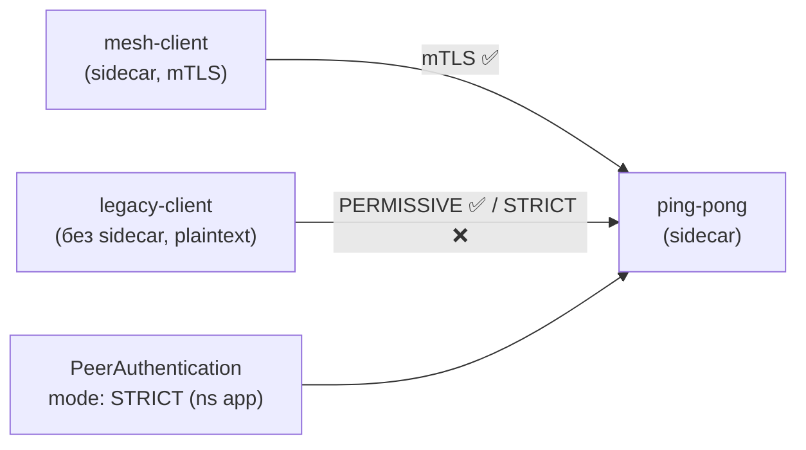

[Eng version](README.MD) · [Versión en español](README_ES.MD) · [Version française](README_FR.MD) · [Deutsche Version](README_DE.MD)

# Lab 20 - Миграция mTLS: PERMISSIVE → STRICT без даунтайма

## Обзор

Перевести живой сервис на строгий mTLS «в лоб» опасно: если сразу включить `STRICT`, то
все клиенты, которые ещё не в mesh (шлют plaintext), мгновенно отвалятся. Istio решает
это режимом **PERMISSIVE**: server-side sidecar принимает и mTLS, и plaintext
одновременно. Это позволяет постепенно завести все нагрузки в mesh, а затем безопасно
переключиться на `STRICT`.

В лабе развёрнуты три нагрузки:
- `ping-pong` в namespace `app` (с sidecar - сам сервис);
- `mesh-client` в namespace `app` (с sidecar - ходит по mTLS);
- `legacy-client` в namespace `legacy` (**без** sidecar - только plaintext).

Без `PeerAuthentication` действует дефолтный **PERMISSIVE**: оба клиента достают сервис.



## Задание

1. Посмотреть базовое поведение PERMISSIVE (оба клиента получают `200`).
2. Применить `PeerAuthentication` со `mode: STRICT` в namespace `app`.
3. Убедиться, что после этого:
   - mesh-клиент (mTLS) по-прежнему получает `200`;
   - legacy-клиент (plaintext) получает reset соединения (не `200`).

## Шаг 1. Базовое поведение PERMISSIVE

```bash
# mesh-клиент -> сервис : работает (mTLS)
kubectl exec -n app deploy/mesh-client -c curl -- \
  curl -s -o /dev/null -w "%{http_code}\n" http://ping-pong.app.svc.cluster.local:8080/
# -> 200

# legacy plaintext -> сервис : при PERMISSIVE ТОЖЕ работает
kubectl exec -n legacy deploy/legacy-client -c curl -- \
  curl -s -o /dev/null -w "%{http_code}\n" http://ping-pong.app.svc.cluster.local:8080/
# -> 200
```

## Шаг 2. (рекомендуется) Явно зафиксировать PERMISSIVE

Безопасная миграция: сначала явно ставим PERMISSIVE, по метрикам убеждаемся, что
plaintext-трафика больше нет, и только потом переключаем на STRICT:

```bash
kubectl apply -f - <<'EOF'
apiVersion: security.istio.io/v1
kind: PeerAuthentication
metadata:
  name: default
  namespace: app
spec:
  mtls:
    mode: PERMISSIVE
EOF
```

## Шаг 3. Переключить namespace на STRICT

```bash
kubectl apply -f - <<'EOF'
apiVersion: security.istio.io/v1
kind: PeerAuthentication
metadata:
  name: default
  namespace: app
spec:
  mtls:
    mode: STRICT
EOF
```

## Шаг 4. Проверка

```bash
# mesh-клиент -> сервис : по-прежнему работает (mTLS)
kubectl exec -n app deploy/mesh-client -c curl -- \
  curl -s -o /dev/null -w "%{http_code}\n" http://ping-pong.app.svc.cluster.local:8080/
# -> 200

# legacy plaintext -> сервис : теперь отклонён (reset)
kubectl exec -n legacy deploy/legacy-client -c curl -- \
  curl -s -o /dev/null -w "%{http_code}\n" --max-time 10 http://ping-pong.app.svc.cluster.local:8080/
# -> 000 (curl exit 56: connection reset by peer)
```

## Как это работает

- **PeerAuthentication** управляет тем, как *серверный* sidecar принимает входящие
  соединения:
  - `PERMISSIVE` (дефолт mesh) - принимает и mTLS, и plaintext. Именно это делает
    возможной миграцию без даунтайма: заводим нагрузки в mesh постепенно, а legacy
    plaintext-клиенты продолжают работать.
  - `STRICT` - только mTLS; plaintext-соединения сбрасываются.
- Иерархия областей: `PeerAuthentication` в `istio-system` (root) - на весь mesh; в
  namespace - переопределяет там; с `selector` - на конкретный ворклоад.
- **Рецепт безопасной миграции**: держим PERMISSIVE, смотрим метрику
  `istio_requests_total{connection_security_policy="none"}`, пока она не упадёт до нуля
  (plaintext не осталось), и только тогда включаем STRICT.

## Связь с другими лабами

Лаба 04 показывает конечное состояние STRICT + `AuthorizationPolicy` (кто кому может
ходить). Эта лаба - про сам переход и роль PERMISSIVE.

## Проверка результата

Запустите на worker PC:

```bash
check_result
```

## Итог

Вы выполнили миграцию namespace на строгий mTLS без обрыва трафика mesh-клиентов и
увидели, как STRICT отсекает plaintext. Понимание пары PERMISSIVE → STRICT - базовый
senior/security-навык для внедрения zero-trust в живом окружении.

## Инфраструктура

| Компонент | Тип | Кол-во | Роль |
|---|---|---|---|
| control-plane | `t3.medium` | 1 | master + istiod |
| worker | `t3.small` | 1 | ёмкость для приложения и клиентов |
| worker PC | `t3.small` | 1 | рабочее место: `kubectl`, `check_result` |

Регион: `eu-central-1` (AZ `eu-central-1a` / `eu-central-1b`).
