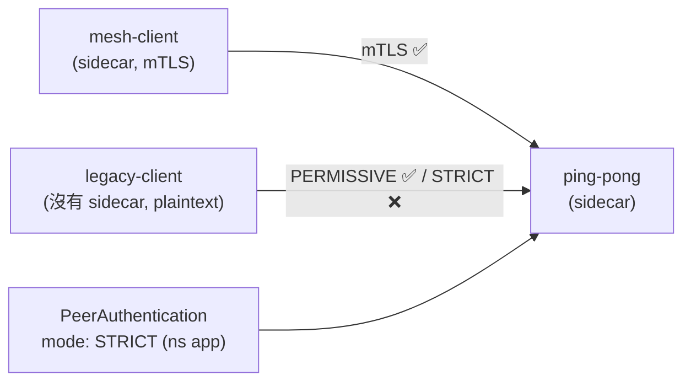

[Русская версия](README_RU.MD) · [Eng version](README.MD) · [Versión en español](README_ES.MD) · [Version française](README_FR.MD) · [Deutsche Version](README_DE.MD) · [ქართული ვერსია](README_GE.MD) · [日本語版](README_JP.MD)

# Lab 20 - mTLS 遷移：PERMISSIVE → STRICT，零停機

> [參考解答](worker/files/solutions/1_TW.MD)

## 概述

直接將線上服務切換為嚴格 mTLS 很危險：若立即啟用 `STRICT`，所有尚未加入 mesh
（傳送 plaintext）的用戶端都會立刻失效。Istio 透過 **PERMISSIVE** 模式解決此問題：
server-side sidecar 同時接受 mTLS 與 plaintext。這讓您能逐步將所有工作負載納入 mesh，
然後安全地切換至 `STRICT`。

本實驗部署了三個工作負載：
- namespace `app` 中的 `ping-pong`（含 sidecar--服務本身）；
- namespace `app` 中的 `mesh-client`（含 sidecar--透過 mTLS 存取）；
- namespace `legacy` 中的 `legacy-client`（**不含** sidecar--僅使用 plaintext）。

未設定 `PeerAuthentication` 時，預設為 **PERMISSIVE**：兩個用戶端都能存取服務。



## 基礎架構

| 元件 | 類型 | 數量 | 角色 |
|---|---|---|---|
| control-plane | `t3.medium` | 1 | master + istiod |
| worker | `t3.small` | 1 | 應用程式與用戶端的容量 |
| worker PC | `t3.small` | 1 | 工作站：`kubectl`、`check_result` |

區域：`eu-central-1`（AZ `eu-central-1a` / `eu-central-1b`）。

## 部署

```bash
TASK=20 make run_ica_task
```

## 任務

1. 查看 PERMISSIVE 的基本行為（兩個用戶端均取得 `200`）。
2. 在 namespace `app` 中套用 `mode: STRICT` 的 `PeerAuthentication`。
3. 確認之後：
   - mesh 用戶端（mTLS）仍取得 `200`；
   - legacy 用戶端（plaintext）收到連線 reset（不是 `200`）。

## 步驟 1. PERMISSIVE 的基本行為

```bash
# mesh 用戶端 -> 服務 : 可運作 (mTLS)
kubectl exec -n app deploy/mesh-client -c curl -- \
  curl -s -o /dev/null -w "%{http_code}\n" http://ping-pong.app.svc.cluster.local:8080/
# -> 200

# legacy plaintext -> 服務 : 在 PERMISSIVE 下同樣可運作
kubectl exec -n legacy deploy/legacy-client -c curl -- \
  curl -s -o /dev/null -w "%{http_code}\n" http://ping-pong.app.svc.cluster.local:8080/
# -> 200
```

## 步驟 2.（建議）明確固定 PERMISSIVE

安全的遷移方式：先明確設定 PERMISSIVE，根據指標確認 plaintext 流量已不存在，
然後才切換至 STRICT：

```bash
kubectl apply -f - <<'EOF'
apiVersion: security.istio.io/v1
kind: PeerAuthentication
metadata:
  name: default
  namespace: app
spec:
  mtls:
    mode: PERMISSIVE
EOF
```

## 步驟 3. 將 namespace 切換至 STRICT

```bash
kubectl apply -f - <<'EOF'
apiVersion: security.istio.io/v1
kind: PeerAuthentication
metadata:
  name: default
  namespace: app
spec:
  mtls:
    mode: STRICT
EOF
```

## 步驟 4. 驗證

```bash
# mesh 用戶端 -> 服務 : 仍然可運作 (mTLS)
kubectl exec -n app deploy/mesh-client -c curl -- \
  curl -s -o /dev/null -w "%{http_code}\n" http://ping-pong.app.svc.cluster.local:8080/
# -> 200

# legacy plaintext -> 服務 : 現在被拒絕 (reset)
kubectl exec -n legacy deploy/legacy-client -c curl -- \
  curl -s -o /dev/null -w "%{http_code}\n" --max-time 10 http://ping-pong.app.svc.cluster.local:8080/
# -> 000 (curl exit 56: connection reset by peer)
```

## 運作原理

- **PeerAuthentication** 控制*伺服器端* sidecar 如何接受傳入連線：
  - `PERMISSIVE`（預設 mesh 模式）--同時接受 mTLS 與 plaintext。這正是能夠零停機
    遷移的原因：逐步將工作負載納入 mesh，同時 legacy plaintext 用戶端仍可繼續運作。
  - `STRICT`--僅限 mTLS；plaintext 連線會被重設。
- 範圍的層級：`istio-system`（root）中的 `PeerAuthentication` 適用於整個 mesh；
  namespace 中的設定會在該 namespace 覆寫；含 `selector` 的設定則適用於特定工作負載。
- **安全遷移流程**：維持 PERMISSIVE，監控指標
  `istio_requests_total{connection_security_policy="none"}`，直到其降至零
  （不再有 plaintext），才啟用 STRICT。

## 與其他實驗的關係

Lab 04 展示 STRICT + `AuthorizationPolicy` 的最終狀態（誰可以存取誰）。本實驗著重於
遷移本身以及 PERMISSIVE 的角色。

## 結果驗證

在 worker PC 上執行：

```bash
check_result
```

## 總結

您已完成將 namespace 遷移至嚴格 mTLS，且不中斷 mesh 用戶端的流量，並了解 STRICT
如何阻擋 plaintext。理解 PERMISSIVE → STRICT 這一組模式，是在實際環境導入 zero-trust
的基本 senior/security 技能。