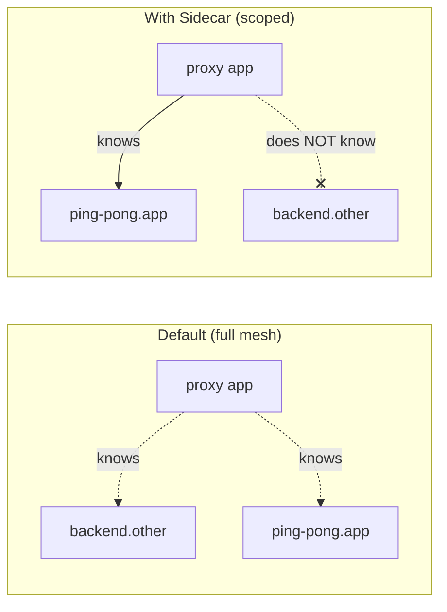

[RU version](README_RU.MD)

# Lab 21 — Sidecar scoping: limit the proxy configuration scope

## Overview

By default Istio runs as a "full mesh": every sidecar receives config for **all**
services in the mesh — even ones it never talks to. In a small cluster that is
invisible, but with thousands of services it means huge Envoy configs, high memory per
pod, and heavy istiod load on every change.

The **`Sidecar`** resource lets you scope this: with `egress.hosts` you declare which
services a proxy should learn about. This is the standard way to make Istio scale:
smaller configs, faster pushes, lower control-plane load, and tighter egress boundaries.

Two namespaces are deployed:
- `app` with the `ping-pong` service (sidecar injected);
- `other` with the `backend` service (sidecar injected).

Right now the `app` proxy carries a cluster for `backend.other` even though it never
calls it.



## Task

1. Observe that by default the `app` proxy has a cluster for `backend.other`.
2. Apply a `Sidecar` resource in namespace `app` scoping `egress.hosts` to the local
   namespace (`./*`) and `istio-system/*`.
3. Confirm that afterwards:
   - the proxy config no longer has a cluster for `backend.other`;
   - the cluster for its own service `ping-pong.app` remains.

## Step 1. Default (unscoped) config

```bash
POD=$(kubectl get pod -n app -l app=ping-pong -o jsonpath='{.items[0].metadata.name}')
istioctl proxy-config clusters "$POD" -n app | grep backend.other
# a cluster for backend.other.svc.cluster.local is present
```

## Step 2. Apply a Sidecar resource to scope egress

```bash
kubectl apply -f - <<'EOF'
apiVersion: networking.istio.io/v1
kind: Sidecar
metadata:
  name: default
  namespace: app
spec:
  egress:
    - hosts:
        - "./*"
        - "istio-system/*"
EOF
```

- `./*` — every service in the **local** namespace (`app`);
- `istio-system/*` — the control-plane namespace (needed for telemetry, etc.).

A `Sidecar` named `default` with no `workloadSelector` applies to all workloads in the
namespace.

## Step 3. Verify the config shrank

```bash
POD=$(kubectl get pod -n app -l app=ping-pong -o jsonpath='{.items[0].metadata.name}')

# 'other' namespace clusters are gone
istioctl proxy-config clusters "$POD" -n app | grep backend.other || echo "pruned ✅"

# own namespace clusters remain
istioctl proxy-config clusters "$POD" -n app | grep ping-pong.app
```

## How it works and why it matters

- The **`Sidecar`** resource controls the scope of configuration istiod pushes to a
  proxy. `egress.hosts` whitelists which services the proxy learns about.
- The default full mesh does not scale: every proxy knows every service. Scoping proxies
  with `Sidecar` resources gives smaller configs, faster pushes, lower istiod load, and
  tighter egress boundaries.
- Inside a `Sidecar` you can also set `outboundTrafficPolicy: REGISTRY_ONLY` per
  namespace to block undeclared egress.

> Note: scoping is about *config distribution*, not authorization. To actually forbid
> calls use `AuthorizationPolicy` (Lab 04) or `outboundTrafficPolicy: REGISTRY_ONLY`.

## Check the result

Run on the worker PC:

```bash
check_result
```

## Summary

You scoped the proxy configuration with a `Sidecar` resource and watched unrelated
services disappear from the Envoy config. Managing scoping is a key senior skill for
operating Istio in large clusters: without it istiod and the sidecars hit memory and CPU
limits as the number of services grows.

## Infrastructure

| Component | Type | Count | Role |
|---|---|---|---|
| control-plane | `t3.medium` | 1 | master + istiod |
| worker | `t3.small` | 1 | capacity for services in two namespaces |
| worker PC | `t3.small` | 1 | workstation: `kubectl`, `istioctl`, `check_result` |

Region: `eu-central-1` (AZ `eu-central-1a` / `eu-central-1b`).
