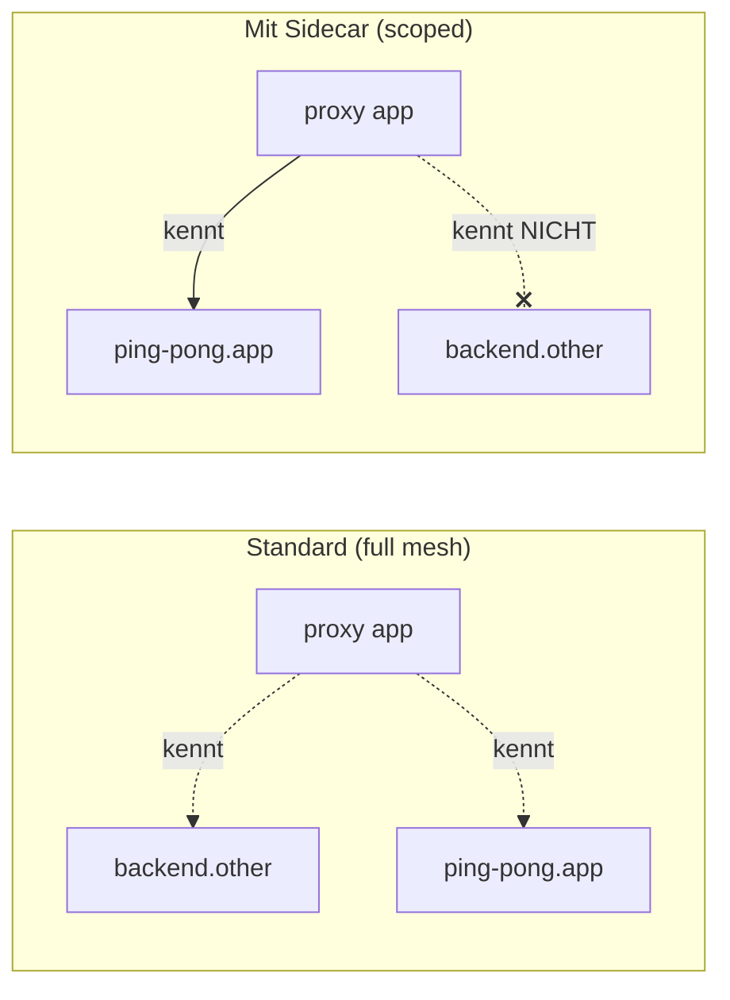

[RU version](README_RU.MD) · [Eng version](README.MD) · [Versión en español](README_ES.MD) · [Version française](README_FR.MD)

# Lab 21 - Sidecar Scoping: Einschränkung des Konfigurationsbereichs des Proxy

## Überblick

Standardmäßig arbeitet Istio als „Full Mesh": jeder Sidecar erhält von istiod die Konfiguration
**aller** Services des Mesh - auch derjenigen, mit denen er nie kommuniziert. In einem kleinen
Cluster fällt das nicht auf, aber bei Tausenden von Services bedeutet das riesige Envoy-Konfigurationen,
viel Speicher pro Pod und eine hohe Last auf istiod bei jeder Änderung.

Die Ressource **`Sidecar`** erlaubt es, den Bereich einzuschränken: über `egress.hosts` geben Sie an,
von welchen Services der Proxy überhaupt wissen soll. Das ist die Standardmethode zur Skalierung von
Istio: kleinere Konfiguration, schnellere Pushes, geringere Last auf der Control Plane, klarere
Egress-Grenzen.

Im Lab sind zwei Namespaces ausgerollt:
- `app` mit dem Service `ping-pong` (mit Sidecar);
- `other` mit dem Service `backend` (mit Sidecar).

Momentan enthält der Proxy in `app` einen Cluster für `backend.other`, obwohl er nie dorthin geht.



## Infrastruktur

| Komponente | Typ | Anzahl | Rolle |
|---|---|---|---|
| control-plane | `t3.medium` | 1 | master + istiod |
| worker | `t3.small` | 1 | Kapazität für die Services zweier Namespaces |
| worker PC | `t3.small` | 1 | Arbeitsplatz: `kubectl`, `istioctl`, `check_result` |

Region: `eu-central-1` (AZ `eu-central-1a` / `eu-central-1b`).

## Deployment

```bash
TASK=21 make run_ica_task
```

## Aufgabe

1. Ansehen, dass der Proxy in `app` standardmäßig einen Cluster für `backend.other` enthält.
2. Eine `Sidecar`-Ressource im Namespace `app` anwenden und `egress.hosts` nur auf den eigenen
   Namespace (`./*`) und `istio-system/*` beschränken.
3. Sicherstellen, dass danach:
   - in der Proxy-Konfiguration kein Cluster für `backend.other` mehr vorhanden ist;
   - der Cluster für den eigenen Service `ping-pong.app` erhalten bleibt.

## Schritt 1. Standardkonfiguration (ohne Einschränkung)

```bash
POD=$(kubectl get pod -n app -l app=ping-pong -o jsonpath='{.items[0].metadata.name}')
istioctl proxy-config clusters "$POD" -n app | grep backend.other
# Cluster für backend.other.svc.cluster.local ist vorhanden
```

## Schritt 2. Sidecar zur Einschränkung des Egress anwenden

```bash
kubectl apply -f - <<'EOF'
apiVersion: networking.istio.io/v1
kind: Sidecar
metadata:
  name: default
  namespace: app
spec:
  egress:
    - hosts:
        - "./*"
        - "istio-system/*"
EOF
```

- `./*` - alle Services des **lokalen** Namespace (`app`);
- `istio-system/*` - der Namespace der Control Plane (nötig für Telemetrie usw.).

Ein `Sidecar` mit dem Namen `default` ohne `workloadSelector` wird auf alle Workloads des
Namespace angewendet.

## Schritt 3. Prüfen, dass die Konfiguration reduziert wurde

```bash
POD=$(kubectl get pod -n app -l app=ping-pong -o jsonpath='{.items[0].metadata.name}')

# clusters aus dem Namespace other sind verschwunden
istioctl proxy-config clusters "$POD" -n app | grep backend.other || echo "pruned ✅"

# clusters des eigenen Namespace sind erhalten geblieben
istioctl proxy-config clusters "$POD" -n app | grep ping-pong.app
```

## Wie das funktioniert und wozu es dient

- Die Ressource **`Sidecar`** steuert, welche Konfiguration istiod in den Proxy pusht.
  `egress.hosts` ist eine Whitelist der Services, von denen der Proxy erfährt.
- Ein voreingestelltes Full Mesh skaliert nicht: jeder Proxy kennt alle. Scoping
  über `Sidecar` liefert kleinere Konfigurationen, schnelle Pushes, geringere Last auf istiod und
  striktere Egress-Grenzen.
- Innerhalb von `Sidecar` kann man zusätzlich `outboundTrafficPolicy: REGISTRY_ONLY` festlegen,
  um auf Namespace-Ebene nicht deklarierten Egress zu blockieren.

> Wichtig: Scoping betrifft die *Verteilung der Konfiguration*, nicht die Autorisierung. Um Aufrufe
> tatsächlich zu verbieten, verwenden Sie `AuthorizationPolicy` (Lab 04) oder
> `outboundTrafficPolicy: REGISTRY_ONLY`.

## Ergebnisprüfung

Führen Sie auf dem worker PC aus:

```bash
check_result
```

## Fazit

Sie haben den Konfigurationsbereich des Proxy über die Ressource `Sidecar` eingeschränkt und gesehen,
wie überflüssige Services aus der Envoy-Konfiguration verschwunden sind. Die Verwaltung des Scoping
ist eine zentrale Senior-Fähigkeit für den Betrieb von Istio in großen Clustern: ohne sie stoßen
istiod und die Sidecars mit wachsender Anzahl von Services an ihre Speicher- und CPU-Grenzen.
