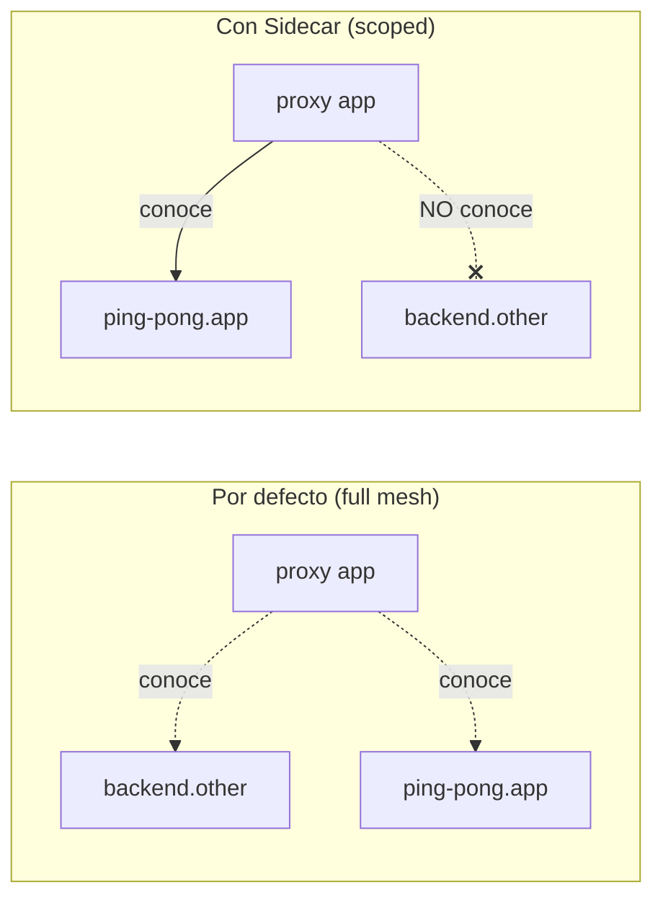

[RU version](README_RU.MD) · [Eng version](README.MD)

# Lab 21 - Sidecar scoping: limitar el alcance de la configuración del proxy

## Resumen

Por defecto, Istio funciona como una «full mesh»: cada sidecar recibe de istiod la
configuración de **todos** los servicios de la malla, incluso de aquellos a los que nunca
se conecta. En un clúster pequeño esto pasa desapercibido, pero con miles de servicios
significa configuraciones de Envoy enormes, mucha memoria por pod y una carga elevada
sobre istiod ante cualquier cambio.

El recurso **`Sidecar`** permite limitar el alcance: mediante `egress.hosts` indicas de
qué servicios debe siquiera tener conocimiento el proxy. Es la forma estándar de escalar
Istio: menos configuración, pushes más rápidos, menor carga sobre el control plane y
límites de egress más claros.

En el lab se despliegan dos namespaces:
- `app` con el servicio `ping-pong` (con sidecar);
- `other` con el servicio `backend` (con sidecar).

Ahora mismo el proxy en `app` contiene un cluster para `backend.other`, aunque nunca se
conecta a él.



## Tarea

1. Ver que por defecto el proxy en `app` contiene un cluster para `backend.other`.
2. Aplicar el recurso `Sidecar` en el namespace `app`, limitando `egress.hosts` solo a su
   propio namespace (`./*`) y a `istio-system/*`.
3. Comprobar que tras esto:
   - en la configuración del proxy ya no hay cluster para `backend.other`;
   - el cluster para su propio servicio `ping-pong.app` permanece.

## Paso 1. Configuración por defecto (sin restricción)

```bash
POD=$(kubectl get pod -n app -l app=ping-pong -o jsonpath='{.items[0].metadata.name}')
istioctl proxy-config clusters "$POD" -n app | grep backend.other
# el cluster para backend.other.svc.cluster.local está presente
```

## Paso 2. Aplicar Sidecar para limitar el egress

```bash
kubectl apply -f - <<'EOF'
apiVersion: networking.istio.io/v1
kind: Sidecar
metadata:
  name: default
  namespace: app
spec:
  egress:
    - hosts:
        - "./*"
        - "istio-system/*"
EOF
```

- `./*` - todos los servicios del namespace **local** (`app`);
- `istio-system/*` - namespace del control plane (necesario para telemetría, etc.).

Un `Sidecar` con el nombre `default` sin `workloadSelector` se aplica a todos los
workloads del namespace.

## Paso 3. Comprobar que la configuración se redujo

```bash
POD=$(kubectl get pod -n app -l app=ping-pong -o jsonpath='{.items[0].metadata.name}')

# los clusters del namespace other desaparecieron
istioctl proxy-config clusters "$POD" -n app | grep backend.other || echo "pruned ✅"

# los clusters del propio namespace permanecen
istioctl proxy-config clusters "$POD" -n app | grep ping-pong.app
```

## Cómo funciona y para qué sirve

- El recurso **`Sidecar`** controla qué configuración empuja istiod hacia el proxy.
  `egress.hosts` es una lista blanca de servicios de los que el proxy tiene conocimiento.
- La full mesh por defecto no escala: cada proxy conoce a todos. El scoping mediante
  `Sidecar` da configuraciones más pequeñas, pushes rápidos, menor carga sobre istiod y
  límites de egress más estrictos.
- Dentro de `Sidecar` se puede además definir `outboundTrafficPolicy: REGISTRY_ONLY`,
  para bloquear a nivel de namespace el egress no declarado.

> Importante: el scoping trata sobre la *distribución de la configuración*, no sobre la
> autorización. Para prohibir realmente las llamadas, usa `AuthorizationPolicy` (Lab 04) o
> `outboundTrafficPolicy: REGISTRY_ONLY`.

## Verificación del resultado

Ejecuta en el worker PC:

```bash
check_result
```

## Conclusión

Has limitado el alcance de la configuración del proxy mediante el recurso `Sidecar` y has
visto cómo desaparecieron de la configuración de Envoy los servicios innecesarios. La
gestión del scoping es una habilidad senior clave para operar Istio en clústeres grandes:
sin ella, istiod y los sidecars chocan contra los límites de memoria y CPU a medida que
crece el número de servicios.

## Infraestructura

| Componente | Tipo | Cantidad | Rol |
|---|---|---|---|
| control-plane | `t3.medium` | 1 | master + istiod |
| worker | `t3.small` | 1 | capacidad para los servicios de dos namespaces |
| worker PC | `t3.small` | 1 | puesto de trabajo: `kubectl`, `istioctl`, `check_result` |

Región: `eu-central-1` (AZ `eu-central-1a` / `eu-central-1b`).
